# Universal Exam Prompt — Ultimate A+ Answer System for Any University Worldwide

    

    

    

    

    

    

    

    

<p align="center">
  <a href="https://pinakdhabu.github.io/Exam-prompt/">
    
  </a>
  <a href="https://github.com/pinakdhabu/Exam-prompt/stargazers">
    
  </a>
  <a href="https://github.com/pinakdhabu/Exam-prompt/forks">
    
  </a>
</p>

<p align="center">
  
  
  
  
  
  
  
  
</p>

> **The world's most comprehensive AI-powered exam preparation system — works for ANY university,
> ANY department, ANY subject worldwide.**
>
> Pre-configured for SPPU Computer Engineering. Adapts to any syllabus PDF. Skills-based
> architecture. Universal agent compatibility.

---

## 🚀 Quick Start

```bash
# 1. Install all 26 exam prep skills in one command
npx skills add https://github.com/pinakdhabu/Exam-prompt -g -y -a opencode

# 2. Open your AI agent (Claude, Cursor, ChatGPT, Gemini)

# 3. Start asking:
#    "Explain ACID properties with example [6 marks]"
#    "Generate Cornell notes for DBMS Unit 3"
#    "Analyze these PYQs and tell me what's important"
```

**That's it.** No config files, no API keys, no setup. The AI auto-loads the right skill.

> **Want one-click access?** Use the [Gemini Gems](#-quick-start-with-gemini-gems) below — zero
> setup required.

---

## 📸 Generated Question Papers

**16 professionally formatted PDFs** — real output from the pipeline, not mockups. Times New Roman,
native Typst math rendering, SPPU layout with seat-number box, right-aligned marks, and OR
separators.

### First Year (FE)

<p align="center">
  <a href="generated-examples/pdfs/fe-2024-maths1-qp.pdf">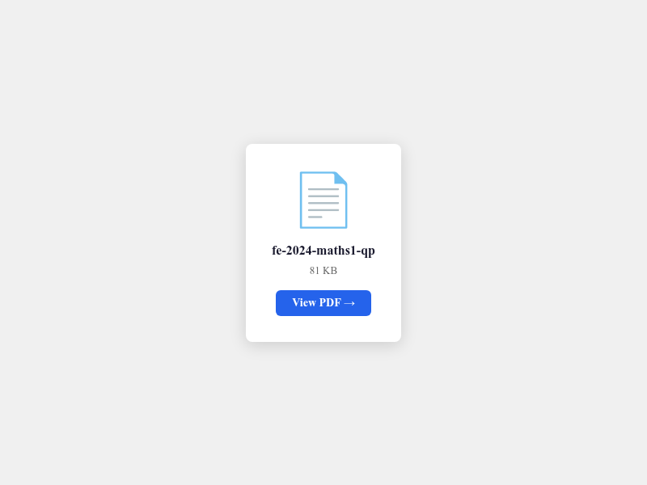</a>
  <a href="generated-examples/pdfs/fe-2019-programming-qp.pdf">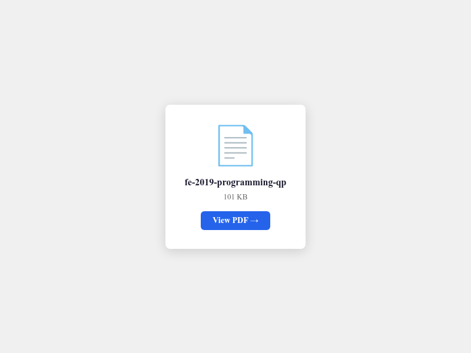</a>
</p>

### Second Year (SE)

<p align="center">
  <a href="generated-examples/pdfs/se-sem3-data-structures-qp.pdf">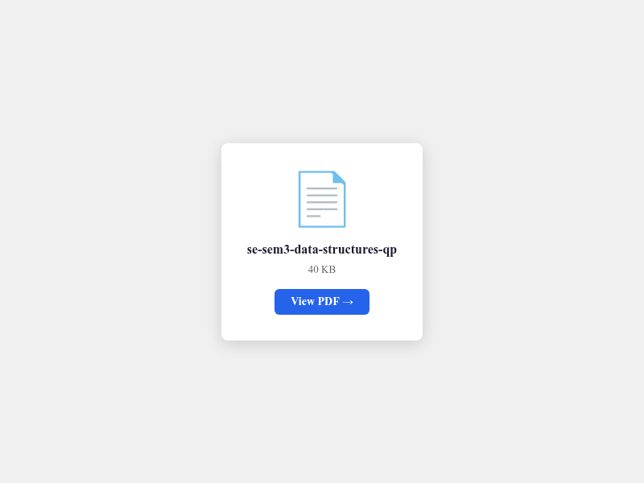</a>
  <a href="generated-examples/pdfs/se-sem3-data-structures-solution.pdf">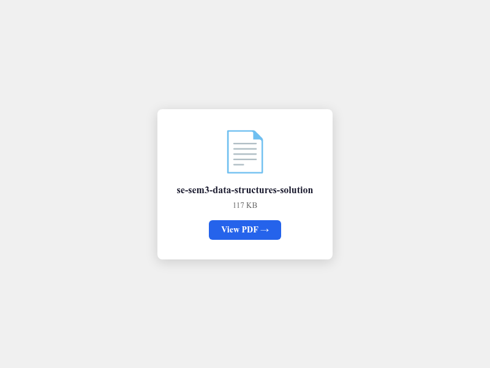</a>
  <a href="generated-examples/pdfs/se-sem4-dsa-qp.pdf">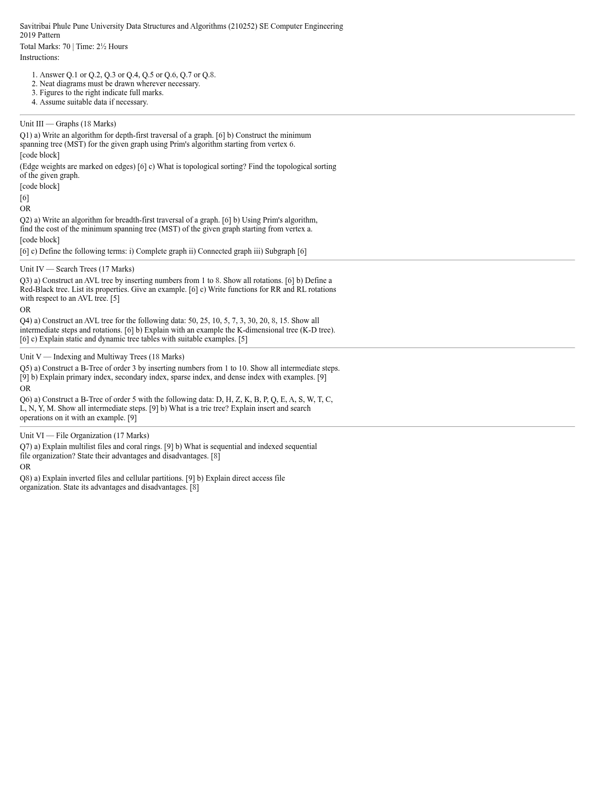</a>
</p>

### Third Year (TE)

<p align="center">
  <a href="generated-examples/pdfs/te-sem5-computer-networks-qp.pdf">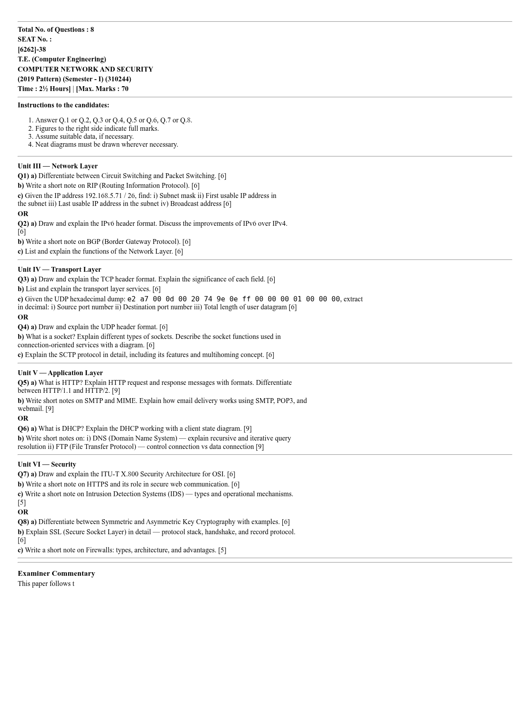</a>
  <a href="generated-examples/pdfs/te-sem5-dbms-qp.pdf">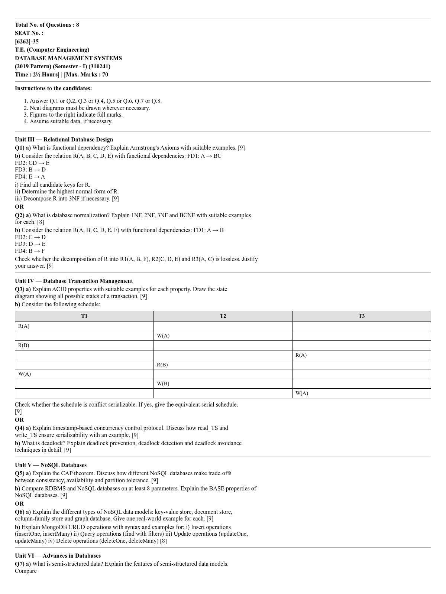</a>
  <a href="generated-examples/pdfs/te-sem6-ai-qp.pdf">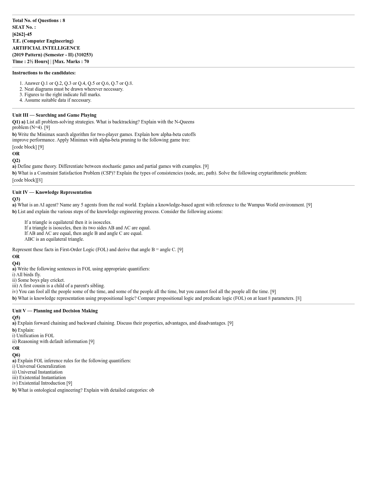</a>
  <a href="generated-examples/pdfs/te-sem6-ds-qp.pdf">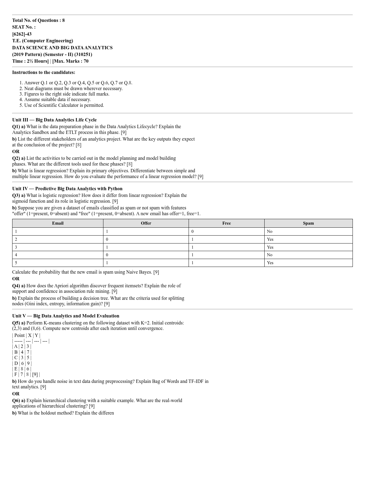</a>
</p>

### Fourth Year (BE)

<p align="center">
  <a href="generated-examples/pdfs/be-sem7-machine-learning-qp.pdf">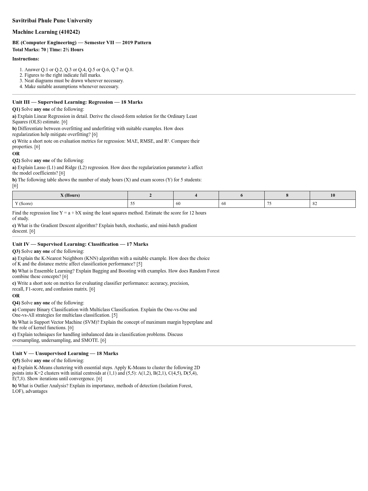</a>
  <a href="generated-examples/pdfs/be-sem7-daa-qp.pdf"></a>
  <a href="generated-examples/pdfs/be-sem8-deep-learning-qp.pdf">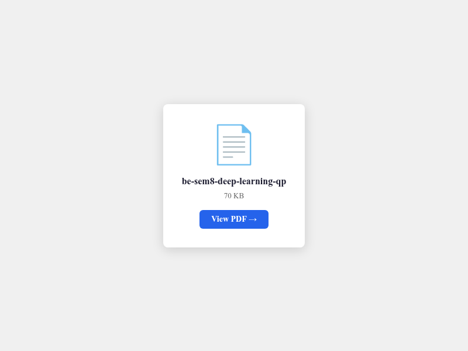</a>
</p>

> **📄 View all 16 PDFs:** [`generated-examples/pdfs/`](generated-examples/pdfs/)
>
> **🔧 Generate your own:**
> `node scripts/convert-to-pdf.js examples/be/sem-7/machine-learning/sample-paper-1.md output.pdf`

---

## 🎯 Example: Question Paper (Input) → Model Answer (Generated)

|                     Question Paper (Input)                      |                             AI-Generated Model Answer                              |
| :-------------------------------------------------------------: | :--------------------------------------------------------------------------------: |
|  |     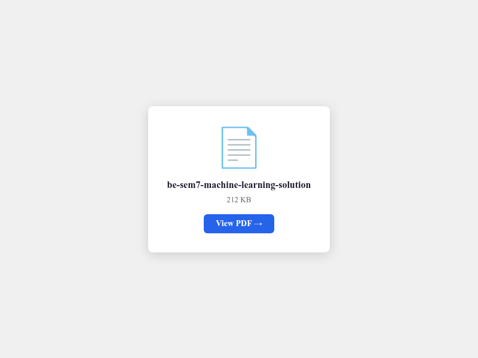      |
|                 Raw SPPU-format question paper                  | Professionally structured answer with definition, diagram, example, marking scheme |

> A normal AI answer without this prompt would be generic and unstructured. The prompt adds SPPU
> formatting, examiner psychology, anti-deduction rules, and Bloom's level alignment.

See the full solution PDF:
[`be-sem7-machine-learning-solution.pdf`](generated-examples/pdfs/be-sem7-machine-learning-solution.pdf)

---

## 📖 What Is This?

This is a **universal skill hub** that transforms any AI coding agent into a personal **10/10 GPA
exam tutor** for **any university worldwide**. Pre-configured with **SPPU Computer Engineering**
intelligence. Instantly adapts to any other university's syllabus and exam pattern when provided.

The system includes **26 skills** for:

- **Write A+ exam answers** — ALL question types, ALL mark levels (1–100+), ALL exam conditions
- **Generate exam-ready notes** — 12+ formats (Outline, Cornell, Mind Map, Flowchart, Q&A)
- **Analyze PYQs** — 13+ statistical analysis types with probability % predictions
- **Generate IMP topics** — 5 probability levels, 7 time-plan options, GPA-targeted tracks
- **Create exam papers** — 11+ university patterns (SPPU, VTU, JNTU, Oxford, Cambridge, etc.)
- **Generate flashcards, MCQs, study plans, formula sheets, mind maps, lab reports**

All powered by a **universal skills-based architecture** inspired by
[Anthropic's Agent Skills](https://github.com/anthropics/skills) specification.

---

## 🔧 Generated PDF Pipeline

The repo includes a production-ready pipeline to convert sample papers into professionally formatted
PDFs:

```
Sample Paper (Markdown) → md-to-Typst converter → typst compile → A4 PDF
```

**Features:**

- **Times New Roman + Cambria Math** (native Typst math rendering)
- **Native math rendering** — integrals, matrices, fractions, derivatives, Greek letters
- **SPPU layout** — seat-number box, right-aligned marks `[6]`, OR separators
- **Dynamic page breaks** — proper spacing, justified paragraphs
- **LaTeX → Typst conversion** — Unicode math symbols auto-mapped

```bash
# Single file
node scripts/convert-to-pdf.js examples/te/sem-5/dbms/sample-paper-1.md output.pdf

# All sample papers
node scripts/batch-convert-to-pdf.js

# Generate preview thumbnails
node scripts/gen-pdf-previews.js
```

**Dependencies:** `typst` (v0.14+) — install from https://typst.app **Optional:**
`npm install marked playwright` (for preview thumbnails and QP fetching)

---

## ⚡ Quick Start with Gemini Gems

One-click access to specialized AI agents — no setup required.

| Tool                   | Link                                                                               | What It Does                                        |
| ---------------------- | ---------------------------------------------------------------------------------- | :-------------------------------------------------- |
| **Q.P. Analysis Tool** | [Open Gemini Gem](https://gemini.google.com/gem/1W8EC9fMchTr3bVl_X4ncnPGWNsEM5heh) | Analyzes PYQs and syllabus to predict exam patterns |
| **Notes Generator**    | [Open Gemini Gem](https://gemini.google.com/gem/bf5b14582187)                      | Generates 100% syllabus-locked revision notes       |
| **Important Topics**   | [Open Gemini Gem](https://gemini.google.com/gem/4266a7e8000e)                      | Outputs must-prepare IMP topics & questions         |
| **Answer Generator**   | [Open Gemini Gem](https://gemini.google.com/gem/1PGOZXhIROLOGU88epT7JGgV3bnXDTcJK) | Writes full-marks theory answers                    |

> **Pro tip:** Upload your syllabus PDF + PYQ PDFs for best results.

---

## 🏗️ Architecture

```
exam-prompt/
├── skills/                      # 26 Universal skill modules (SKILL.md format)
│   ├── answer-writer/           #  → 10/10 GPA answer generator
│   ├── notes-generator/         #  → Exam-ready notes (12+ formats)
│   ├── pyq-analyzer/            #  → PYQ analysis (13+ types)
│   ├── imp-topics-generator/    #  → High-probability exam topics
│   ├── exam-paper-generator/    #  → Question papers (11+ patterns)
│   └── ... (20 more skills)
├── generated-examples/          # 16 real PDFs generated from the pipeline
├── scripts/                     # Conversion & utility tools
│   ├── convert-to-pdf.js        # MD → PDF (Typst pipeline)
│   ├── batch-convert-to-pdf.js  # Batch convert all sample papers
│   └── gen-pdf-previews.js      # Generate PNG preview thumbnails
├── docs/                        # GitHub Pages website
├── examples/                    # 48 sample papers across FE/SE/TE/BE
├── architectures/               # D2 language system diagrams
└── AGENTS.md                    # Universal skill loader for AI agents
```

---

## 🎓 Covered Subjects (50+ across 4 years)

| Year   | Semesters  | Key Subjects                                                        |
| :----- | :--------- | :------------------------------------------------------------------ |
| **FE** | I & II     | Maths I & II, Physics, Chemistry, BEE, Programming, Mechanics       |
| **SE** | III & IV   | Discrete Math, FDS, OOP, DSA, DBMS, M3, Microprocessor              |
| **TE** | V & VI     | **DBMS**, **TOC**, **SPOS**, **CN**, Data Science, **AI**, Web Tech |
| **BE** | VII & VIII | **DAA**, **ML**, **Deep Learning**, **HPC**, Blockchain             |

[Full subject list →](README.md#covered-subjects)

---

## 📊 Key Features

| Feature             | Detail                                                                          |
| :------------------ | :------------------------------------------------------------------------------ |
| **Universities**    | Any worldwide (SPPU, VTU, JNTU, Oxford, MIT, etc.)                              |
| **Question Types**  | ALL: theory, numerical, MCQ, case study, derivation, diagram, design, oral, lab |
| **Command Words**   | 50+ (Define → Invent), all 6 Bloom's levels                                     |
| **Mark Ranges**     | 1 → 100+, with universal lines-per-mark formula                                 |
| **Pattern Support** | 11+ patterns: SPPU 2019/2024, VTU, JNTU, Mumbai, UK/Oxford                      |
| **PYQ Coverage**    | 2019–2025, all semesters                                                        |
| **Note Formats**    | 12+ formats: Outline, Cornell, Mind Map, Flowchart, Q&A                         |
| **Time Plans**      | 7 options: emergency (1 night) → 1-month                                        |

---

## 📚 AI Agent Instructions

This section tells **any AI coding agent** exactly how to use this repo.

### For Claude Code / Cursor / Windsurf

Skills are auto-discovered. Just start asking:

```
"Explain ACID properties with example [6 marks]"
"Generate Cornell notes for Unit 3 of DBMS"
"Analyze these PYQs and tell me what's important"
"I have 3 days to prepare for TOC. Give me IMP topics with a time plan."
```

### For ChatGPT / Gemini (Manual Load)

1. Copy content from any `skills/<name>/SKILL.md`
2. Paste into chat
3. Then ask your exam question

```
You: [Paste skills/answer-writer/SKILL.md]
You: Now write an answer for "Explain ACID properties with example [6 marks]"
```

---

## 📜 License

MIT — see [LICENSE](LICENSE).

---

<div align="center">

**Made for SPPU Engineering students, by students — now universal for any university worldwide.**

⭐ If this helps you, star the repo — it helps other students find it too.

</div>
