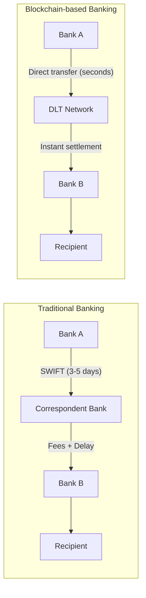

# Blockchain Technology — Sample Paper 1 — Ideal Solution

---

## Unit III — Blockchain Platforms and Consensus

### Q1(a) — Types of Blockchain Platforms

**Blockchain platforms** are categorized based on participation permissions into Public, Private,
and Consortium types.

**Public Blockchain**: Permissionless network where anyone can read, write, and participate in
consensus. Examples: Bitcoin, Ethereum. Fully decentralized but has lower throughput.

**Private Blockchain**: Permissioned network controlled by a single organization. Only authorized
participants can validate transactions. Examples: Hyperledger Fabric (single-org). Higher
throughput, lower trust.

**Consortium Blockchain**: Permissioned network governed by a group of organizations. Multiple
entities share control. Examples: R3 Corda, Hyperledger (multi-org). Balances decentralization with
efficiency.

| Aspect               | Public            | Private                 | Consortium                    |
| -------------------- | ----------------- | ----------------------- | ----------------------------- |
| **Access**           | Anyone            | Restricted              | Restricted                    |
| **Consensus**        | PoW/PoS           | Pre-approved validators | Multi-party agreement         |
| **Speed**            | Slow              | Fast                    | Moderate                      |
| **Decentralization** | Full              | Centralized             | Partially decentralized       |
| **Trust model**      | Trustless         | Trust-based             | Trusted group                 |
| **Example**          | Bitcoin, Ethereum | Bank internal ledger    | R3 Corda (banking consortium) |

---

### Q1(b) — Corda Blockchain

**Corda** is a distributed ledger platform designed for businesses, optimized for **privacy** and
**legal certainty** in financial transactions.

**Key features**:

1. **Notary nodes**: Prevent double-spending without broadcasting all transactions to all nodes
2. **Point-to-point communication**: Transactions shared only with relevant parties (not broadcast
   globally)
3. **Legal prose integration**: Smart contracts can reference legal documents
4. **No global broadcast**: Unlike Bitcoin/Ethereum, Corda does not broadcast all transactions to
   all participants
5. **UTXO model**: Uses a model similar to Bitcoin's Unspent Transaction Output

**CorDapps (Corda Distributed Applications)** are applications built on Corda that define states,
contracts, and flows. They represent business agreements with legal significance.

**Difference from other platforms**: Corda focuses on **privacy and finality** — only parties to a
transaction see its details, and notary nodes provide immediate finality without mining.

---

### Q2(a) — Consensus Algorithms and Byzantine General Problem

**Consensus algorithms** ensure all nodes in a blockchain network agree on the state of the ledger.

**Five consensus algorithms**:

1. **Proof of Work (PoW)**: Miners solve cryptographic puzzles (Bitcoin)
2. **Proof of Stake (PoS)**: Validators stake tokens (Ethereum 2.0)
3. **Delegated Proof of Stake (DPoS)**: Stakeholders vote for delegates (EOS)
4. **Practical Byzantine Fault Tolerance (PBFT)**: Multi-round voting among known validators
   (Hyperledger)
5. **Proof of Authority (PoA)**: Pre-approved validators stake reputation (private chains)

**Byzantine General Problem**: Describes the challenge of reaching consensus in a distributed system
where participants may be faulty or malicious. The Byzantine generals must agree on an attack plan
even with traitors sending conflicting messages.

**PBFT solution**: Uses a three-phase protocol (pre-prepare, prepare, commit) with at least 3f+1
nodes to tolerate f faulty nodes. The primary node proposes, replicas validate, and a supermajority
(2f+1) commits.

---

### Q2(b) — PoW vs PoS

| Aspect               | Proof of Work                    | Proof of Stake                  |
| -------------------- | -------------------------------- | ------------------------------- |
| **Energy**           | Very high (ASIC mining)          | Low (no mining hardware)        |
| **Security**         | Mathematically robust            | Economic incentives             |
| **Decentralization** | Mining pools centralize          | Validators can centralize       |
| **Finality**         | Probabilistic (~6 blocks)        | Deterministic (finality gadget) |
| **Entry barrier**    | High (hardware cost)             | Lower (stake amount)            |
| **51% attack cost**  | Very high (hardware+electricity) | High (must own 51% of tokens)   |
| **Example**          | Bitcoin                          | Ethereum 2.0, Cardano           |

**Enterprise suitability**: **PoS and PBFT** are more suitable for enterprise blockchains due to
lower energy costs, faster transaction finality, and better scalability. Consortium chains often use
PBFT variants that require minimal energy and provide deterministic finality.

---

## Unit IV — Cryptocurrency: Bitcoin and Token

### Q3(a) — Bitcoin Mining

**Bitcoin mining** is the process of validating transactions and adding them to the blockchain by
solving computationally intensive cryptographic puzzles (Proof of Work).

**Miner functionality**:

1. Collect pending transactions from the mempool
2. Validate transactions (verify signatures, check UTXO)
3. Construct a candidate block with a hash pointer to the previous block
4. Find a **nonce** such that block hash < target difficulty
5. Broadcast the solved block; collect block reward + transaction fees

**Difficulty adjustment**: Every 2016 blocks (~2 weeks), the network adjusts the target difficulty
to maintain a block time of approximately 10 minutes. If blocks were found faster, difficulty
increases; if slower, difficulty decreases.

**Nonce role**: The nonce is a 32-bit field in the block header that miners vary to produce
different block hashes. Finding a valid nonce requires ~2³² attempts on average.

```mermaid
flowchart TD
    TX[Pending Transactions] --> MemPool[Mempool]
    MemPool --> Block[Block Construction]
    Block --> Hash[Compute Hash<br/>SHA256(SHA256(header))]
    Hash --> Check{Hash < Target?}
    Check -->|No| Nonce[Increment Nonce]
    Nonce --> Hash
    Check -->|Yes| Broadcast[Broadcast Block]
    Broadcast --> Reward[Receive Block Reward + Fees]
```

---

### Q3(b) — Custodial vs Non-Custodial Wallets

**Custodial Wallet**: Private keys are held by a third-party service provider (exchange). User
trusts the provider to secure funds. Examples: Coinbase, Binance.

**Non-Custodial Wallet**: Private keys are held exclusively by the user. The user has full control
and full responsibility. Examples: MetaMask, Trust Wallet, Ledger.

| Aspect                    | Custodial                       | Non-Custodial                |
| ------------------------- | ------------------------------- | ---------------------------- |
| **Key ownership**         | Third party                     | User                         |
| **Security**              | Exchange's security (hack risk) | User's responsibility        |
| **Recovery**              | Via KYC with exchange           | Seed phrase backup           |
| **Control**               | Exchange can freeze funds       | Full user control            |
| **Convenience**           | High (password reset)           | Lower (seed phrase critical) |
| **Censorship resistance** | Low                             | High                         |

---

### Q4(a) — Hot Wallet vs Cold Wallet

**Hot Wallet**: Connected to the internet. Used for frequent transactions. Examples: MetaMask,
mobile wallets. Higher convenience but vulnerable to online attacks.

**Cold Wallet**: Offline storage. Used for long-term holdings. Examples: Hardware wallets (Ledger,
Trezor), paper wallets. Maximum security but less convenient.

**MetaMask**: A popular hot wallet browser extension and mobile app that:

- Connects to Ethereum and EVM-compatible chains
- Manages private keys locally (non-custodial)
- Enables dApp interaction (DeFi, NFTs, gaming)
- Includes a built-in swap feature

**Benefits**: Easy dApp access, multi-chain support, seed phrase recovery **Drawbacks**: Browser
extension attack surface, phishing risks, no built-in fiat on-ramp

| Aspect           | Hot Wallet             | Cold Wallet             |
| ---------------- | ---------------------- | ----------------------- |
| **Connectivity** | Online                 | Offline                 |
| **Security**     | Lower (online attacks) | Higher (air-gapped)     |
| **Convenience**  | High                   | Low                     |
| **Use case**     | Daily spending, dApps  | Long-term storage, HODL |
| **Example**      | MetaMask, Trust Wallet | Ledger, Trezor          |

---

### Q4(b) — ZeroCoin and ZeroCash

**ZeroCoin** and **ZeroCash** are privacy-focused cryptocurrency protocols that enhance transaction
anonymity beyond Bitcoin's pseudonymous model.

**ZeroCoin**: Uses a mixing protocol where coins are deposited into a "pool" and withdrawn as new,
untraceable coins. Each withdrawal produces a zero-knowledge proof that the coin belongs to the pool
without revealing which specific coin.

**ZeroCash**: Built on ZeroCoin concepts using **zk-SNARKs (Zero-Knowledge Succinct Non-Interactive
Arguments of Knowledge)**. Transactions can hide sender, receiver, and amount. Implements shielded
transactions where details are encrypted and verified using cryptographic proofs.

**Privacy comparison with Bitcoin**:

- Bitcoin: Pseudonymous (all transactions visible on public ledger)
- ZeroCoin: Hides coin origin through mixing
- ZeroCash: Hides all transaction details (who, what, how much)

**zk-SNARKs in ZeroCash**: Allow a prover to prove knowledge of a valid transaction without
revealing any transaction details. Proofs are small (~200 bytes) and verifiable in milliseconds.

---

## Unit V — Ethereum Platform using Solidity

### Q5(a) — Ethereum Features and Networks

**Ethereum** is a decentralized, open-source blockchain platform with smart contract functionality.

**Key features**:

1. **Turing-complete Virtual Machine (EVM)**: Executes smart contracts deterministically
2. **Smart Contracts**: Self-executing code on the blockchain
3. **Gas System**: Measures computational effort for transactions
4. **dApps (Decentralized Applications)**: Applications built on Ethereum
5. **ERC Standards**: Token standards (ERC-20, ERC-721, ERC-1155)
6. **Account Model**: Externally Owned Accounts (EOA) and Contract Accounts

**Network types**:

| Network     | Purpose              | Currency   | Consensus    |
| ----------- | -------------------- | ---------- | ------------ |
| **Mainnet** | Live production      | ETH (real) | PoS          |
| **Ropsten** | PoS testnet          | ETH (free) | PoS          |
| **Goerli**  | Cross-client testnet | ETH (free) | PoA          |
| **Sepolia** | Lightweight testnet  | ETH (free) | PoS          |
| **Private** | Internal development | Custom     | Configurable |

**EVM**: The EVM is a stack-based virtual machine that executes bytecode. It provides isolation
between contracts and deterministic execution across all nodes.

---

### Q5(b) — Smart Contracts and Solidity

**Smart Contract** is a self-executing program stored on the blockchain that automatically enforces
agreements when predefined conditions are met.

**Real-world example — Crowdfunding**: Contributors send ETH to a smart contract. If the funding
goal is reached by the deadline, funds are released to the project creator. Otherwise, contributors
can withdraw their funds.

**Gas**: Gas is the unit measuring computational effort in Ethereum. Each operation has a gas cost.
Gas limits prevent infinite loops and allocate computational resources. Gas price (in gwei)
determines transaction priority.

**Solidity Voting Contract**:

```solidity
// SPDX-License-Identifier: MIT
pragma solidity ^0.8.0;

contract Voting {
    struct Candidate {
        string name;
        uint voteCount;
    }

    mapping(address => bool) public voters;
    Candidate[] public candidates;

    constructor(string[] memory candidateNames) {
        for (uint i = 0; i < candidateNames.length; i++) {
            candidates.push(Candidate(candidateNames[i], 0));
        }
    }

    function vote(uint candidateIndex) public {
        require(!voters[msg.sender], "Already voted");
        require(candidateIndex < candidates.length, "Invalid candidate");
        voters[msg.sender] = true;
        candidates[candidateIndex].voteCount++;
    }
}
```

**Deployment steps**: Write contract → Compile with Solc → Deploy via Remix/Truffle → Confirm
transaction → Interact via ABI

---

### Q6(a) — Whisper

**Whisper** is a decentralized peer-to-peer messaging protocol in the Ethereum ecosystem designed
for secure, low-level communication between dApps.

**Purpose**: Enables dApps to communicate without relying on centralized servers, maintaining the
decentralized ethos of Ethereum.

**Architecture**: Messages are sent with TTL (Time to Live) and Proof of Work. Nodes filter messages
by topics. Messages can be encrypted (using symmetric/asymmetric keys) or signed for authenticity.

**Comparison with traditional messaging**:

| Aspect           | Whisper            | Traditional (WhatsApp) |
| ---------------- | ------------------ | ---------------------- |
| **Architecture** | P2P, decentralized | Client-server          |
| **Metadata**     | Anonymized         | Visible to provider    |
| **Censorship**   | Resistant          | Vulnerable             |
| **Scalability**  | Lower              | Higher                 |
| **Persistence**  | Ephemeral (TTL)    | Permanent              |

---

### Q6(b) — Smart Contract Types and Deployment

**Common smart contract types**:

- **ERC-20**: Fungible token standard (USDC, UNI)
- **ERC-721**: Non-fungible token (NFT) standard (CryptoPunks)
- **ERC-1155**: Multi-token standard (fungible + non-fungible)
- **ERC-4626**: Tokenized vault standard

**Deployment steps using Truffle**:

1. `npm init` and install truffle
2. Write smart contract in Solidity
3. Write migration script
4. Configure `truffle-config.js` (network, compiler)
5. `truffle compile`
6. `truffle migrate --network [network]`
7. Interact via Truffle console or Web3.js

**Deployment using Remix IDE**: Write contract → Compile → Deploy (Injected Web3 with MetaMask) →
Confirm transaction → Interact with deployed contract.

---

## Unit VI — Blockchain Case Studies

### Q7(a) — Blockchain in Banking and Financial Services

**Blockchain applications in banking**:

1. **Cross-border payments**: Ripple, Stellar enable near-instant settlement with low fees
2. **Trade finance**: Letter of credit automation using smart contracts
3. **KYC/AML**: Shared, immutable customer records across institutions
4. **Securities settlement**: T+0 settlement vs traditional T+2



**Fraud reduction**: Immutable ledger prevents double-spending and tampering. Smart contracts
enforce business rules automatically.

**Settlement time reduction**: From 3-5 days (SWIFT) to seconds using distributed ledger technology
with atomic settlement.

---

### Q7(b) — Blockchain for Digital Identity

**Self-Sovereign Identity (SSI)** is a digital identity model where individuals control their own
identity data without relying on centralized authorities.

**Blockchain enables SSI through**:

1. **Decentralized Identifiers (DIDs)**: Globally unique identifiers registered on blockchain
2. **Verifiable Credentials**: Cryptographic proofs issued by trusted entities
3. **Selective Disclosure**: Users share only required attributes (age > 18, not birthdate)

**Reducing cyber hacks**: Since identity data is not stored in a central honeypot database, mass
breaches become infeasible. Users hold private keys locally. Data access is permissioned and
auditable.

---

### Q8(a) — Blockchain in Government Sector

**Government blockchain applications**:

**Land Registry**: Immutable record of property ownership. Andhra Pradesh (India) and Sweden have
piloted blockchain land registries. Reduces fraud, eliminates disputes.

**Voting Systems**: Blockchain-based voting ensures tamper-proof, verifiable elections. Voatz and
Follow My Vote are platforms exploring this. Voter identity is verified via blockchain without
revealing ballot choices.

**Public Records**: Birth/death certificates, business registrations, and licenses can be issued on
blockchain for instant verification and fraud resistance.

**Implementation challenges**:

- Regulatory and legal framework gaps
- Integration with legacy systems
- Scalability and throughput limitations
- Public acceptance and digital literacy
- Privacy concerns (public vs private data)

---

### Q8(b) — Blockchain in IoT and Banking

**Blockchain in IoT**: Provides decentralized security for IoT networks where centralized servers
are vulnerable.

**Use Case — Supply Chain Management**: IoT sensors record temperature, location, and handling
conditions of goods. Data is stored immutably on blockchain. Smart contracts automatically trigger
payments when conditions are met.

**Blockchain in Banking**: DeFi (Decentralized Finance) offers lending, borrowing, and trading
without intermediaries. Stablecoins (USDC, DAI) provide fiat-pegged digital currencies for on-chain
transactions.

**Benefits in IoT security**:

1. Device identity management via blockchain
2. Immutable audit trail of device interactions
3. Automated consensus for device firmware updates
4. Micro-transactions for machine-to-machine payments

---

═══════════════════════════════════════════════════════ **EXAMINER COMMENTARY** **Why this scores
full marks**: Real-world examples are named (Ripple, Corda, MetaMask). Comparisons use structured
tables. Solidity code is syntactically correct. Architecture diagrams clarify complex concepts.
Privacy protocols (zk-SNARKs) are explained with their role. **Common Deductions**:

- Consensus algorithms listed without explaining the Byzantine General Problem
- Wallet types described without comparing accessibility vs security trade-offs
- Smart contracts discussed without a code example
- Blockchain applications listed without architectural diagrams
- Gas concept explained without relating to EVM operation costs **Time Budget**:
- Q1/Q2 (18 marks): 40 min
- Q3/Q4 (17 marks): 38 min
- Q5/Q6 (18 marks): 42 min
- Q7/Q8 (17 marks): 38 min ═══════════════════════════════════════════════════════
