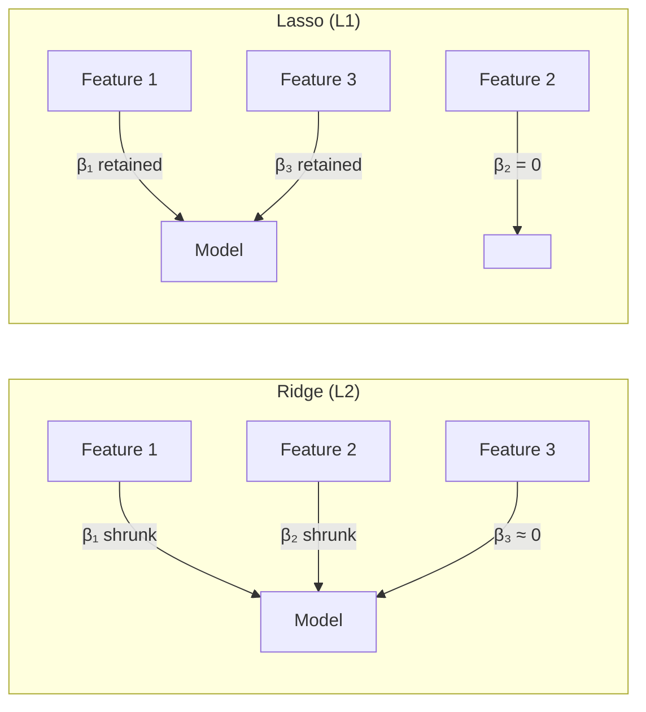
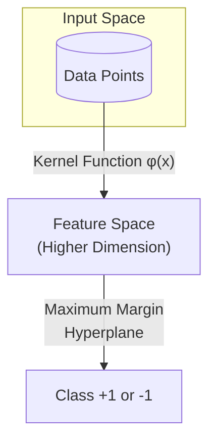
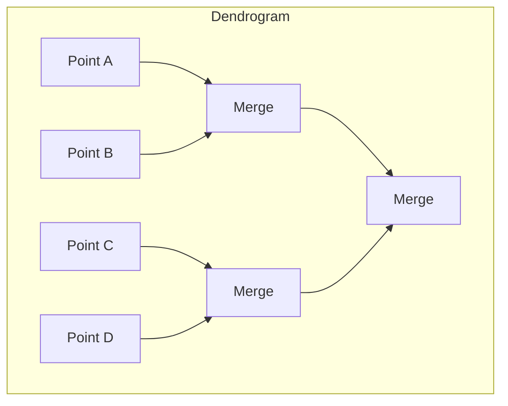
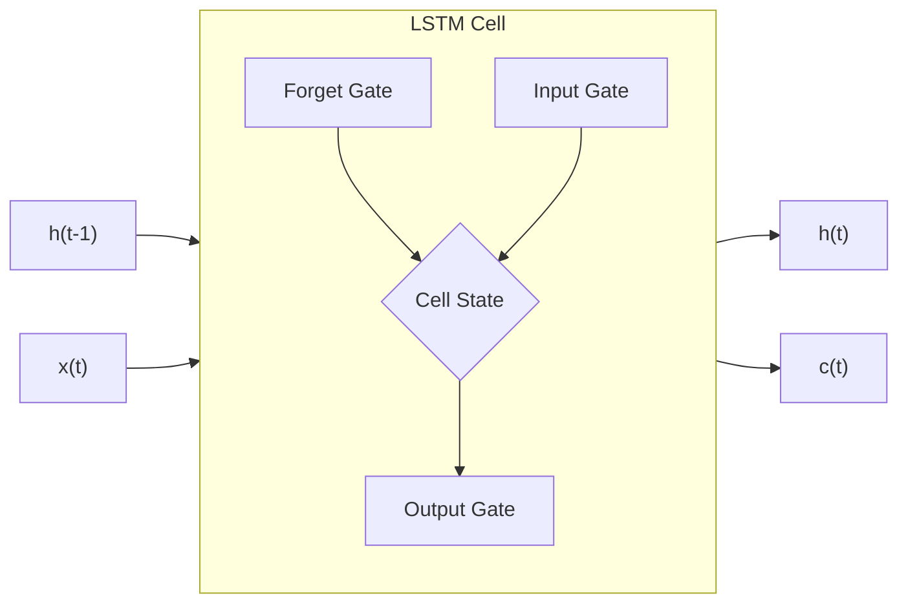

# Machine Learning — Sample Paper 1 — Ideal Solution

---

## Unit III — Supervised Learning: Regression

### Q1(a) — Linear Regression and OLS Derivation

**Linear Regression** is defined as a supervised learning algorithm that models the relationship
between a dependent variable Y and one or more independent variables X by fitting a linear equation
Y = β₀ + β₁X + ε.

**Ordinary Least Squares (OLS) estimation** finds the coefficients β₀ and β₁ that minimize the sum
of squared residuals:

Minimize: S(β₀, β₁) = Σᵢⁿ₌₁ (yᵢ − β₀ − β₁xᵢ)²

**Derivation**: Take partial derivatives and set to zero.

∂S/∂β₀ = −2 Σ (yᵢ − β₀ − β₁xᵢ) = 0 → β₀ = ȳ − β₁x̄

∂S/∂β₁ = −2 Σ xᵢ(yᵢ − β₀ − β₁xᵢ) = 0 → β₁ = Σ(xᵢ − x̄)(yᵢ − ȳ) / Σ(xᵢ − x̄)²

**Closed-form solution in matrix form**: β = (XᵀX)⁻¹XᵀY

---

### Q1(b) — Overfitting vs Underfitting

**Overfitting** occurs when the model learns noise in the training data, capturing patterns that do
not generalize. **Underfitting** occurs when the model fails to capture the underlying structure of
the data.

| Aspect             | Underfitting                   | Overfitting                          |
| ------------------ | ------------------------------ | ------------------------------------ |
| **Bias**           | High bias                      | Low bias                             |
| **Variance**       | Low variance                   | High variance                        |
| **Training error** | High                           | Near zero                            |
| **Test error**     | High                           | High (gap from training)             |
| **Example**        | Linear model on quadratic data | High-degree polynomial on small data |
| **Cause**          | Model too simple               | Model too complex                    |

**Regularization** mitigates overfitting by adding a penalty term to the loss function: L_total =
L_original + λ||w||. Ridge (L2) shrinks coefficients proportionally; Lasso (L1) can drive
coefficients to zero, performing feature selection.

---

### Q1(c) — Regression Evaluation Metrics

**MAE (Mean Absolute Error)**: MAE = (1/n) Σ|yᵢ − ŷᵢ|

- Measures average absolute deviation
- Robust to outliers, linear penalty
- Same units as target variable

**RMSE (Root Mean Squared Error)**: RMSE = √((1/n) Σ(yᵢ − ŷᵢ)²)

- Measures standard deviation of residuals
- Quadratic penalty — more sensitive to large errors
- Same units as target variable

**R² (Coefficient of Determination)**: R² = 1 − (SS_res / SS_tot)

- Proportion of variance explained by the model
- Ranges from (−∞, 1]; 1 = perfect fit
- Can be artificially inflated by adding features (adjusted R² corrects this)

| Metric | Range   | Sensitivity to Outliers | Interpretation               |
| ------ | ------- | ----------------------- | ---------------------------- |
| MAE    | [0, ∞)  | Low                     | Average absolute error       |
| RMSE   | [0, ∞)  | High                    | Standard deviation of errors |
| R²     | (−∞, 1] | Depends                 | Goodness of fit              |

---

### Q2(a) — Lasso and Ridge Regression

**Ridge Regression (L2)**: L = Σ(yᵢ − ŷᵢ)² + λ Σ wⱼ²

- Shrinks coefficients toward zero but never exactly to zero
- Handles multicollinearity well
- All features retained with reduced magnitude

**Lasso Regression (L1)**: L = Σ(yᵢ − ŷᵢ)² + λ Σ |wⱼ|

- Can drive coefficients exactly to zero (feature selection)
- Produces sparse models
- Preferred when many features are irrelevant

**Effect of λ**:

- λ = 0: standard OLS (may overfit)
- λ → ∞: coefficients → 0 (underfitting)
- Optimal λ found via cross-validation

---

### Q2(b) — Least Squares Regression (Numerical)

**Given**: | X | 2 | 4 | 6 | 8 | 10 | |---|---|---|---|---|---| | Y | 55 | 60 | 68 | 75 | 82 |

n = 5, ΣX = 30, ΣY = 340, ΣXY = 2140, ΣX² = 220

x̄ = 30/5 = 6, ȳ = 340/5 = 68

β₁ = (ΣXY − n·x̄·ȳ) / (ΣX² − n·x̄²) β₁ = (2140 − 5×6×68) / (220 − 5×36) β₁ = (2140 − 2040) / (220
− 180) = 100/40 = **2.5**

β₀ = ȳ − β₁x̄ = 68 − 2.5×6 = 68 − 15 = **53**

**Regression line**: Y = 53 + 2.5X

**Prediction for X = 12**: Y = 53 + 2.5×12 = 53 + 30 = **83**

**Answer**: **Y = 53 + 2.5X, Estimated score for 12 hours = 83**

---

### Q2(c) — Gradient Descent

**Gradient Descent** is an iterative optimization algorithm that minimizes the loss function J(θ) by
moving in the direction of steepest descent: θⱼ := θⱼ − α·(∂/∂θⱼ)J(θ)

**Types of Gradient Descent**:

| Type              | Data per Iteration   | Noise    | Convergence                       | Memory   |
| ----------------- | -------------------- | -------- | --------------------------------- | -------- |
| **Batch GD**      | Entire dataset       | Low      | Smooth, guaranteed                | High     |
| **Stochastic GD** | 1 sample             | High     | Oscillating, escapes local minima | Low      |
| **Mini-batch GD** | k samples (e.g., 32) | Moderate | Good balance                      | Moderate |

**Learning rate α** controls step size:

- α too large: may diverge
- α too small: slow convergence
- Adaptive methods (Adam, RMSProp) adjust α per parameter

---

## Unit IV — Supervised Learning: Classification

### Q3(a) — K-Nearest Neighbors (KNN)

**KNN** is a non-parametric, lazy supervised learning algorithm that classifies a sample based on
the majority class among its K nearest neighbors in the feature space.

**Algorithm**:

1. Choose K and a distance metric (Euclidean, Manhattan, Minkowski)
2. For each test sample, compute distances to all training samples
3. Select K nearest neighbors
4. Assign the majority class label

**Example**: Classify point (3, 4) with K=3. Training: Class A = {(1,2), (2,3)}, Class B = {(5,6),
(7,8)}. Distances: to (1,2)=√8≈2.8, (2,3)=√2≈1.4, (5,6)=√8≈2.8, (7,8)=√41≈6.4. Nearest: (2,3)=A,
(1,2)=A, (5,6)=B → **Class A**.

**Effect of K**: Small K = low bias, high variance (sensitive to noise). Large K = high bias, low
variance (smoother boundaries). K is typically chosen as odd to avoid ties, tuned via
cross-validation.

---

### Q3(b) — Ensemble Learning: Bagging and Boosting

**Ensemble Learning** combines multiple base learners to produce a model with better generalization
than individual learners.

**Bagging (Bootstrap Aggregating)**:

- Train multiple models on bootstrap samples (random sampling with replacement)
- Aggregate predictions: voting (classification), averaging (regression)
- Reduces **variance** without increasing bias
- **Random Forest** = Bagging + random feature subset selection at each split

**Boosting**:

- Train models sequentially, each focusing on misclassified samples from the previous model
- Weighted voting for final prediction
- Reduces **bias** and variance
- Examples: AdaBoost, Gradient Boosting, XGBoost

| Aspect      | Bagging       | Boosting          |
| ----------- | ------------- | ----------------- |
| Training    | Parallel      | Sequential        |
| Bias        | Unchanged     | Reduced           |
| Variance    | Reduced       | Reduced           |
| Overfitting | Less prone    | Can overfit       |
| Example     | Random Forest | AdaBoost, XGBoost |

---

### Q3(c) — Classifier Evaluation Metrics

**Confusion Matrix**:

|                     | Predicted Positive  | Predicted Negative  |
| ------------------- | ------------------- | ------------------- |
| **Actual Positive** | TP (True Positive)  | FN (False Negative) |
| **Actual Negative** | FP (False Positive) | TN (True Negative)  |

- **Accuracy** = (TP + TN) / (TP + TN + FP + FN) — overall correctness
- **Precision** = TP / (TP + FP) — how many selected items are relevant
- **Recall (Sensitivity)** = TP / (TP + FN) — how many relevant items are selected
- **F1-Score** = 2·(Precision·Recall) / (Precision + Recall) — harmonic mean, balances precision and
  recall

**When to use**: F1-score is preferred for imbalanced datasets. Accuracy can be misleading when
classes are skewed (e.g., 95% negative, classifying all as negative gives 95% accuracy but 0% recall
for positive class).

---

### Q4(a) — Binary vs Multiclass Classification

**Binary Classification**: Two mutually exclusive classes (e.g., Spam/Not Spam). Output is a single
probability thresholded at 0.5.

**Multiclass Classification**: Three or more classes (e.g., digit recognition 0-9).

**Strategies for Multiclass**:

| Strategy        | One-vs-All (OvA)               | One-vs-One (OvO)               |
| --------------- | ------------------------------ | ------------------------------ |
| **Classifiers** | k binary classifiers           | k(k-1)/2 binary classifiers    |
| **Training**    | Each class vs rest             | Each pair of classes           |
| **Prediction**  | Highest confidence score       | Majority voting                |
| **Scalability** | Better for large k             | Better for small k             |
| **Example**     | OvA: 10 classifiers for digits | OvO: 45 classifiers for digits |

---

### Q4(b) — Support Vector Machine (SVM)

**SVM** is a supervised classification algorithm that finds the **maximum margin hyperplane** that
best separates classes.

**Key concepts**:

- **Support Vectors**: Data points closest to the decision boundary that define the margin
- **Margin**: Distance between the hyperplane and the nearest support vectors
- **Hard Margin**: Perfectly separable data
- **Soft Margin**: Allows misclassifications (controlled by C parameter)

**Kernel Trick**: Maps data to higher-dimensional space without explicit computation:

- Linear: K(x,y) = x·y
- Polynomial: K(x,y) = (x·y + c)ᵈ
- RBF (Gaussian): K(x,y) = exp(−γ||x−y||²)

---

### Q4(c) — Handling Imbalanced Data

**Imbalanced data** occurs when classes have significantly different sample sizes. Common
techniques:

1. **Random Oversampling**: Duplicate samples from minority class
2. **Random Undersampling**: Remove samples from majority class
3. **SMOTE (Synthetic Minority Over-sampling Technique)**: Create synthetic samples by interpolating
   between minority class neighbors
4. **Cost-sensitive Learning**: Assign higher misclassification cost to minority class
5. **Ensemble Methods**: Balanced Random Forest, EasyEnsemble

| Method         | Advantage                           | Disadvantage                  |
| -------------- | ----------------------------------- | ----------------------------- |
| Oversampling   | No information loss                 | Risk of overfitting           |
| Undersampling  | Reduces training time               | Loses potentially useful data |
| SMOTE          | Creates realistic synthetic samples | May create noisy samples      |
| Cost-sensitive | No data modification                | Requires domain-specific cost |

---

## Unit V — Unsupervised Learning

### Q5(a) — K-Means Clustering

**K-Means** is a partition-based clustering algorithm that groups data into K clusters by minimizing
within-cluster variance.

**Steps**:

1. Initialize K centroids
2. Assign each point to nearest centroid
3. Recompute centroids as mean of assigned points
4. Repeat steps 2-3 until convergence

**Given points**: A(1,2), B(2,1), C(4,5), D(5,4), E(7,8) **Initial centroids**: C1 = (1,1), C2 =
(5,5)

**Iteration 1**:

- Distances to C1: A(√1=1), B(√1=1), C(√25=5), D(√25=5), E(√85=9.2)
- Distances to C2: A(√25=5), B(√25=5), C(√1=1), D(√1=1), E(√13=3.6)
- Cluster 1: {A, B}, Cluster 2: {C, D, E}
- New C1 = ((1+2)/2, (2+1)/2) = (1.5, 1.5)
- New C2 = ((4+5+7)/3, (5+4+8)/3) = (5.33, 5.67)

**Iteration 2**:

- Distances to C1(1.5,1.5): A(√0.5=0.7), B(√0.5=0.7), C(√26=5.1), D(√24.5=4.95), E(√67.3=8.2)
- Distances to C2(5.33,5.67): A(√32.2=5.7), B(√33.2=5.8), C(√1.1=1.05), D(√2.8=1.67), E(√8.2=2.86)
- Cluster 1: {A, B}, Cluster 2: {C, D, E} — **No change, converged**

**Answer**: **Cluster 1 = {A, B} centroid (1.5, 1.5), Cluster 2 = {C, D, E} centroid (5.33, 5.67)**

---

### Q5(b) — Outlier Analysis

**Outlier Analysis** is the process of identifying data points that deviate significantly from the
majority of data.

**Importance**: Outliers can indicate errors (data entry, sensor malfunction), fraud (credit card
transactions), or novel discoveries (medical anomalies).

**Detection Methods**:

- **Isolation Forest**: Randomly partitions data; outliers require fewer partitions to isolate
- **Local Outlier Factor (LOF)**: Measures local density deviation — outliers have lower density
  than neighbors
- **Z-Score**: Points beyond 3 standard deviations from mean
- **IQR**: Points below Q1−1.5×IQR or above Q3+1.5×IQR

| Method           | Advantage                     | Disadvantage               |
| ---------------- | ----------------------------- | -------------------------- |
| Z-Score          | Simple, interpretable         | Assumes normality          |
| IQR              | Distribution-free             | Ignores local patterns     |
| LOF              | Detects local outliers        | Sensitive to parameter k   |
| Isolation Forest | Efficient for high dimensions | Random (non-deterministic) |

---

### Q5(c) — Elbow Method

**Elbow Method** is a heuristic for determining the optimal number of clusters K in K-Means.

**Procedure**:

1. Compute K-Means for K = 1 to K_max
2. Plot **Within-Cluster Sum of Squares (WCSS)** against K
3. Choose K where WCSS starts to decrease linearly (the "elbow point")

**Silhouette Score** measures how similar a point is to its own cluster vs neighboring clusters,
ranging from -1 to 1. Higher values indicate better-defined clusters. It complements the elbow
method by providing a quantitative validation of cluster quality.

---

### Q6(a) — Hierarchical Clustering

**Agglomerative Hierarchical Clustering** builds a hierarchy by iteratively merging the closest pair
of clusters.

**Linkage criteria**:

- **Single-linkage**: Distance between closest members of clusters — produces chain-like clusters
- **Complete-linkage**: Distance between farthest members — produces compact clusters
- **Average-linkage**: Average of all pairwise distances — balances the two

---

### Q6(b) — DBSCAN

**DBSCAN (Density-Based Spatial Clustering of Applications with Noise)** groups points that are
closely packed together, marking points in low-density regions as noise.

**Parameters**: ε (neighborhood radius), minPts (minimum points to form a dense region)

**Properties**:

- Can find arbitrarily shaped clusters
- Automatically identifies noise points
- No need to specify number of clusters
- Struggles with varying density clusters

| Aspect     | K-Means                       | DBSCAN                  |
| ---------- | ----------------------------- | ----------------------- |
| Shape      | Spherical only                | Arbitrary shapes        |
| Noise      | Forces all points to clusters | Explicit noise handling |
| K          | Must specify                  | Automatic               |
| Parameters | K                             | ε, minPts               |

---

## Unit VI — Introduction to Neural Networks

### Q7(a) — Activation Functions

**Activation functions** introduce non-linearity into neural networks, enabling them to learn
complex patterns.

**Sigmoid**: f(x) = 1/(1+e⁻ˣ), range (0,1) — used in binary classification output **Tanh**: f(x) =
2σ(2x)−1 = (eˣ−e⁻ˣ)/(eˣ+e⁻ˣ), range (−1,1) — zero-centered, better gradient flow **ReLU**: f(x) =
max(0,x), range [0,∞) — most common in hidden layers, avoids vanishing gradient **Softmax**: f(xᵢ) =
eˣⁱ/Σⱼeˣʲ — multiclass probability output

| Function | Range | Gradient | Use Case | | -------- | ------ | -------------------------- |
----------------------- | --- | ------------- | | Sigmoid | (0,1) | Vanishes for large | x | |
Binary output | | Tanh | (-1,1) | Vanishes but zero-centered | Hidden layers | | ReLU | [0,∞) | 0 or
1 (no vanish) | Hidden layers (default) | | Softmax | (0,1) | Full Jacobian | Multiclass output |

---

### Q7(b) — Recurrent Neural Networks and LSTM

**RNN** is a neural network architecture designed for sequential data, maintaining a hidden state
that captures information from previous time steps: hₜ = tanh(Wₕₕhₜ₋₁ + Wₓₕxₜ + bₕ)

**Example**: Language modeling — given "the cat sat on the \_\_\_", RNN predicts "mat" using context
from previous words.

**Vanishing Gradient Problem**: During backpropagation through time (BPTT), gradients can
exponentially diminish, preventing the network from learning long-range dependencies.

**LSTM (Long Short-Term Memory)** addresses this with:

- **Forget gate**: Decides what to discard from cell state
- **Input gate**: Decides what new information to store
- **Output gate**: Decides what to output based on cell state
- **Cell state**: Maintains information over long sequences

---

### Q7(c) — CNN Architecture

```mermaid
flowchart LR
    Input["Input Image<br/>32×32×3"] --> Conv["Convolutional Layer<br/>Filters: 6×5×5<br/>→ 28×28×6"]
    Conv --> ReLU["ReLU Activation"]
    ReLU --> Pool["Pooling Layer<br/>Max Pool 2×2<br/>→ 14×14×6"]
    Pool --> Conv2["Convolutional Layer<br/>Filters: 16×5×5<br/>→ 10×10×16"]
    Conv2 --> ReLU2["ReLU Activation"]
    ReLU2 --> Pool2["Pooling Layer<br/>2×2 → 5×5×16"]
    Pool2 --> FC1["Fully Connected<br/>120 neurons"]
    FC1 --> FC2["Fully Connected<br/>84 neurons"]
    FC2 --> Output["Output Layer<br/>10 classes (Softmax)"]
```

**Convolutional Layer**: Applies learnable filters (kernels) to detect features (edges, textures).
Stride and padding control output dimensions.

**Pooling Layer**: Reduces spatial dimensions, providing translation invariance. Max pooling retains
strongest activation; average pooling smooths features.

**Fully Connected Layer**: Combines extracted features for final classification.

---

### Q8(a) — Backpropagation vs Feedforward

**Feedforward Network**: Information flows in one direction — input → hidden → output. No feedback
connections. Used for static pattern mapping.

**Backpropagation Network**: Same architecture but trained using backpropagation — an algorithm that
computes gradients of the loss with respect to weights using the **chain rule**.

| Aspect        | Feedforward                 | Backpropagation     |
| ------------- | --------------------------- | ------------------- |
| Direction     | Forward only                | Forward + backward  |
| Weight update | Not applicable              | Gradient descent    |
| Learning      | Requires external algorithm | Integrated training |
| Purpose       | Inference                   | Training            |

**Backpropagation algorithm**:

1. Forward pass: compute predictions and loss
2. Backward pass: compute ∂L/∂w for each layer
3. Update: w = w − η·∂L/∂w

---

### Q8(b) — Padding in CNNs

**Padding** adds extra pixels around the input boundary to control the output spatial dimensions.

**Valid Padding**: No padding. Output size = n − f + 1 (where n=input size, f=filter size). Output
is smaller than input.

**Same Padding**: Pad such that output size equals input size. p = (f−1)/2. Zero-padding is most
common.

**Effect**: Without padding, each convolution shrinks the spatial dimensions and loses edge
information. Same padding preserves size and edge features.

---

### Q8(c) — Convolutional and Pooling Layers

**i) Convolutional Layer**: Applies a set of learnable filters (kernels) that slide across the
input. Each filter detects specific features — early layers detect edges, later layers detect
complex patterns. Parameters: filter size, stride, padding, number of filters.

**ii) Pooling Layer**: Down-samples feature maps:

- **Max Pooling**: Outputs maximum value in each window — preserves strongest features
- **Average Pooling**: Outputs average value — preserves overall information
- **Global Pooling**: Reduces entire feature map to a single value

Pooling reduces computational load, controls overfitting, and provides translation invariance.

---

═══════════════════════════════════════════════════════ **EXAMINER COMMENTARY** **Why this scores
full marks**: Each answer follows the definition → explanation → example/closing structure.
Numerical parts show all steps with boxed answers. Comparisons use tables with minimum 3 bases.
Diagrams are embedded where structural. **Common Deductions**:

- Regression derivation without showing gradient steps or partial derivatives
- K-Means without showing distance calculations for each iteration
- Confusion matrix without explanation of TP/TN/FP/FN
- Activation functions listed without mathematical expressions
- CNN architecture drawn without labeling all layers **Time Budget**:
- Q1/Q2 (18 marks): 42 min
- Q3/Q4 (17 marks): 40 min
- Q5/Q6 (18 marks): 42 min
- Q7/Q8 (17 marks): 38 min ═══════════════════════════════════════════════════════
