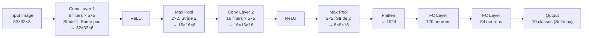
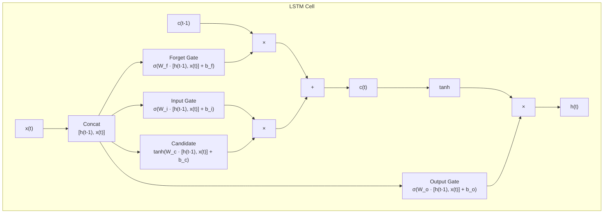
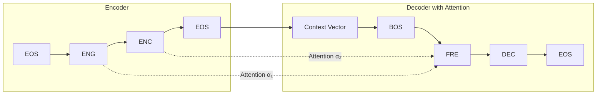
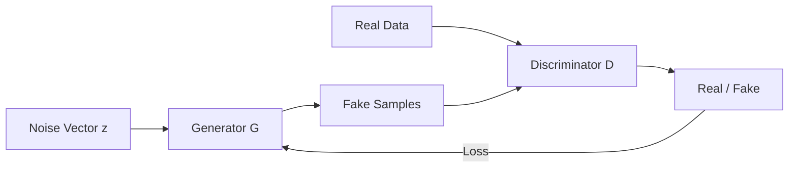
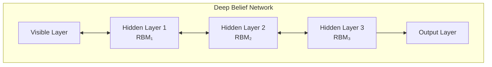

# Deep Learning — Sample Paper 1 — Ideal Solution

---

## Unit III — Convolution Neural Network

### Q1(a) — CNN Architecture

**CNN** is a deep neural network architecture designed for processing grid-like data (images), using convolution operations to automatically learn spatial hierarchies of features.



**Role of each layer**:
1. **Input Layer**: Raw pixel values (height × width × channels)
2. **Convolutional Layer**: Learns feature maps by sliding filters across input
3. **Activation Layer (ReLU)**: Introduces non-linearity
4. **Pooling Layer**: Reduces spatial dimensions, provides translation invariance
5. **Fully Connected Layer**: Combines high-level features for classification
6. **Output Layer**: Softmax produces class probabilities

---

### Q1(b) — Working of Convolution Layer

**Convolution Layer** applies learnable filters (kernels) that slide across the input to produce feature maps.

**Operation**: Each filter computes the dot product between its weights and a local region of the input. Multiple filters produce multiple feature maps.

**Output dimension formula**: O = ⌊(n − f + 2p) / s⌋ + 1

Where n = input size, f = filter size, p = padding, s = stride

**Feature extraction**: Early layers detect low-level features (edges, corners). Deeper layers combine these into high-level features (shapes, objects, faces).

**Stride** controls how much the filter shifts each step. Larger stride = smaller output.
**Padding** adds zeros around the input to preserve spatial dimensions.
- Valid padding (p=0): output shrinks
- Same padding (p=(f-1)/2): output same size as input

---

### Q1(c) — Pooling Layers

**Pooling** is a down-sampling operation that reduces spatial dimensions and provides translation invariance.

**Types**:
- **Max Pooling**: Takes maximum value in each window. Preserves strongest activations. Most common.
- **Average Pooling**: Takes average value. Smoother, preserves background information.
- **Global Pooling**: Reduces entire feature map to a single value. Used before final FC layers.

| Type | Operation | Preservation | Use Case |
|------|-----------|-------------|----------|
| Max Pool | Maximum | Edge/texture features | Hidden layers |
| Average Pool | Mean | Overall signal | Transition layers |
| Global Pool | Mean over entire map | Channel importance | Before output |

**Max Pooling** is preferred in most architectures because it selects the most important features and provides better translation invariance.

---

### Q2(a) — Features of Pooling Layer

**Pooling Layer** provides:
1. **Dimensionality reduction**: Reduces spatial size, lowering computational cost
2. **Translation invariance**: Small shifts in input produce same pooled output
3. **Overfitting prevention**: Fewer parameters reduce model capacity
4. **Receptive field increase**: Subsequent layers see larger portions of input
5. **Feature selection**: Max pooling retains dominant features

---

### Q2(b) — Local Response Normalization (LRN)

**LRN** is a normalization technique that creates competition among neuron outputs computed by different filters at the same spatial location.

**Formula**: bᵢˣʸ = aᵢˣʸ / (k + α Σⱼ₌ₘₐₓ⁽⁰ⁱ⁻ⁿ/²⁾... min⁽ᴺ⁻¹ⁱ⁺ⁿ/²⁾ (aⱼˣʸ)²)ᵝ

Where aᵢˣʸ is the output of filter i at position (x,y), and N is the total number of filters.

**Effect**: LRN encourages lateral inhibition — strongly activated neurons suppress nearby neurons, promoting feature diversity.

| Aspect | LRN | Batch Normalization |
|--------|-----|-------------------|
| Scope | Across channels | Across batch |
| Normalization | Per spatial location | Per feature |
| Location | After activation | Before or after activation |
| Modern usage | Rare (AlexNet era) | Standard in modern CNNs |

**Batch Normalization** has largely replaced LRN as it enables higher learning rates, reduces internal covariate shift, and provides regularization.

---

### Q2(c) — ReLU Layer

**ReLU (Rectified Linear Unit)**: f(x) = max(0, x)

**Advantages over Sigmoid/Tanh**:
1. **Computational efficiency**: Simple threshold operation vs exponential
2. **No vanishing gradient**: Gradient = 1 for positive inputs, 0 for negative
3. **Sparse activation**: Only positive neurons fire
4. **Faster convergence**: Empirically 6× faster than Tanh

**Dying ReLU problem**: When many inputs are negative, ReLU neurons can permanently die (output = 0, gradient = 0) for all inputs, never recovering.

**Solution — Leaky ReLU**: f(x) = max(αx, x) where α is a small constant (e.g., 0.01). Provides a small gradient for negative inputs, preventing dead neurons.

---

## Unit IV — Recurrent Neural Network

### Q3(a) — Recursive vs Recurrent Neural Networks

**Recursive Neural Network** operates on hierarchical structures (trees) by recursively applying the same weight matrix to child nodes. Used for natural language parsing and compositional semantics.

**RNN** operates on sequential data (chains) by applying the same transition function at each time step.

| Aspect | Recursive NN | Recurrent NN |
|--------|-------------|--------------|
| **Structure** | Tree | Chain |
| **Data type** | Hierarchical (parse trees) | Sequential (time series) |
| **Weight sharing** | Across nodes in tree | Across time steps |
| **Application** | Sentiment analysis of phrases | Language modeling |
| **Backprop** | Through structure (BPTS) | Through time (BPTT) |

---

### Q3(b) — LSTM Architecture

**LSTM (Long Short-Term Memory)** is a gated RNN architecture designed to capture long-range dependencies by controlling information flow through three gates.



**Forget gate**: Decides which information to discard from cell state
**Input gate**: Decides which new information to store in cell state
**Output gate**: Decides what to output based on cell state

---

### Q3(c) — Working of RNN

**RNN** processes sequential data by maintaining a hidden state that captures information from previous time steps.

**Hidden state update**: hₜ = tanh(Wₕₕhₜ₋₁ + Wₓₕxₜ + bₕ)

The **hidden state hₜ** acts as memory, carrying information across time steps. It is updated at each step based on the previous hidden state and current input.

**Variable-length sequences**: RNNs handle variable-length inputs by processing one token at a time, updating the hidden state. The final hidden state (or all hidden states) can be used for downstream tasks. Padding or bucketing handles batch processing of different-length sequences.

---

### Q4(a) — CNN vs RNN

| Aspect | CNN | RNN |
|--------|-----|-----|
| **Data** | Grid (images, 2D/3D) | Sequence (text, time series) |
| **Connection** | Feedforward | Recurrent (feedback loops) |
| **Weight sharing** | Across spatial locations | Across time steps |
| **Memory** | No internal state | Hidden state as memory |
| **Parallelization** | High (independent patches) | Low (sequential dependence) |
| **Use case** | Image classification, object detection | Language modeling, translation |
| **Gradient flow** | Stable | Vanishing/exploding (BPTT) |

---

### Q4(b) — Long-Term Dependencies and Gradient Problems

**Long-term dependencies**: RNNs struggle to learn patterns separated by many time steps because gradient signals decay or explode through repeated multiplication.

**Vanishing gradients**: During backpropagation through time (BPTT), gradients are multiplied by Wₕₕ at each step. If Wₕₕ's eigenvalues < 1, gradients → 0 exponentially, and early time steps receive negligible gradient updates.

**Exploding gradients**: If eigenvalues > 1, gradients → ∞. Addressed by gradient clipping.

**Gated architectures (LSTM/GRU)** alleviate vanishing gradients through:
- **Cell state**: Direct linear connection across time (not squashed by activation)
- **Gates**: Learn to control information flow (forget irrelevant information, retain relevant)
- **Additive gradients**: Error signals flow through the cell state without repeated non-linear transformations

---

### Q4(c) — Encoder-Decoder with Attention

**Encoder-Decoder (Seq2Seq)**: An architecture for mapping variable-length input sequences to variable-length output sequences.

- **Encoder RNN**: Reads input sequence and produces a context vector (final hidden state)
- **Decoder RNN**: Generates output sequence conditioned on the context vector and previous outputs

**Machine translation**: English "I am a student" → Encoder → context vector → Decoder → "Je suis étudiant"

**Attention mechanism**: Instead of compressing the entire input into a single context vector, attention allows the decoder to focus on relevant parts of the input at each step. Attention weights compute alignment between decoder state and all encoder hidden states.



---

## Unit V — Deep Generative Models

### Q5(a) — Deep Generative Models

**Deep Generative Models** learn the joint probability distribution P(X, Y) of the data, enabling them to generate new samples from the learned distribution.

**Difference from discriminative models**: Discriminative models learn P(Y|X) — the decision boundary. Generative models learn the full data distribution P(X), enabling sampling of new data.

**Applications**: Image generation (DALL-E, Stable Diffusion), data augmentation (generating synthetic training data), anomaly detection, super-resolution, text-to-image synthesis.

---

### Q5(b) — Boltzmann Machine

**Boltzmann Machine** is a stochastic recurrent neural network where neurons are connected symmetrically, learning internal representations from binary data.

**Energy function**: E(v, h) = −Σᵢvᵢbᵢ − Σⱼhⱼcⱼ − ΣᵢΣⱼvᵢwᵢⱼhⱼ

Where v = visible units, h = hidden units, w = connection weights, b, c = biases.

**Training**: Contrastive Divergence minimizes the energy of observed data while maximizing the energy of unobserved configurations.

**RBM (Restricted Boltzmann Machine)** removes connections between visible-visible and hidden-hidden, forming a bipartite graph. This enables efficient Gibbs sampling and tractable inference. RBMs can be stacked to form Deep Belief Networks.

| Aspect | Boltzmann Machine | Restricted BM |
|--------|------------------|---------------|
| Connections | Visible-visible, hidden-hidden, visible-hidden | Only visible-hidden |
| Inference | Intractable for large networks | Tractable (conditional independence) |
| Training | Slow (MCMC) | Efficient (CD-k) |
| Use | Theoretical foundation | Building block for DBNs |

---

### Q5(c) — Generative Adversarial Network (GAN)

**GAN** consists of two networks trained adversarially: a **Generator** G that creates fake data, and a **Discriminator** D that distinguishes real from fake.



**Minimax objective**: min_G max_D V(D,G) = Eₓ~ₚdata[log D(x)] + E_𝓏~ₚ𝓏[log(1 − D(G(z)))]

**Training process**: Alternate between updating D (distinguish real from fake) and G (fool D). Convergence occurs when G generates data indistinguishable from real and D outputs 1/2.

**Example — MNIST generation**: G takes random noise (100-dim) → deconvolution layers → 28×28 image. D takes 28×28 image → convolution layers → binary classification.

---

### Q6(a) — Deep Belief Networks (DBN)

**DBN** is a generative model composed of stacked RBMs, where each RBM's hidden layer serves as the visible layer for the next RBM.

**Greedy layer-wise pretraining**:
1. Train RBM₁ (visible = input, hidden = h₁) using Contrastive Divergence
2. Freeze RBM₁ weights, train RBM₂ (visible = h₁, hidden = h₂)
3. Repeat for each layer
4. Fine-tune all layers using supervised backpropagation



**Benefits**: Pretraining initializes weights near a good solution, preventing poor local minima and enabling deeper networks.

---

### Q6(b) — GAN Components

**Generator G(z)**: Maps latent noise z (random vector) to data space. Uses transposed convolutions. Learns to produce realistic samples. Goal: maximize D(G(z)) such that D classifies it as real.

**Discriminator D(x)**: Binary classifier distinguishing real from generated data. Uses convolutional layers. Outputs probability of realness. Goal: maximize D(x) for real x, minimize D(G(z)).

**Training loop**: For each iteration: (1) Sample real batch + noise batch. (2) Update D: ∇θ_D[log D(x) + log(1 − D(G(z)))]. (3) Update G: ∇θ_G[log D(G(z))]. Repeat until Nash equilibrium.

---

### Q6(c) — Types of GAN

**DCGAN (Deep Convolutional GAN)**: Uses convolutional layers (instead of MLPs) for both G and D. Introduces batch normalization, strided convolutions, and no fully connected layers. Significantly improves training stability.

**Conditional GAN (cGAN)**: Both G and D receive additional conditioning information (class labels, text). Enables controlled generation: generate images of a specific class.

**CycleGAN**: Enables image-to-image translation without paired examples (e.g., zebra ↔ horse). Uses cycle consistency loss: translating zebra→horse→zebrafish should reconstruct the original.

| GAN Type | Input | Key Feature | Application |
|----------|-------|-------------|-------------|
| DCGAN | Noise + Convolutions | Stable convolutional architecture | Image generation |
| cGAN | Noise + Condition | Controlled generation | Text-to-image |
| CycleGAN | Image A | Cycle consistency loss | Style transfer |

---

## Unit VI — Reinforcement Learning

### Q7(a) — Markov Decision Process (MDP)

**MDP** is a mathematical framework for modeling sequential decision-making problems.

**Components**: (S, A, P, R, γ)
- S: Set of states (environment configurations)
- A: Set of actions (agent choices)
- P(s'|s,a): Transition probability — probability of reaching s' from s after action a
- R(s,a,s'): Reward function — immediate reward received
- γ ∈ [0,1]: Discount factor (weights near vs far rewards)

**Policy π(a|s)**: Maps states to action probabilities.

**Value Iteration**: Iteratively updates state values: Vₖ₊₁(s) = maxₐ Σ_{s'} P(s'|s,a)[R(s,a,s') + γVₖ(s')], converging to optimal V*.

**Policy Iteration**: Alternates between policy evaluation (computing V for current π) and policy improvement (updating π greedily with respect to V).

---

### Q7(b) — Deep Reinforcement Learning

**Deep RL** combines deep neural networks with RL to handle high-dimensional state spaces (e.g., raw pixels from games) where traditional tabular RL is infeasible.

**Limitations addressed**: Traditional RL requires discrete state spaces and hand-crafted features. Deep RL learns feature representations automatically from raw input.

**DQN (Deep Q-Network)**: Uses a CNN to approximate the Q-function Q(s,a; θ), taking raw game frames as input and outputting Q-values for each action.

---

### Q7(c) — Challenges of RL

1. **Exploration-exploitation tradeoff**: Agent must balance exploring unknown actions (gathering information) vs exploiting known high-reward actions. ε-greedy, UCB, and Thompson sampling address this.

2. **Delayed rewards**: Actions may affect rewards many steps later (e.g., winning a chess game). Credit assignment is difficult. Discounted returns help but don't fully solve it.

3. **Sample efficiency**: Deep RL requires millions of interactions with the environment. Model-based RL and offline RL aim to improve sample efficiency.

4. **Reward design**: Poorly designed reward functions can lead to unintended behaviors (reward hacking).

---

### Q8(a) — Deep Q-Learning

**Deep Q-Learning** approximates the optimal action-value function Q*(s,a) using a neural network.

**Q-learning update rule**: Q(s,a) ← Q(s,a) + α[r + γ max_{a'} Q(s',a') − Q(s,a)]

**DQN improvements**:
1. **Experience replay**: Stores transitions (s,a,r,s') in a replay buffer. Samples mini-batches randomly during training. Breaks correlation between consecutive samples, improving stability.
2. **Target network**: A separate network Q̂ (with fixed parameters θ⁻) computes target Q-values. θ⁻ is periodically updated to match the online network θ. Reduces oscillations during training.

```mermaid
flowchart TD
    Env[Environment] -->|"(s,a,r,s')"| Buffer[Replay Buffer]
    Buffer -->|"Random Batch"| Online[Online Network<br/>Q(s,a;θ)]
    Online -->|"Loss L = (r + γQ̂(s',a') − Q(s,a))²"| Update[Update θ]
    Update -->|"Every C steps"| Target[Target Network<br/>Q̂(s,a;θ⁻)]
    Target --> LossCalc[Compute Target]
```

---

### Q8(b) — RL for Tic-Tac-Toe

**Tic-Tac-Toe modeled as MDP**:
- **States**: Board configurations (3×3 grid, each cell = empty/X/O)
- **Actions**: Place a marker in an empty cell
- **Transitions**: Deterministic (opponent's move is part of environment dynamics)
- **Rewards**: +1 for win, −1 for loss, 0 for draw, −0.1 for each move (encourage shorter wins)
- **Discount factor**: γ = 1 (finite horizon)

**Learning process**: Agent plays against itself (self-play) or a fixed opponent. Q-values are updated using the Q-learning rule after each move. After training (~10000 games), the agent converges to optimal play (never loses).

---

### Q8(c) — Dynamic Programming for RL

**Dynamic Programming (DP)** methods solve MDPs when the model (transition probabilities and rewards) is fully known.

**Policy Evaluation**: Compute V_π(s) for a given policy π using Bellman expectation backup: Vₖ₊₁(s) = Σₐ π(a|s) Σ_{s'} P(s'|s,a)[R(s,a,s') + γVₖ(s')]

**Policy Improvement**: Generate a better policy π' from V_π: π'(s) = argmaxₐ Σ_{s'} P(s'|s,a)[R(s,a,s') + γV_π(s')]

**Policy Iteration**: Eval → Improve → Eval → Improve ... until convergence to optimal π*.

---

═══════════════════════════════════════════════════════
**EXAMINER COMMENTARY**
**Why this scores full marks**: Architecture diagrams are comprehensive with all layers labeled. LSTM cell diagram shows internal gate structure. Code-equivalent logic is explained stepwise. Mathematical formulations (energy functions, Q-learning updates) are included. Comparison tables have minimum 3 bases.
**Common Deductions**:
- CNN architecture drawn without fully connected layers
- LSTM explained textually without gate diagram
- GAN training described without the minimax objective
- DBN construction without explaining greedy pretraining
- RL algorithms described without Bellman equation reference
**Time Budget**:
- Q1/Q2 (18 marks): 42 min
- Q3/Q4 (17 marks): 40 min
- Q5/Q6 (18 marks): 42 min
- Q7/Q8 (17 marks): 38 min
═══════════════════════════════════════════════════════
