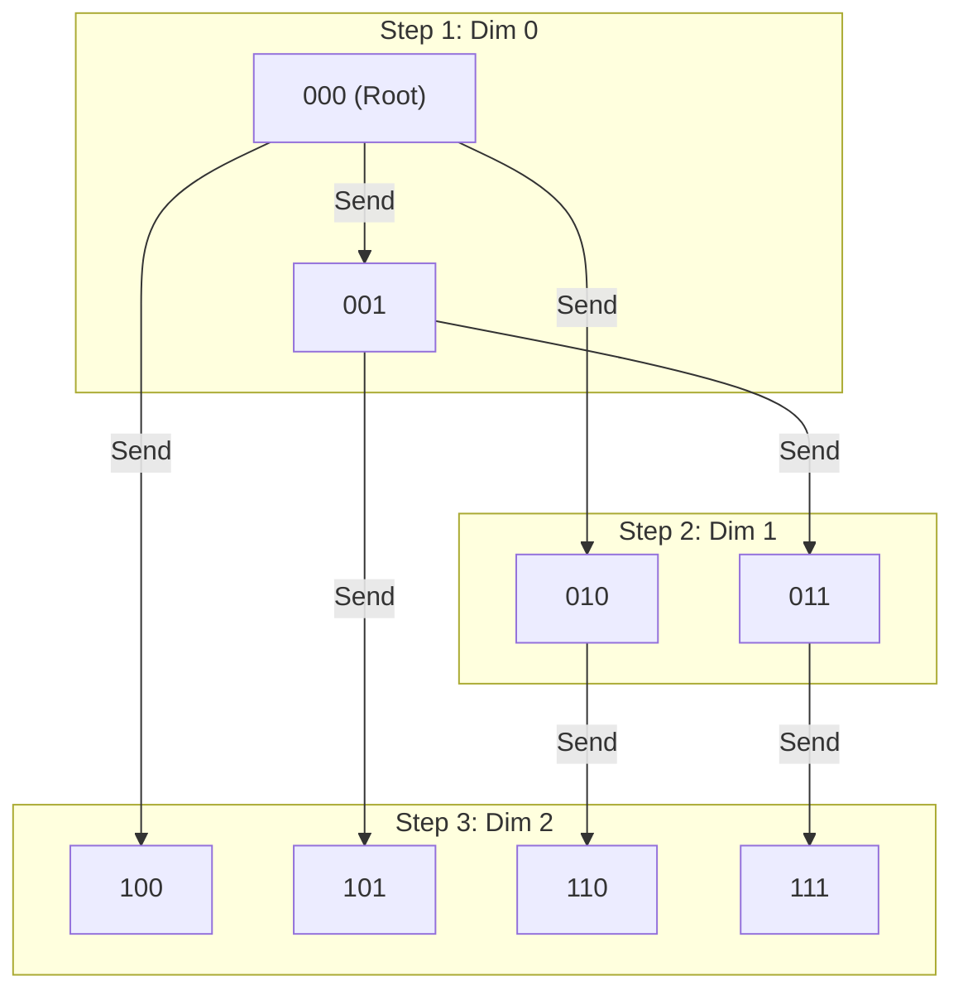
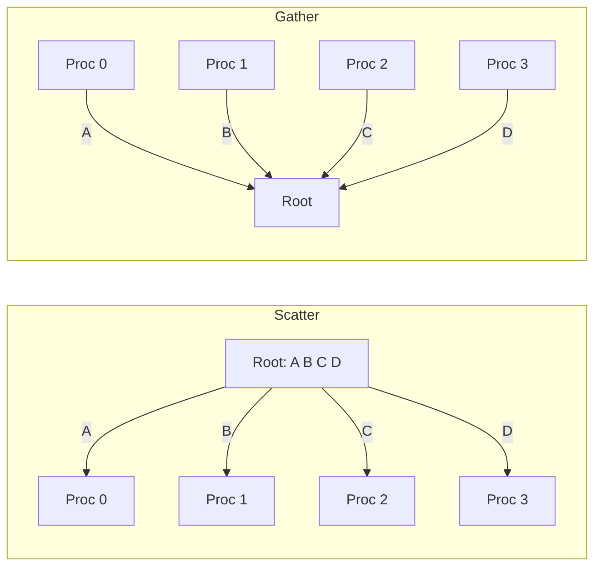
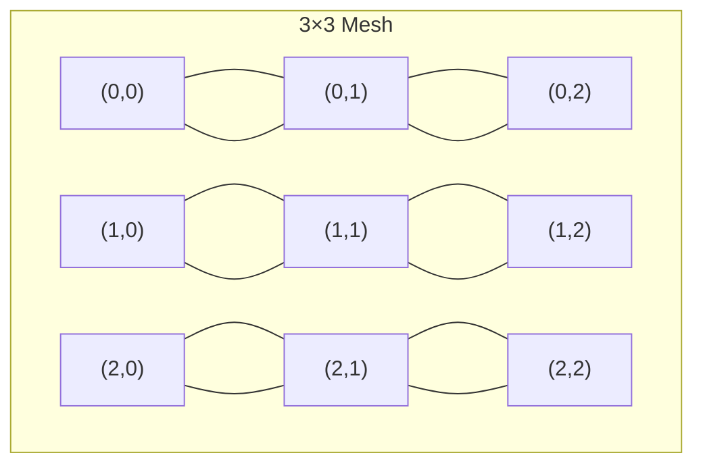
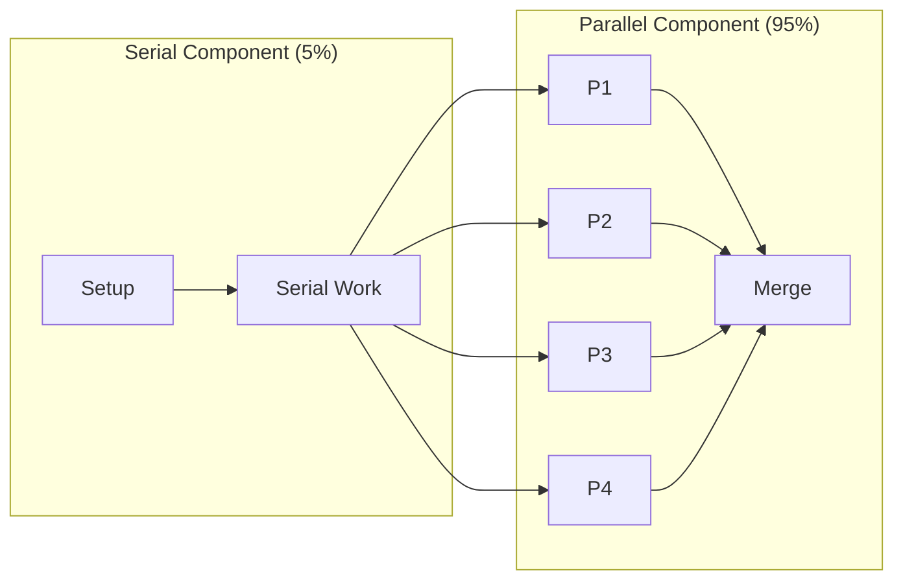
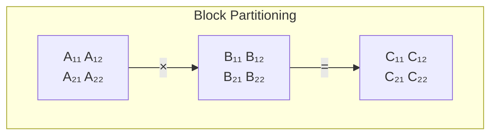
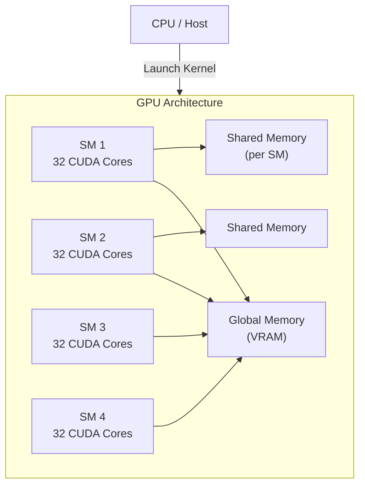
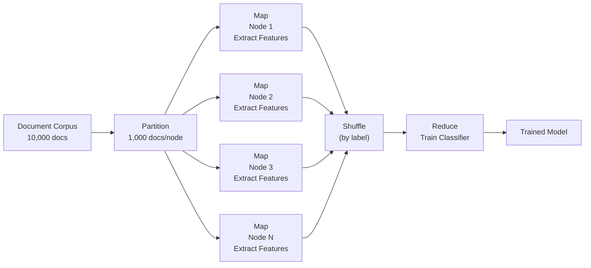

# High Performance Computing — Sample Paper 1 — Ideal Solution

---

## Unit III — Parallel Communication

### Q1(a) — Broadcast and Reduce Operations

**One-to-All Broadcast**: A single source node sends the same data to all other nodes. Data flows from root through a communication structure (hypercube, tree, mesh).

**All-to-One Reduction**: Each node contributes data, which is combined (sum, max, min, logical AND) at a single destination node.

**8-node hypercube (dimension 3)**:



**Broadcast in 3D hypercube**: 3 steps (log₂8 = 3). Communication time = (log₂p) × (t_s + t_w × m), where t_s = startup, t_w = per-word, m = message size.

**Reduce is the reverse**: Each node sends partial result; reduce operation (e.g., sum) applied at each step.

| Operation | Direction | Combining | Result |
|-----------|-----------|-----------|--------|
| Broadcast | One → All | Copy | All receive data |
| Reduce | All → One | +, ×, max, min, AND | Root receives combined result |

---

### Q1(b) — Scatter and Gather

**Scatter**: Root sends a distinct portion of data to each process (vs broadcast which sends the same data to all).

**Gather**: Each process sends data to root; root collects all data into one array (vs reduce which combines values).



**MPI signatures**:
- `MPI_Scatter(sendbuf, sendcount, sendtype, recvbuf, recvcount, recvtype, root, comm)`
- `MPI_Gather(sendbuf, sendcount, sendtype, recvbuf, recvcount, recvtype, root, comm)`
- `MPI_Bcast(buffer, count, datatype, root, comm)`
- `MPI_Reduce(sendbuf, recvbuf, count, datatype, op, root, comm)`

---

### Q1(c) — Circular Shift on a Mesh

**Circular Shift** moves data by k positions along each dimension of a mesh. On a √p × √p mesh:

**Algorithm**: 
1. All processors perform a shift along rows by k mod √p
2. All processors perform a shift along columns by ⌊k/√p⌋

**Example**: 4×4 mesh, k = 5: shift by 1 column (5 mod 4 = 1) then 1 row (5/4 = 1).

Communication cost = t_s·(√p − 1) + t_w·m·(√p − 1) for each dimension.

---

### Q2(a) — Prefix-Sum (Scan) on Hypercube

**Prefix-sum (Scan)**: Each node i computes the sum of values from nodes 0 to i.

**On 8-node hypercube**:
Given values at nodes 0-7: [a₀, a₁, a₂, a₃, a₄, a₅, a₆, a₇]

**Step 1** (dim=0): Each node at distance 1 sends its value. Node i receives from i⊕1.
- After: Node 0 has a₀; Node 1 has a₀+a₁; Node 2 has a₂; Node 3 has a₂+a₃...

**Step 2** (dim=1): Nodes at distance 2 exchange.
**Step 3** (dim=2): Nodes at distance 4 exchange.

After 3 steps (log₂8): Each node i has the prefix sum up to i.

**Complexity**: O(log p) communication steps, O(p) computation.

---

### Q2(b) — Broadcast and Reduction on Ring

**One-to-All Broadcast on Ring**: Root sends to neighbor → each node receives and forwards. For p processors:
- Communication time = (p − 1) × (t_s + t_w × m)
- Bottleneck: sequential propagation

**All-to-One Reduction on Ring**: Each node sends partial data clockwise or counter-clockwise:
- Total time = (p − 1) × (t_s + t_w × m)
- Each node combines incoming data with its own before forwarding

**Optimization**: Split-ring broadcast uses both directions, halving the time.

---

### Q2(c) — All-to-All Broadcast on 3×3 Mesh

**All-to-All Broadcast**: Every node sends data to every other node. On a 3×3 mesh (9 nodes):



**Algorithm**:
1. **Row broadcast**: Each row performs all-to-all broadcast horizontally (2 steps for 3 nodes)
2. **Column broadcast**: Each column performs all-to-all broadcast vertically (2 steps for 3 nodes)

**Communication cost**: 2 × (t_s + t_w × m × (√p − 1)) per row/column, total ≈ 2√p × (t_s + t_w × m × √p)

**Compare to one-to-all**: All-to-all is (√p) × more expensive than one-to-all for the same data size.

---

## Unit IV — Analytical Modeling of Parallel Programs

### Q3(a) — Performance Metrics and Amdahl's Law

**Performance metrics**:
- **Speedup S(p)**: T(1) / T(p) — how much faster on p processors
- **Efficiency E(p)**: S(p) / p = T(1) / (p × T(p)) — processor utilization
- **Cost**: p × T(p) — total processor-time product
- **Utilization**: Fraction of time processors are usefully occupied

**Amdahl's Law**: S(p) = 1 / (f_serial + f_parallel/p)

Where f_serial is the inherently sequential fraction, f_parallel is the parallelizable fraction (f_serial + f_parallel = 1).

**Implication**: Even with infinite processors, maximum speedup = 1/f_serial. For example, if 5% of code is serial, max speedup = 20×.



**Gustafson's Law** provides a scaled perspective: S(p) = f_serial + p × f_parallel (scaled speedup), arguing that problem size grows with processors.

---

### Q3(b) — Matrix-Matrix Multiplication

**Sequential**: C = A × B where A(m×n), B(n×p). Standard O(mnp) for square matrices O(n³).

**Parallel formulation — 2D partitioning**:
- Partition A and B into √p × √p blocks
- Each of p processors computes a block of C
- Cannons algorithm: aligns blocks through systematic shifts



**Performance**: For 2D decomposition with Cannon's algorithm on √p × √p mesh:
- Communication: O(n²/√p) per processor
- Computation: O(n³/p) per processor
- Isoefficiency: O(p³/²)

---

### Q3(c) — Minimum and Cost-Optimal Execution Time

**Minimum execution time** T_min(p) is the theoretical lower bound for a parallel algorithm on p processors, limited by the critical path (span) and communication overhead.

**Cost-optimal execution time**: The execution time at which cost = p × T(p) equals the best sequential time T(1). When cost is minimized while maintaining efficiency → cost-optimal.

If T(p) = O(T(1)/p), the algorithm is cost-optimal. Sub-optimal when p is too large relative to problem size.

---

### Q4(a) — Matrix-Vector Multiplication

**i) Row-wise 1D partitioning**:
- Each processor stores n/p rows of A and computes n/p elements of y
- y = A × x: each processor needs all of x (broadcast x)
- Computation: O(n²/p), Communication: O(n)

**ii) 2D partitioning**:
- Processors arranged in √p × √p grid
- Each stores n/√p × n/√p block
- Computation: O(n²/p), Communication: O(n/√p)

**iii) Comparison**:

| Aspect | 1D Partitioning | 2D Partitioning |
|--------|----------------|-----------------|
| **Communication** | O(n) | O(n/√p) |
| **Scalability** | Limited (p ≤ n) | Better (p ≤ n²) |
| **Load balance** | Good for dense | Good for dense |
| **Implementation** | Simpler | More complex |

---

### Q4(b) — Dense Matrix Algorithms

**Matrix-Vector Multiplication (y = Ax)**:
- Sequential: O(n²)
- Parallel (1D row): Each processor computes yᵢ = Σ Aᵢⱼxⱼ
- Requires all-to-all broadcast of x

**Matrix-Matrix Multiplication (C = AB)**:
- Sequential: O(n³)
- Parallel: Cannon's algorithm (2D), Fox's algorithm, Systolic arrays
- 2D partitioning reduces communication to O(n²/√p)

---

## Unit V — CUDA Architecture

### Q5(a) — CUDA Architecture

**CUDA (Compute Unified Device Architecture)** is NVIDIA's parallel computing platform that enables general-purpose computation on GPUs.



**Hardware components**:
- **Streaming Multiprocessors (SMs)**: Each SM contains multiple CUDA cores, shared memory, registers, and warp schedulers
- **CUDA cores**: Execution units for floating-point and integer operations
- **Warp**: Group of 32 threads executed simultaneously (SIMT model)
- **Memory hierarchy**: Global (large, high latency), Shared (small, low latency), Registers (fastest), Constant (cached, read-only), Texture (optimized for spatial access)

---

### Q5(b) — Managing GPU Memory

**Types of GPU memory**:

| Memory | Scope | Access | Latency | Size |
|--------|-------|--------|---------|------|
| **Global** | All threads | R/W | High (~400 cycles) | Large (GB) |
| **Shared** | All threads in a block | R/W | Low (~5 cycles) | Small (48 KB/SM) |
| **Constant** | All threads | Read-only | Low (cached) | Small (64 KB) |
| **Texture** | All threads | Read-only (spatial) | Low (cached) | Large |
| **Registers** | Per-thread | R/W | Lowest | Limited |

**Memory coalescing**: When threads in a warp access consecutive global memory addresses, hardware coalesces accesses into a single wide transaction. Non-coalesced accesses cause serialization, reducing bandwidth utilization.

**Best practices**: Use shared memory for frequently accessed data, ensure coalesced global memory access, minimize host-device transfers, overlap computation with communication using streams.

---

### Q6(a) — Parallel DFS

**DFS** explores a graph by visiting nodes depth-first using a stack. Parallelizing DFS is challenging due to irregular access patterns and unpredictable branching.

**Parallel formulation**:
1. **Work pool approach**: Maintain a shared work pool of unexplored nodes. Processors dequeue nodes, explore their neighbors, and push unvisited nodes back.
2. **Distributed stacks**: Each processor maintains its own stack. Work stealing balances load when a processor's stack becomes empty.
3. **Speculative exploration**: Processors explore different branches speculatively when graph structure is unknown.

```mermaid
flowchart TD
    subgraph LoadBalance["Work Stealing"]
        P1[Processor 1<br/>Stack: A, B, C] -->|"Steals work"| P2[Processor 2<br/>Stack: (empty)]
    end
```

**Complexity**:
- Work: O(V + E) — same as sequential
- Span: O(V) in worst case (if graph is a chain)
- **Challenges**: Load imbalance, contention on shared stack, termination detection

---

### Q6(b) — Parallel Dijkstra's Algorithm

**Dijkstra's algorithm** finds shortest paths from a source to all vertices. Sequential runs in O(V²) or O((V+E) log V) with heap.

**Parallel formulation**:
1. **Partition vertices** among processors (each owns V/p vertices)
2. Each iteration:
   - Find local minimum distance (O(V/p))
   - Global reduction to find global minimum (O(log p))
   - Broadcast newly settled vertex
   - Update distances for local vertices (O(V/p) per iteration)

**Performance**: Total run time: O(V²/p + V log p). For dense graphs, good speedup. For sparse graphs, communication dominates.

---

## Unit VI — HPC Applications

### Q7(a) — Parallel BFS

**Parallel BFS** explores a graph level by level. The **level-synchronous** approach:
1. Start from source, frontier = {source}
2. For each level: process all frontier nodes in parallel
3. For each frontier node, explore neighbors; mark unvisited neighbors as part of next frontier
4. Continue until frontier is empty

**GPU implementation**: Each thread processes a vertex or edge. Using CSR (Compressed Sparse Row) format, threads with consecutive vertex IDs access consecutive memory (coalesced). Frontier expansion uses atomic operations for marking.

---

### Q7(b) — Communication Strategies in BFS

**Communication strategies** determine how vertices are exchanged between processors:

1. **Push-based**: Current frontier sends messages to neighbors. Efficient for low-diameter graphs (social networks) where frontier is small.
2. **Pull-based**: Each vertex checks if any neighbor is in the frontier. Efficient for high-diameter graphs where frontier covers most vertices.
3. **Hybrid**: Switches between push and pull based on frontier size, achieving best performance across graph types.

---

### Q7(c) — Communication Strategies

**i) Random Communication Strategy**: Each processor communicates with randomly chosen peers. Useful for irregular problems where communication patterns are unpredictable. Can cause high contention and variable latency.

**ii) Ring Communication Strategy**: Processors are arranged in a logical ring. Data flows in one direction. Simple to implement, predictable latency. Suitable for iterative algorithms (e.g., matrix multiplication). Communication time = O(p) for ring.

**iii) Blackboard Communication Strategy**: A shared "blackboard" (broadcast medium) where any processor can post or read data. Used in shared-memory systems. Simpler programming model but can become a bottleneck.

| Strategy | Topology | Contention | Scalability |
|----------|----------|------------|-------------|
| Random | None | High | Poor |
| Ring | Ring | Low | Moderate |
| Blackboard | Star | Very high (board) | Poor (large p) |

---

### Q8(a) — Odd-Even Transposition Sort

**Odd-Even Transposition Sort** is a parallel sorting algorithm for linear arrays. Based on bubble sort with parallel phase execution.

**Sequence**: [5, 2, 8, 1, 9, 3] on 6 processors

| Phase | Operation | Result |
|-------|-----------|--------|
| Odd (1) | Compare (P₀-P₁),(P₂-P₃),(P₄-P₅): swap if out of order | [2,5,1,8,3,9] |
| Even (1) | Compare (P₁-P₂),(P₃-P₄): swap | [2,1,5,3,8,9] |
| Odd (2) | Compare (P₀-P₁),(P₂-P₃),(P₄-P₅): swap | [1,2,3,5,8,9] |
| Even (2) | Compare (P₁-P₂),(P₃-P₄): swap | [1,2,3,5,8,9] |
| Odd (3) | Compare (P₀-P₁),(P₂-P₃),(P₄-P₅): no swaps needed | [1,2,3,5,8,9] |
| Even (3) | Compare (P₁-P₂),(P₃-P₄): no swaps → sorted | [1,2,3,5,8,9] |

**Number of phases**: p (6 phases for 6 elements). Each phase executes in O(1) time (compare-and-swap). Total parallel time = O(p) = O(n).

---

### Q8(b) — Parallel Formulation for CRCW PRAM

**CRCW (Concurrent Read, Concurrent Write) PRAM** allows multiple processors to read from and write to the same memory location simultaneously.

**Concurrent write resolution**:
- **Common**: All writing processors must write the same value
- **Arbitrary**: One arbitrary processor succeeds
- **Priority**: Processor with highest priority succeeds
- **Combining**: All values are combined (sum, max, etc.)

**Parallel sorting on CRCW PRAM**: O(log n) using enumeration sort. Each element compares with all others in parallel (n² processors). Write conflicts resolved by priority. Efficient but not physically realizable — used for theoretical analysis.

---

### Q8(c) — Distributed Computing for Document Classification

**Distributed document classification** partitions large document corpora across multiple nodes for parallel processing.

**Data distribution**: Documents are distributed across nodes using hash partitioning (based on document ID) or range partitioning (based on content category).

**MapReduce approach**:
1. **Map phase**: Each node processes its document partition, extracting features (TF-IDF, word counts) and emitting (label, features) pairs
2. **Shuffle phase**: Pairs are redistributed by label
3. **Reduce phase**: Each node trains a classifier (Naive Bayes, SVM) on its label partition
4. **Model aggregation**: Local models are combined using ensemble methods or parameter averaging



**Advantages**: Linear speedup with node count, fault tolerance, handles large-scale datasets.

---

═══════════════════════════════════════════════════════
**EXAMINER COMMENTARY**
**Why this scores full marks**: All collective communication operations include diagrams showing data flow. Amdahl's Law derivation is shown stepwise. CUDA memory hierarchy is described with latency numbers. Parallel sorting algorithms include full phase-by-phase execution traces. Performance analysis includes both communication and computation complexity.
**Common Deductions**:
- Broadcast/R describe without distinguishing Scatter vs Broadcast
- Amdahl's Law stated without derivation
- CUDA architecture drawn without showing SM internals
- Parallel sorting shown only for 1 phase (not full trace)
- Performance metrics explained without formulas
**Time Budget**:
- Q1/Q2 (18 marks): 42 min
- Q3/Q4 (17 marks): 40 min
- Q5/Q6 (18 marks): 42 min
- Q7/Q8 (17 marks): 38 min
═══════════════════════════════════════════════════════
