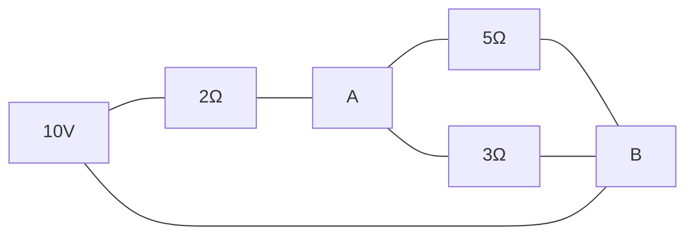

# Savitribai Phule Pune University
## Basic Electrical Engineering (103004)
### 2019 Pattern | Semester I/II

**Total Marks:** 70 | **Time:** 2½ Hours

**Instructions:** Q1 or Q2, Q3 or Q4, Q5 or Q6, Q7 or Q8. Use of calculator allowed.

---

## Unit III — Single Phase AC Circuits (18 Marks)

**Q1)** Attempt the following: [15]

a) A voltage of \(V = V\angle0^\circ\) V is applied across a **R-L-C series circuit**. Write equation for impedance, current, and comment on power factor when: i) \(X_L > X_C\) and ii) \(X_L < X_C\). Also draw phasor diagram for each case. [8]

b) A **series RLC circuit** has \(R = 10\,\Omega\), \(L = 0.1\) H, \(C = 100\,\mu\)F. Calculate resonance frequency, quality factor, and bandwidth. [7]

**OR**

**Q2)** Attempt the following: [15]

a) Explain the concept of **active power**, **reactive power**, **apparent power**, and **power factor** with impedance triangle. [8]

b) A coil of resistance \(10\,\Omega\) and inductance \(0.02\) H is connected in series with a capacitor of \(200\,\mu\)F across a 200 V, 50 Hz supply. Calculate current, power factor, and power consumed. [7]

---

## Unit IV — Polyphase Circuits and Transformers (17 Marks)

**Q3)** Attempt the following: [15]

a) Derive the relation between phase and line quantities in a **balanced star-connected** three-phase system. Draw phasor diagram. [6]

b) Explain principle of working of a **single phase transformer**. Derive the **EMF equation**. [5]

c) A 3-phase, balanced star-connected load has impedance of \((8 + j6)\,\Omega\) per phase. Line voltage is 400 V, 50 Hz. Calculate line current, power factor, and total power. [4]

**OR**

**Q4)** Attempt the following: [15]

a) Derive power equation in a balanced **delta-connected** three-phase system. Compare star and delta connections. [6]

b) Explain **losses** in a transformer. Define regulation and efficiency. [5]

c) A 20 kVA, 2000/200 V, 50 Hz single phase transformer has core loss of 200 W and copper loss of 300 W at full load. Calculate efficiency at full load, unity power factor. [4]

---

## Unit V — DC Circuits (18 Marks)

**Q5)** Attempt the following: [15]

a) State and explain **Kirchhoff's Current Law (KCL)** and **Kirchhoff's Voltage Law (KVL)**. [5]

b) Find current through \(5\,\Omega\) resistor using **Thevenin's theorem**:

[6]

c) Use **star-delta conversion** to find equivalent resistance between terminals A and B for a bridge network with all arms \(10\,\Omega\). [4]

**OR**

**Q6)** Attempt the following: [15]

a) State and explain **Superposition theorem**. [5]

b) Find current through \(4\,\Omega\) resistor using **Superposition theorem** in a circuit with two voltage sources: \(V_1 = 20\) V, \(V_2 = 10\) V, \(R_1 = 2\,\Omega\), \(R_2 = 4\,\Omega\), \(R_3 = 6\,\Omega\) in a mesh configuration. [6]

c) Convert the given star network (\(R_A = 10\,\Omega\), \(R_B = 20\,\Omega\), \(R_C = 30\,\Omega\)) to its equivalent delta network. [4]

---

## Unit VI — Work, Power, Energy and Batteries (17 Marks)

**Q7)** Attempt the following: [15]

a) Explain the effect of temperature on resistance. Derive the relation for **resistance temperature coefficient** \(\alpha\). [5]

b) Explain construction, working, and applications of **Lead-Acid battery**. [6]

c) A copper coil has resistance of \(100\,\Omega\) at \(20^\circ\)C and \(120\,\Omega\) at \(60^\circ\)C. Calculate temperature coefficient of resistance at \(0^\circ\)C. [4]

**OR**

**Q8)** Attempt the following: [15]

a) Explain construction, working, and applications of **Lithium-Ion battery**. Compare with Lead-Acid battery. [6]

b) Explain concept of **depth of discharge** and **charging/discharging** of batteries. [5]

c) Three coils of resistances \(100\,\Omega\), \(150\,\Omega\), and \(200\,\Omega\) are connected in parallel. Calculate equivalent resistance. [4]

---

\*\*\* END OF QUESTION PAPER \*\*\*
