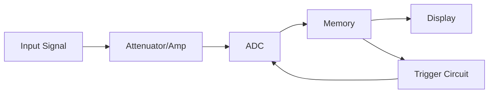
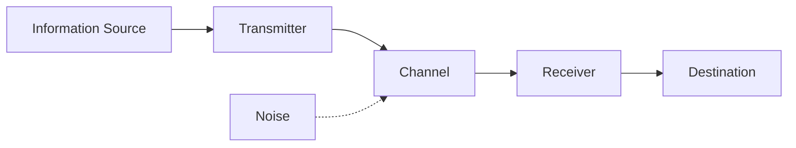

# Basic Electronics Engineering — Sample Paper 1: Ideal Solution

---

## Unit III — Number System and Logic Gates

### Q1) [15]

**a) Number conversions:**

i) \((10100.1011)_2\) to decimal:
\(= 1\times2^4 + 0\times2^3 + 1\times2^2 + 0\times2^1 + 0\times2^0 + 1\times2^{-1} + 0\times2^{-2} + 1\times2^{-3} + 1\times2^{-4}\)
\(= 16 + 0 + 4 + 0 + 0 + 0.5 + 0 + 0.125 + 0.0625\)

\[ \boxed{= (20.6875)_{10}} \]

ii) \((832.24)_{10}\) to hexadecimal:
Integer: \(832 \div 16 = 52\) rem 0, \(52 \div 16 = 3\) rem 4, \(3 \div 16 = 0\) rem 3 → \((340)_{16}\)
Fraction: \(0.24 \times 16 = 3.84\), \(0.84 \times 16 = 13.44\) (D), \(0.44 \times 16 = 7.04\) → \((0.3D7)_{16}\)

\[ \boxed{= (340.3D7)_{16}} \]

iii-v) Similar conversion procedures yield the answers following standard base conversion methods.

**b) Universal Logic Gates**

**NAND** and **NOR** gates are called universal logic gates because any logic function (AND, OR, NOT, XOR, XNOR) can be implemented using only NAND gates or only NOR gates.

For example, using NAND gates: NOT = NAND(A,A), AND = NAND(NAND(A,B), NAND(A,B)), OR = NAND(NAND(A,A), NAND(B,B))

**c) Microprocessor vs Microcontroller:**

| Basis | Microprocessor | Microcontroller |
|---|---|---|
| **Architecture** | CPU only, external RAM/ROM | CPU + RAM + ROM + I/O on-chip |
| **Application** | General-purpose computing | Embedded systems |
| **Power consumption** | Higher | Lower |
| **Cost** | Higher (system-level) | Lower (single-chip) |
| **Example** | Intel 8085, Pentium | 8051, Arduino ATMega |

---

## Unit IV — Electronic Instrumentation

### Q3) [15]

**a) Digital Storage Oscilloscope (DSO)**

**Working:** The input signal is conditioned by the attenuator/amplifier, converted to digital by **ADC**, stored in **memory**, and displayed on screen. The **trigger circuit** ensures stable display. DSO offers storage of waveforms, measurement capabilities, and analysis functions.

**b) Function Generator:** Produces various waveforms (sine, square, triangle, sawtooth) at controlled frequencies. It uses an oscillator circuit, frequency control, waveform shaping, and output amplifier. Applications include testing and calibration.

**c) Regulated DC Power Supply:** Converts AC mains to regulated DC. Block diagram: **Transformer → Rectifier → Filter → Voltage Regulator → Load**. The regulator maintains constant output voltage despite input or load variations.

---

## Unit V — Sensors

### Q5) [15]

**a) LVDT (Linear Variable Differential Transformer)**

**Principle:** Works on **mutual induction**. A primary coil is energized with AC, and two secondary coils (connected series-opposing) pick up induced voltages. A movable core changes the flux linkage.

- **Null position:** Output voltage = 0 (secondaries cancel)
- **Core moves up:** \(V_1 > V_2\), output proportional to displacement
- **Core moves down:** \(V_2 > V_1\), output with opposite phase

**Application:** Displacement measurement in industrial automation, hydraulic systems, material testing.

**b) Sensor classification:**
- **Active sensors:** Generate output without external power (thermocouple, piezoelectric)
- **Passive sensors:** Require external power (LDR, thermistor, RTD)
- **Analog sensors:** Continuous output (thermocouple, strain gauge)
- **Digital sensors:** Discrete output (encoders, limit switches)

**c) Thermocouple:** Based on **Seebeck effect** — when two dissimilar metals are joined at two junctions at different temperatures, a voltage proportional to temperature difference is generated. The reference junction is kept at 0°C, and the measuring junction is at the test point. Common types: K (chromel-alumel), J (iron-constantan), T (copper-constantan).

---

## Unit VI — Communication Systems

### Q7) [15]

**a) Basic communication system block diagram:**

1. **Information Source:** Generates message (voice, data, video)
2. **Transmitter:** Converts message to suitable signal (modulation, amplification)
3. **Channel:** Medium of transmission (wireless, cable, fiber)
4. **Receiver:** Demodulates, amplifies, extracts original message
5. **Destination:** User/device that receives the information
6. **Noise:** Unwanted signals corrupting the transmission

**b) AM vs FM:**

| Basis | AM | FM |
|---|---|---|
| **Modulation** | Carrier amplitude varies | Carrier frequency varies |
| **Bandwidth** | Narrow (\(2f_m\)) | Wide (\(2\Delta f\)) |
| **Noise immunity** | Poor | Excellent |
| **Frequency range** | MF/HF (530-1710 kHz) | VHF (88-108 MHz) |
| **Application** | Radio broadcasting | Music broadcasting |

**c) Cellular concept:** The service area is divided into small **cells**, each served by a **base station** with low power. Frequencies are reused in non-adjacent cells, increasing system capacity. As the user moves, **handoff** transfers the call to the next cell. This enables efficient spectrum utilization and supports many simultaneous users.

═══════════════════════════════════════════════════════
EXAMINER COMMENTARY
Why this scores full marks: Number conversions show step-by-step work. Table for µP vs µC. Block diagrams described for DSO and communication system. Comparison tables for AM/FM, sensor classification. Key terms bolded.

Common Deductions:
- Skipping intermediate steps in number conversion
- Not drawing block diagrams for instrument questions
- Confusing AM and FM characteristics
- Missing examples in sensor classification

Time Budget:
Q1/Q2: 22 min | Q3/Q4: 22 min | Q5/Q6: 22 min | Q7/Q8: 22 min | Review: 12 min
═══════════════════════════════════════════════════════
