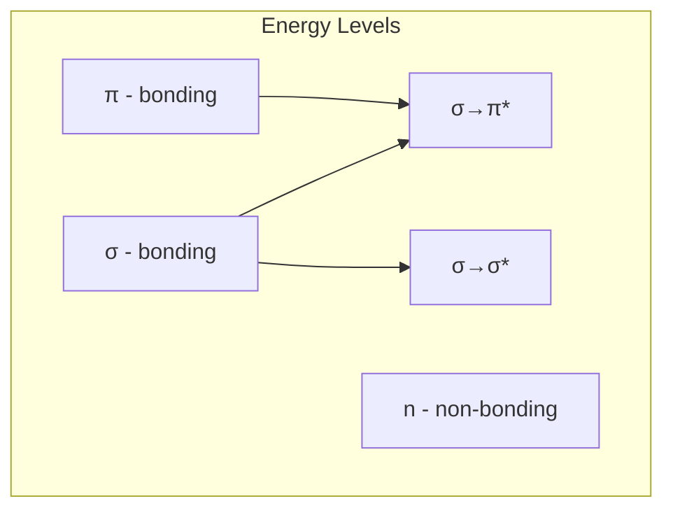
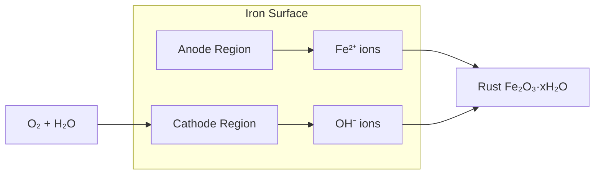

# Engineering Chemistry — Sample Paper 1: Ideal Solution

---

## Q1) Multiple Choice Questions [10]

a) **Option (i)** — bicarbonates of Ca and Mg cause temporary hardness (removed by boiling).

b) **Option (iii)** — **Eriochrome Black T** is the metal ion indicator used in EDTA titrations.

c) **Option (ii)** — **Conductometry** measures change in ionic conductance during titration.

d) **Option (ii)** — **Polycarbonate** is synthesized from **Bisphenol-A** and **phosgene**.

e) **Option (ii)** — **Carbon nanotubes** have diameter in nm and length in μm → 1D.

f) **Option (ii)** — **Bomb calorimeter** measures **Higher Calorific Value** (includes latent heat
of steam).

g) **Option (iii)** — \(A = \varepsilon c l\) (absorbance ∝ concentration × path length).

---

## Unit III — Engineering Materials

### Q2) [15]

**a) Polycarbonate**

**Preparation:** **Polycarbonate** is synthesized by condensation polymerization of **Bisphenol-A**
and **phosgene** in the presence of pyridine as a catalyst:
\[n\text{HO-C}\_6\text{H}\_4\text{-C(CH}\_3)\_2\text{-C}\_6\text{H}\_4\text{-OH} + n\text{COCl}\_2
\to [-O\text{-C}_6\text{H}_4\text{-C(CH}_3)_2\text{-C}_6\text{H}_4\text{-O-CO-}]\_n + 2n\text{HCl}\]

**Properties:**

1. **High impact strength** — excellent toughness
2. **Transparent** — transmits light like glass
3. **Heat resistant** — up to 135°C
4. **Dimensionally stable** — low creep
5. **Good electrical insulator**

**Applications:** Safety helmets, bullet-proof glass, aircraft windows, compact discs, medical
devices

**b) Biodegradable polymers**

These are polymers that decompose naturally in the environment through microbial action. **PHBV**
[Poly(hydroxybutyrate-co-hydroxyvalerate)] is a bacterial polyester.

**Preparation:** Produced by bacterial fermentation (e.g., _Ralstonia eutropha_) using carbon
sources like glucose. The bacteria accumulate PHBV as energy storage granules.

**Applications:** Biodegradable packaging, agricultural mulch films, disposable medical implants,
drug delivery carriers.

**c) Nanomaterials classification (by dimension):**

1. **0D** — all dimensions in nm (quantum dots, fullerenes)
2. **1D** — two dimensions in nm (nanotubes, nanowires, CNTs)
3. **2D** — one dimension in nm (graphene sheets, thin films)
4. **3D** — no dimension restricted (nanocomposites, bulk nanostructured materials)

---

## Unit IV — Fuels

### Q4) [15]

**a) Calorific value (CV)**

**Calorific value** is the amount of heat released when unit mass (or volume) of fuel is completely
burned.

**Bomb calorimeter construction and working:**

1. A known mass of fuel is placed in a stainless steel **bomb** filled with oxygen at 25 atm.
2. The bomb is submerged in a **water calorimeter** with a stirrer.
3. The fuel is ignited electrically through fusible wire.
4. Heat released raises water temperature, measured by a **Beckmann thermometer**.

\[\text{HCV} = \frac{(W + w) \times \Delta T \times S - (\text{corrections})}{m}\]

where \(W\) = water equivalent, \(w\) = water mass, \(\Delta T\) = temperature rise, \(m\) = fuel
mass.

**b) Proximate analysis of coal**

Determines moisture, volatile matter, fixed carbon, and ash percentage.

| Component           | Method                       | Significance                         |
| ------------------- | ---------------------------- | ------------------------------------ |
| **Moisture**        | Heating at 105°C for 1 hr    | Reduces CV, increases transport cost |
| **Volatile matter** | Heating at 950°C for 7 min   | Indicates ignition quality           |
| **Fixed carbon**    | By difference                | Main heat-producing component        |
| **Ash**             | Complete combustion at 700°C | Non-combustible residue, reduces CV  |

**c)** **Dulong's formula**: HCV = \(\frac{1}{100}[8080C + 34500(H - O/8) + 2240S]\) cal/g

C=75, H=10, O=8, S=2: HCV = \(\frac{1}{100}[8080(75) + 34500(10 - 8/8) + 2240(2)]\) =
\(\frac{1}{100}[606000 + 34500(9) + 4480]\) = \(\frac{1}{100}[606000 + 310500 + 4480]\)

\[ \boxed{\text{HCV} = 9209.8\text{ cal/g}} \]

---

## Unit V — Spectroscopic Techniques

### Q6) [15]

**a) Beer-Lambert's law**

When monochromatic light passes through an absorbing medium, the intensity decreases exponentially
with concentration and path length.

**Lambert's law:** Each layer of equal thickness absorbs equal fraction of incident light. **Beer's
law:** Absorbance is directly proportional to concentration.

Combined: \(\log\frac{I_0}{I} = A = \varepsilon c l\)

where \(I_0\) = incident intensity, \(I\) = transmitted intensity, \(\varepsilon\) = **molar
absorptivity**, \(c\) = concentration, \(l\) = path length.

**Derivation:** From differential form \(-\frac{dI}{dl} = kcI\) → integrate → \(A = \varepsilon c
l\).

**b) Electronic transitions in UV-Visible spectroscopy**

Possible transitions (increasing energy): \(n \to \pi^_ < \pi \to \pi^_ < n \to \sigma^_ < \sigma
\to \sigma^_\)

**c)** - **Chromophore:** Functional group responsible for UV absorption (e.g., C=C, C=O, NO₂)

- **Auxochrome:** Saturated group that modifies absorption (e.g., -OH, -NH₂, -Cl)
- **Bathochromic shift:** Shift of absorption to longer wavelength (red shift)

---

## Unit VI — Corrosion Science

### Q8) [15]

**a) Wet corrosion by oxygen absorption**

**Mechanism:** In presence of water and oxygen:

- **Anodic reaction:** Fe → Fe²⁺ + 2e⁻ (iron dissolves at anode)
- **Cathodic reaction:** O₂ + 2H₂O + 4e⁻ → 4OH⁻ (oxygen reduction)
- **Overall:** 2Fe + O₂ + 2H₂O → 2Fe(OH)₂ → further oxidized to rust (Fe₂O₃·xH₂O)

**b) Pilling-Bedworth rule**

It states that for an oxide layer to be protective, the ratio \(R = \frac{\text{Volume of
oxide}}{\text{Volume of metal}}\) should be between 1 and 2. If \(R < 1\), oxide is porous and
non-protective (e.g., Mg, Ca). If \(R > 2\), oxide is brittle and flakes off (e.g., W, Mo). If \(1 <
R < 2\), oxide forms a continuous protective layer (e.g., Al, Cr, Ni).

**c) Anodic vs Cathodic protection:**

| Basis          | Anodic Protection                          | Cathodic Protection                    |
| -------------- | ------------------------------------------ | -------------------------------------- |
| **Principle**  | Passivate anode by applying anodic current | Make metal surface cathodic            |
| **Applied to** | Metals that passivate (stainless steel)    | All metals                             |
| **Method**     | External DC power supply                   | Sacrificial anode or impressed current |
| **Example**    | Storage tanks of H₂SO₄                     | Pipeline protection using Mg anode     |

**\[Closing\]** Understanding corrosion mechanisms enables selection of appropriate prevention
techniques for different service environments.

═══════════════════════════════════════════════════════ EXAMINER COMMENTARY Why this scores full
marks: Chemical equations included for polymer synthesis. Numerical calculation with Dulong's
formula shows all steps. Tables used for comparison. Mermaid diagram for electronic transitions. Key
terms bolded.

Common Deductions:

- Not writing chemical equations in polymer preparation
- Missing Dulong's formula statement before substitution
- Improper units in calorific value calculation
- Vague description of mechanism (no half-reactions)

Time Budget: Q1: 10 min | Q2/Q3: 22 min | Q4/Q5: 22 min | Q6/Q7: 22 min | Q8/Q9: 22 min | Review: 12
min ═══════════════════════════════════════════════════════
