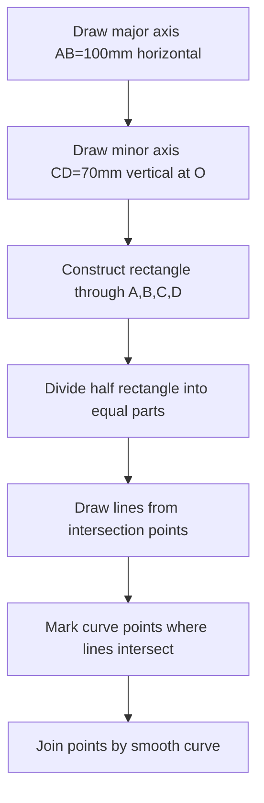

# Engineering Graphics — Sample Paper 1: Ideal Solution

---

## Unit III — Engineering Curves and Development

### Q1) Ellipse by rectangular method [8]

**Given:** Major axis = 100 mm (AB), Minor axis = 70 mm (CD), center O.

**Construction steps:**

1. Draw major axis **AB** (100 mm) horizontally. Mark midpoint O.
2. Draw minor axis **CD** (70 mm) vertically through O.
3. Construct rectangle with sides parallel to axes through A, B, C, D.
4. Divide OA into 6 equal parts. Divide adjacent side into same number of parts.
5. From C, draw lines through division points on OA.
6. From D, draw lines through division points on the side.
7. Intersection of corresponding lines gives points on ellipse.
8. Repeat for all four quadrants. Join points with smooth curve.

**Result:** An **ellipse** with major axis 100 mm and minor axis 70 mm is constructed.

### Q3) Development of lateral surface of square pyramid [10]

**Given:** Base side = 30 mm, axis height = 50 mm.

**Steps:**
1. Draw the front view and top view of the pyramid.
2. In top view, base is a square of 30 mm sides. Locate apex O at center.
3. Find true length of slant edges using auxiliary view or rotation method: \(TL = \sqrt{(15)^2 + (50)^2} = 52.2\) mm
4. **Development:** Draw an arc of radius equal to true slant edge length (52.2 mm).
5. Mark chord lengths equal to base side (30 mm) along the arc — 4 divisions.
6. Connect division points to the center (apex).
7. Attach base (square of 30 mm) to one edge of the development.

**Result:** The **development** of the lateral surface shows four isosceles triangles joined at the apex, with the base attached to one edge.

---

## Unit IV — Orthographic Projection

### Q5) Orthographic views of stepped block [12]

**Given:** Base 80×50×20 mm, stepped portion 50×30×30 mm centered, through hole of dia 20 mm.

**First angle projection:**

**Front View (looking from front, along Y-axis):**
- Lower rectangle: 80 mm wide × 20 mm high
- Upper rectangle: 50 mm wide × 30 mm high, centered (15 mm from each side)
- Hidden lines for the through hole (dia 20 mm) shown as dashed lines
- Total height: 50 mm

**Top View (looking from top, along Z-axis):**
- Outer rectangle: 80 mm × 50 mm
- Inner rectangle (stepped portion): 50 mm × 30 mm centered
- Circle of dia 20 mm at center for the through hole
- Hidden lines for the step

**Side View (looking from right, along X-axis):**
- Lower rectangle: 50 mm wide × 20 mm high
- Upper rectangle: 30 mm wide × 30 mm high, centered
- Hidden lines for through hole

**Drawing conventions used:**
- **First angle projection** symbol in title block
- Visible edges: continuous thick lines
- Hidden edges: dashed lines
- Center lines: thin chain-dotted lines
- All dimensions in mm

---

## Unit V — Isometric Projection

### Q7) Isometric projection of rectangular prism and cylinder [12]

**Rectangular prism 80×50×40 mm:**

1. Draw **isometric axes** at 30° to horizontal.
2. Mark 80 mm along left axis (length), 50 mm along right axis (width), 40 mm vertical (height).
3. Complete the isometric box by drawing parallel lines.
4. In isometric, dimensions are reduced by isometric scale (0.816 factor).
5. However, standard practice is to take actual dimensions and draw — the reduction happens automatically.

**Cylinder (base dia 50 mm, height 70 mm):**

1. Draw **isometric axes**. Mark vertical axis for height = 70 mm.
2. Draw **isometric circles** (ellipses) for top and bottom faces using four-center method.
3. Base ellipse: Draw rhombus of side = circle diameter (50 mm) in isometric, inscribe ellipse using four arcs.
4. Top ellipse: Similar at height 70 mm, same side length.
5. Draw vertical tangent lines connecting the two ellipses.
6. Erase hidden portions (bottom-back half of base ellipse).

**Result:** The isometric view shows the 3D appearance of both objects with proper depth representation.

**Drawing rules observed:**
- Isometric lines (parallel to axes) drawn at true angles
- Non-isometric lines located by coordinate method
- Hidden features shown as dashed lines
- All construction lines retained (as per instruction)

═══════════════════════════════════════════════════════
EXAMINER COMMENTARY
Why this scores full marks: Step-by-step construction procedure for curves/development. Exact dimensions specified. Projection methods clearly followed. Isometric construction described with proper rules.

Common Deductions:
- Not retaining construction lines (big deduction in EG)
- Confusing first angle vs third angle symbols
- Wrong orientation of isometric axes
- Missing center lines in orthographic views
- Not specifying hidden line conventions

Time Budget:
Q1/Q2: 20 min | Q3/Q4: 25 min | Q5/Q6: 30 min | Q7/Q8: 25 min | Review: 10 min
═══════════════════════════════════════════════════════
