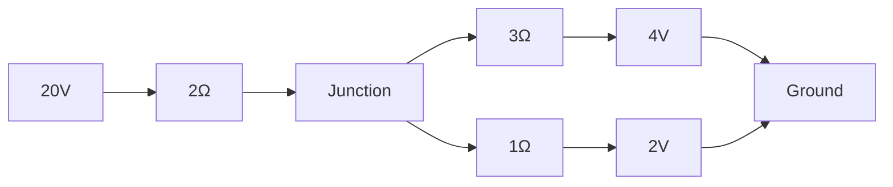

# Savitribai Phule Pune University

## Engineering Mathematics — I (107001)

### 2019 Pattern | Semester I

**Total Marks:** 70 | **Time:** 2½ Hours

**Instructions:**

1. Question 1 is compulsory.
2. Attempt Q.2 or Q.3, Q.4 or Q.5, Q.6 or Q.7, Q.8 or Q.9.
3. Neat diagrams must be drawn wherever necessary.
4. Figures to the right indicate full marks.
5. Use of electronic pocket calculator is allowed.
6. Assume suitable data, if necessary.

---

## Q1) Write the correct option for the following multiple choice questions. [10]

a) If \(u = x^4 + y^4 + z^4\), then \(x\frac{\partial u}{\partial x} + y\frac{\partial u}{\partial
y} + z\frac{\partial u}{\partial z} =\) **\_\_\_** [2] i) \(u\) &emsp; ii) \(2u\) &emsp; iii) \(3u\)
&emsp; iv) \(4u\)

b) The quadratic form corresponding to matrix \(A = \begin{bmatrix} 1 & 0 & 3/2 \\ 0 & 2 & 1 \\ 3/2
& 1 & -3 \end{bmatrix}\) is **\_\_\_** [2] i) \(x_1^2 + 2x_2^2 - 3x_3^2 + 3x_1x_3 + 2x_2x_3\) ii)
\(x_1^2 + 2x_2^2 - 3x_3^2 + \frac{3}{2}x_1x_3 + x_2x_3\) iii) \(x_1^2 + x_2^2 - 3x_3^2 + 3x_1x_2 -
2x_2x_3\) iv) \(x_1^2 + 2x_2^2 - x_3^2\)

c) For a square matrix \(P\) to be orthogonal, **\_\_\_** [2] i) \(PP^T = A^{-1}\) &emsp; ii) \(PP^T
= I\) &emsp; iii) \(P^2 = I\) &emsp; iv) \(P = P^T\)

d) If \(u = \ln\left(\frac{x^2 + y^2}{x + y}\right)\), then \(u\) is a homogeneous function of
degree: [1] i) 1 &emsp; ii) 1/2 &emsp; iii) 2 &emsp; iv) 0

e) For a square matrix \(A\), sum of eigen values is 3 and product is 2. The characteristic equation
is: [1] i) \(\lambda^2 - 3\lambda - 2 = 0\) &emsp; ii) \(\lambda^2 - 3\lambda + 2 = 0\) iii)
\(\lambda^2 + 2\lambda + 3 = 0\) &emsp; iv) \(\lambda^2 + 2\lambda - 3 = 0\)

f) Heisenberg's uncertainty principle is about the **\_\_\_** of position and momentum of a
particle. [1] i) Difference &emsp; ii) Addition &emsp; iii) Multiplication &emsp; iv) Division

g) The rank of matrix \(\begin{bmatrix} 2 & -1 & -1 \\ 1 & 2 & 1 \\ 4 & -7 & -5 \end{bmatrix}\) is:
[1] i) 3 &emsp; ii) 2 &emsp; iii) 1 &emsp; iv) 0

---

## Unit III — Partial Differentiation (18 Marks)

**Q2)** Attempt the following: [15]

a) If \(u = \sin^{-1}(x^2 + y^2)\), prove that [5] \[x^2\frac{\partial^2 u}{\partial x^2} +
2xy\frac{\partial^2 u}{\partial x \partial y} + y^2\frac{\partial^2 u}{\partial y^2} = 2\tan
u\left(\frac{2}{5} + \tan^2 u \cdot \frac{3}{5}\right)\]

b) If \(z = f(x,y)\) where \(x = u + v\), \(y = uv\), prove that [5] \[u\frac{\partial z}{\partial
u} + v\frac{\partial z}{\partial v} = x\frac{\partial z}{\partial x} + 2y\frac{\partial z}{\partial
y}\]

c) If \(u = \log(x^3 + y^3 - y^2x - x^2y)\), show that [5] \[\left(\frac{\partial}{\partial x} +
\frac{\partial}{\partial y}\right) u = \frac{-4}{(x+y)^2}\]

**OR**

**Q3)** Attempt the following: [15]

a) If \(u = ax + by\), \(v = bx - ay\), find \(\left(\frac{\partial u}{\partial x}\right)\_y
\left(\frac{\partial x}{\partial u}\right)\_v \left(\frac{\partial v}{\partial y}\right)\_x
\left(\frac{\partial y}{\partial v}\right)\_u\) [5]

b) If \(T = \sin\left(\frac{xy}{x^2 + y^2}\right) + \frac{x^2 y}{x + y} + \sqrt{x^2 + y^2}\), find
\(x\frac{\partial T}{\partial x} + y\frac{\partial T}{\partial y}\) [5]

c) If \(Z = F(x,y)\) where \(x = e^u \cos v\), \(y = e^u \sin v\), prove that [5] \[y\frac{\partial
Z}{\partial u} + x\frac{\partial Z}{\partial v} = e^{2u}\frac{\partial Z}{\partial y}\]

---

## Unit IV — Applications of Partial Differentiation (17 Marks)

**Q4)** Attempt the following: [15]

a) If \(x = uv\), \(y = \frac{u+v}{u-v}\), find \(\frac{\partial(u,v)}{\partial(x,y)}\) [5]

b) A power dissipated in a resistor is given by \(P = \frac{E^2}{R}\). Find the approximate
percentage error in \(P\) if \(E\) is increased by 3% and \(R\) is increased by 2%. [5]

c) Find stationary point of \(f(x,y) = x^3 + y^3 - 3axy\) where \(a < 0\). [5]

**OR**

**Q5)** Attempt the following: [15]

a) If \(u^3 + v^3 = x + y\), \(u^2 + v^2 = x^3 + y^3\), find \(\frac{\partial(u,v)}{\partial(x,y)}\)
[5]

b) Find stationary value of \(u = x^2 + y^2 + z^2\) subject to \(\frac{1}{x} + \frac{1}{y} +
\frac{1}{z} = 1\) using Lagrange's method. [5]

c) Examine for functional dependence: \(u = y + z\), \(v = x + 2z^2\), \(w = x - 4yz - 2y^2\) [5]

---

## Unit V — Linear Algebra: Matrices (18 Marks)

**Q6)** Attempt the following: [15]

a) Examine for consistency the system: [5] \[x + 2y + z = 2,\quad 2x - y - z = 2,\quad 4x - 7y - 5z
= 2\]

b) Examine whether vectors \(x_1 = (2, -1, 3, 2)\), \(x_2 = (1, 3, 4, 2)\), \(x_3 = (3, -5, 2, 2)\)
are linearly independent or dependent. If dependent, find the relation. [5]

c) For which values of \(a, b, c\) is the matrix \(A\) orthogonal where [5] \[A = \begin{bmatrix}
\frac{1}{3} & \frac{2}{3} & \frac{2}{3} \\ \frac{2}{3} & \frac{1}{3} & -\frac{2}{3} \\ a & b & c
\end{bmatrix}\]

**OR**

**Q7)** Attempt the following: [15]

a) Determine values of \(\lambda\) for which the system is inconsistent: [5] \[3x - y + \lambda z =
0,\quad 2x + y + z = 2,\quad x - 2y - \lambda z = -1\]

b) Examine whether vectors \(x_1 = (3,1,1)\), \(x_2 = (2,0,-1)\), \(x_3 = (4,2,1)\) are linearly
independent or dependent. [5]

c) Reduce matrix \(A = \begin{bmatrix} 5 & 4 \\ 1 & 2 \end{bmatrix}\) to diagonal form by finding
modal matrix \(P\). [5]

---

## Unit VI — Eigen Values and Diagonalization (17 Marks)

**Q8)** Attempt the following: [15]

a) Verify Cayley-Hamilton theorem for \(A = \begin{bmatrix} 1 & 2 \\ 2 & 2 \end{bmatrix}\). Hence
find \(A^{-1}\) if it exists. [5]

b) By using Cayley-Hamilton theorem, find the inverse of matrix \(\begin{bmatrix} 1 & 1 & 3 \\ 1 & 3
& -3 \\ -2 & -4 & -4 \end{bmatrix}\) [5]

c) Find eigen values and eigen vectors of matrix \(A = \begin{bmatrix} 3 & 1 & 4 \\ 0 & 2 & 6 \\ 0 &
0 & 5 \end{bmatrix}\) [5]

**OR**

**Q9)** Attempt the following: [15]

a) Find eigen values of \(A = \begin{bmatrix} 2 & 0 & 1 \\ 0 & 2 & 0 \\ 1 & 0 & 2 \end{bmatrix}\).
Also find eigen vector corresponding to smallest eigen value. [5]

b) Find the transformation which reduces the quadratic form \(Q = 3x^2 + 5y^2 + 2z^2 - 2yz + 2zx -
2xy\) to canonical form by congruent transformations. Also write the canonical form. [5]

c) Determine the currents in the following network using matrix methods: [5]

---

\*\*\* END OF QUESTION PAPER \*\*\*
