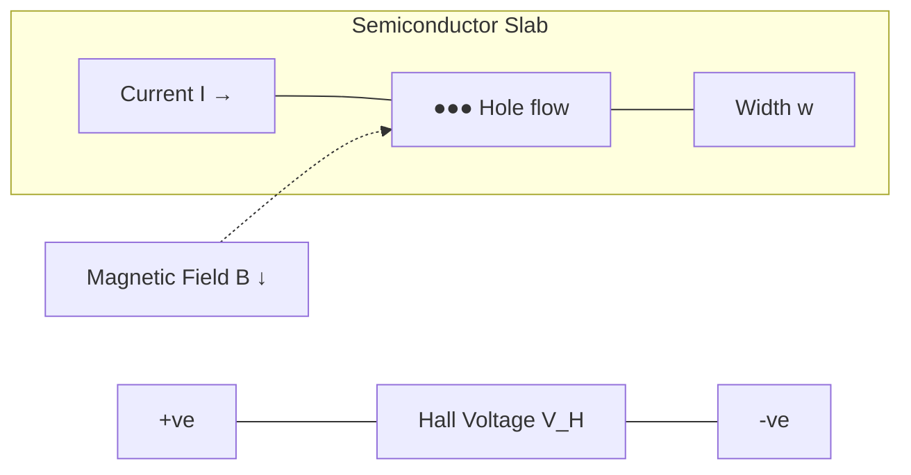
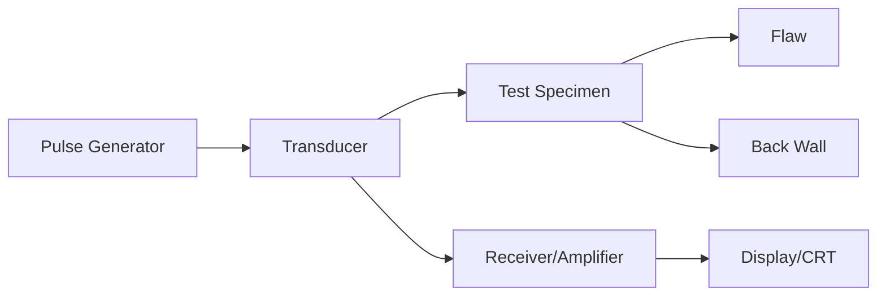

# Engineering Physics — Sample Paper 1: Ideal Solution

---

## Q1) Multiple Choice Questions [10]

a) **Option (i) Electron** — matter waves (de Broglie waves) have significant wavelength only for particles with very small mass moving at high speeds.

b) **Option (i) Matter particles** — de Broglie proposed that every moving particle has an associated wavelength \(\lambda = h/p\).

c) **Option (ii) Product** — \(\Delta x \cdot \Delta p \ge h/4\pi\)

d) **Option (ii) Zero, infinite** — below \(T_c\), resistance vanishes and conductivity becomes infinite.

e) **Option (i) \(\chi = M/H\)** — magnetic susceptibility relates magnetization to field strength.

f) **Option (ii) Metal < Semiconductor < Insulator** — band gap increases from metals (overlapping) to insulators (wide gap).

g) **Option (iv) All of the above** — Hall effect occurs in all conductors and semiconductors.

h) **Option (i) 1–100 nm** — this defines the nanoscale range.

i) **Option (ii) Internal defects** — NDT detects internal flaws without damaging the material.

j) **Option (iv) Combined effect of i and ii** — both orbital and spin motions contribute to atomic magnetism.

---

## Unit III — Quantum Mechanics

### Q2) [15]

**a) Particle in an infinite potential well**

Consider a particle of mass \(m\) confined in a 1D box of length \(L\) with potential:
\[V(x) = \begin{cases} 0, & 0 < x < L \\ \infty, & \text{otherwise} \end{cases}\]

The **time-independent Schrödinger equation** inside the well:
\[-\frac{\hbar^2}{2m}\frac{d^2\psi}{dx^2} = E\psi\]

Rearranging: \(\frac{d^2\psi}{dx^2} + k^2\psi = 0\) where \(k^2 = \frac{2mE}{\hbar^2}\)

General solution: \(\psi(x) = A\sin(kx) + B\cos(kx)\)

**Boundary conditions:** \(\psi(0) = 0\) and \(\psi(L) = 0\)

At \(x=0\): \(\psi(0) = B = 0 \implies B = 0\), so \(\psi(x) = A\sin(kx)\)

At \(x=L\): \(\psi(L) = A\sin(kL) = 0 \implies kL = n\pi\) where \(n = 1, 2, 3, \ldots\)

Thus \(k = \frac{n\pi}{L}\), and:
\[E_n = \frac{\hbar^2 k^2}{2m} = \frac{n^2\pi^2\hbar^2}{2mL^2} = \frac{n^2h^2}{8mL^2}\]

The **normalized wave function**:
\[\psi_n(x) = \sqrt{\frac{2}{L}}\sin\left(\frac{n\pi x}{L}\right)\]

\[ \boxed{E_n = \frac{n^2h^2}{8mL^2},\quad n=1,2,3,\ldots} \]

**\[Closing\]** The infinite potential well model shows that energy is **quantized** (\(E \propto n^2\)), with the ground state energy \(E_1 = h^2/(8mL^2)\) being non-zero due to the **uncertainty principle**.

**b) Heisenberg's uncertainty principle**

It states that it is impossible to simultaneously measure the exact position and exact momentum of a particle. The product of uncertainties has a lower bound:
\[\Delta x \cdot \Delta p \ge \frac{h}{4\pi}\]
where \(\Delta x\) is uncertainty in position, \(\Delta p\) is uncertainty in momentum, and \(h\) is **Planck's constant**.

**Implications:** The more precisely position is measured, the less precisely momentum is known, and vice versa. This is a fundamental limit of nature, not a limitation of measurement instruments.

**c)** Wavelength associated with electron of energy 10 eV:
**de Broglie wavelength**: \(\lambda = \frac{h}{\sqrt{2mE}}\)

\[m_e = 9.1\times10^{-31}\text{ kg},\quad h = 6.63\times10^{-34}\text{ J·s}\]
\[E = 10\text{ eV} = 10 \times 1.6\times10^{-19} = 1.6\times10^{-18}\text{ J}\]

\[\lambda = \frac{6.63\times10^{-34}}{\sqrt{2 \times 9.1\times10^{-31} \times 1.6\times10^{-18}}}\]
\[= \frac{6.63\times10^{-34}}{\sqrt{2.912\times10^{-48}}} = \frac{6.63\times10^{-34}}{1.706\times10^{-24}}\]

\[ \boxed{\lambda = 3.886 \times 10^{-10}\text{ m} = 3.886\text{ Å}} \]

---

## Unit IV — Semiconductor Physics

### Q4) [15]

**a) Hall effect**

When a current-carrying semiconductor is placed in a perpendicular magnetic field, a **voltage** (Hall voltage) develops across the transverse direction. This is the **Hall effect**.

**Derivation:** Consider a semiconductor slab with current \(I\), width \(w\), thickness \(t\), in magnetic field \(B\).

Force on charge carriers: \(\vec{F} = q(\vec{v} \times \vec{B})\)

The Lorentz force deflects carriers, creating an electric field \(E_H\) that balances it:
\[qE_H = qvB \implies E_H = vB\]

Hall voltage: \(V_H = E_H w = vBw\)

Current density: \(J = nqv = \frac{I}{wt} \implies v = \frac{I}{nqwt}\)

Thus: \(V_H = \frac{I}{nqwt} \cdot Bw = \frac{IB}{nqt}\)

**Hall coefficient**: \(R_H = \frac{V_H t}{IB} = \frac{1}{nq}\)

\[ \boxed{V_H = \frac{IB}{nqt}} \]

**\[Closing\]** The **Hall effect** enables determination of carrier type, concentration, and mobility in semiconductors.

**b) Solar cell efficiency**

**Efficiency** \(\eta = \frac{P_{\text{max}}}{P_{\text{in}}} = \frac{V_{oc} \times I_{sc} \times FF}{P_{\text{in}}}\)

where \(V_{oc}\) = open circuit voltage, \(I_{sc}\) = short circuit current, \(FF\) = fill factor.

**Measures to improve efficiency:**
1. **Anti-reflection coating** to minimize reflection losses
2. **Surface texturing** to increase light trapping
3. **Tandem/Multi-junction cells** to utilize wider spectrum
4. **Reducing recombination** by passivation layers and high-quality materials

**c)** For intrinsic Si, \(\rho = 10\) Ω·cm, \(\mu_h = 500\) cm²/V·s.

Conductivity: \(\sigma = nq\mu_n + pq\mu_p\). For p-type (acceptor added), conductivity is primarily due to holes: \(\sigma \approx pq\mu_p\)

\(\sigma = \frac{1}{\rho} = \frac{1}{10} = 0.1\) (Ω·cm)⁻¹

\(p = \frac{\sigma}{q\mu_p} = \frac{0.1}{1.6\times10^{-19} \times 500} = \frac{0.1}{8\times10^{-17}}\)

\[ \boxed{p = 1.25 \times 10^{15}\text{ cm}^{-3}} \]

---

## Unit V — Magnetism and Superconductivity

### Q6) [15]

**a) Magnetic storage (recording and retrieval)**

**Recording (Write):** A **write head** (electromagnet) generates a magnetic field that magnetizes small regions of the magnetic medium (e.g., hard disk platter). The direction of magnetization represents binary data (0 or 1). As the medium moves past the head, the current through the head coil is switched to encode bits.

**Retrieval (Read):** A **read head** (magneto-resistive sensor) passes over the magnetized regions. The changing magnetic field causes resistance variation in the read head (GMR effect), which is detected as voltage changes and decoded into binary data. The **Giant Magneto-Resistance (GMR)** effect enables high-density storage.

**\[Closing\]** Magnetic storage relies on **remanent magnetization** of ferromagnetic materials, with **read/write heads** converting between magnetic and electrical signals.

**b)** i) **Magnetic field strength** \(H\): The magnetizing force that produces magnetic flux in a material. Measured in A/m.

ii) **Magnetization** \(M\): The magnetic dipole moment per unit volume induced in the material. Measured in A/m.

**Relation:** \(B = \mu_0(H + M)\) or \(M = \chi H\) where \(\chi\) is **magnetic susceptibility**.

**c)** For a **Type I superconductor**: \(H_c(T) = H_c(0)\left[1 - \left(\frac{T}{T_c}\right)^2\right]\)

\[H_c(4.2) = 6.5\times10^4\left[1 - \left(\frac{4.2}{7.18}\right)^2\right] = 6.5\times10^4\left[1 - (0.585)^2\right]\]
\[= 6.5\times10^4(1 - 0.342) = 6.5\times10^4 \times 0.658\]

\[ \boxed{H_c(4.2\text{ K}) = 4.277\times10^4\text{ A/m}} \]

---

## Unit VI — NDT and Nanotechnology

### Q8) [15]

**a) Ultrasonic flaw detection**

**Working:** A **transducer** generates high-frequency ultrasonic pulses (0.5–25 MHz) that travel through the material. When the pulse encounters a **flaw** (crack, void, inclusion), part of the energy is reflected. The time delay between the initial pulse and the reflected **echo** indicates the flaw depth. By scanning the transducer, flaw size and location are mapped.

**\[Closing\]** **Ultrasonic testing** is a widely used NDT method for detecting internal flaws in metals, composites, and welds.

**b) Non Destructive Testing (NDT)**

NDT refers to techniques used to evaluate material properties, detect flaws, and measure dimensions without damaging the test object.

**Advantages over destructive testing:**
1. **Component remains usable** after testing — no waste
2. **100% inspection** possible (not just sampling)
3. **In-service monitoring** during operation
4. **Cost-effective** — early flaw detection prevents catastrophic failure

**c)** Ultrasonic velocity \(v = 5000\) m/s, thickness \(= 0.5\) cm \(= 0.005\) m.

Time for echo from bottom: \(t = \frac{2d}{v} = \frac{2\times0.005}{5000} = 2\times10^{-6}\) s \(= 2\) μs

Flaw echo time \(= 1.5\) μs. Distance to flaw: \(d_f = \frac{v \times t_f}{2}\)

\[d_f = \frac{5000 \times 1.5\times10^{-6}}{2} = \frac{7.5\times10^{-3}}{2} = 3.75\times10^{-3}\text{ m}\]

\[ \boxed{\text{Flaw location: } 3.75\text{ mm from top surface}} \]

═══════════════════════════════════════════════════════
EXAMINER COMMENTARY
Why this scores full marks: Derivation steps are complete (Schrödinger, Hall effect, potential well). Numerical problems show formula → substitution → boxed answer. Diagrams described for NDT and Hall effect. Key terms bolded on first use.

Common Deductions:
- Omitting boundary conditions in potential well derivation
- Not stating units in numerical answers
- Vague description of Meissner effect / magnetic storage
- Missing the diagram reference lines

Time Budget:
Q1: 10 min | Q2/Q3: 22 min | Q4/Q5: 22 min | Q6/Q7: 22 min | Q8/Q9: 22 min | Review: 12 min
═══════════════════════════════════════════════════════
