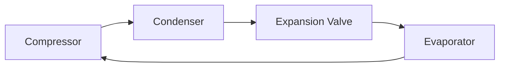

# Systems in Mechanical Engineering — Sample Paper 1: Ideal Solution

---

## Unit III — Vehicles and their Specifications

### Q1) [15]

**a) Vehicle specification** refers to the detailed technical data describing a vehicle's
characteristics.

**Engine specifications:**

1. **Power of Engine:** Rate at which engine does work, measured in kW or bhp. Determines vehicle
   speed and acceleration capability.
2. **Cylinder Capacity (Engine displacement):** Total volume swept by all pistons in one cycle. \(V
   = \frac{\pi}{4}d^2 \times L \times n\) where \(d\) = bore, \(L\) = stroke, \(n\) = cylinders.
   Higher CC generally means more power.
3. **Type of Transmission:** Manual (MT) — driver operates clutch and gear shift manually; Automatic
   (AT) — gear shifts automatically via torque converter/CVT; AMT — automated manual transmission.

**b) Automobile classification:**

- **By purpose:** Passenger cars, commercial vehicles, special purpose
- **By capacity:** Two-wheeler, three-wheeler, LMV, HCV, multi-axle
- **By fuel:** Petrol, diesel, CNG, electric, hybrid
- **By drive:** Front-wheel, rear-wheel, 4WD/AWD

**c) Electric and Hybrid Vehicles:** EVs use electric motor and battery only (zero emissions).
Hybrids combine ICE with electric motor (better fuel economy). Compared to conventional: lower
running cost, quieter, fewer moving parts, but higher initial cost and range limitation for EVs.

---

## Unit IV — Vehicle Systems

### Q3) [15]

**a) Steering system:** Converts driver's rotary input (steering wheel) into angular motion of
wheels.

**Types:**

1. **Rack and pinion:** Most common in cars. Steering wheel rotates pinion, which moves rack
   linearly → turns wheels.
2. **Recirculating ball:** Used in heavy vehicles. Ball bearings reduce friction between worm gear
   and nut.

**b) Braking system — Disc vs Drum:**

| Basis                | Disc Brake              | Drum Brake               |
| -------------------- | ----------------------- | ------------------------ |
| **Component**        | Rotor (disc) + caliper  | Drum + shoes             |
| **Heat dissipation** | Excellent (open to air) | Poor (enclosed)          |
| **Fading**           | Low                     | High                     |
| **Maintenance**      | Easier                  | More complex             |
| **Application**      | Front wheels of cars    | Rear wheels, budget cars |

**c)** Driving gear \(N_1 = 20\), driven gear \(N_2 = 60\).

**Speed ratio** \(= \frac{N_1}{N_2} = \frac{20}{60} = \frac{1}{3}\)

**Torque ratio** \(= \frac{N_2}{N_1} = \frac{60}{20} = 3\)

\[ \boxed{\text{Speed ratio} = 1:3,\ \text{Torque ratio} = 3:1} \]

---

## Unit V — Manufacturing

### Q5) [15]

**a) Conventional manufacturing processes:**

1. **Casting:** Molten metal poured into mold cavity → solidifies. Used for complex shapes (engine
   blocks).
2. **Forging:** Metal shaped by compressive forces (hammering/pressing). Produces strong parts
   (crankshafts).
3. **Metal forming:** Sheet metal working, drawing, extrusion, rolling. Used for panels, tubes,
   wires.

**b) Additive manufacturing (3D printing):** Builds parts layer-by-layer from CAD model. Materials:
plastics, metals, ceramics. **Process:** CAD model → STL file → slicing → layer deposition →
post-processing. Applications: prototyping, medical implants, aerospace components.

**c) CNC (Computer Numerical Control) programming:** Machine tools controlled by computer programs.
**G-code** commands tool path, speed, feed. Advantages: high accuracy, repeatability, complex
geometries, reduced labor.

---

## Unit VI — Engineering Mechanisms

### Q7) [15]

**a) Refrigerator working:**

1. **Compressor:** Compresses refrigerant vapor (high pressure, high temp)
2. **Condenser:** Heat rejection — refrigerant condenses to liquid
3. **Expansion valve:** Reduces pressure — refrigerant cools rapidly
4. **Evaporator:** Heat absorption — refrigerant evaporates, cooling the interior

**b) Applications:**

- **Gears:** Transmit motion/power between shafts. Used in: car gearbox, wall clocks, washing
  machines.
- **Belts:** Flexible power transmission between distant pulleys. Used in: alternator drive,
  conveyor systems.
- **Chains:** Positive drive without slip. Used in: bicycle, motorcycle drive, camshaft timing.

**c)** Flow rate \(Q = 1000\) L/min \(= \frac{1000}{1000 \times 60} = 0.01667\) m³/s Head \(h = 20\)
m, \(\eta = 0.75\), \(\rho = 1000\) kg/m³

Hydraulic power \(P_h = \rho g Q h = 1000 \times 9.81 \times 0.01667 \times 20\)

\(P_h = 3270\) W \(= 3.27\) kW

Power input \(= \frac{P_h}{\eta} = \frac{3.27}{0.75}\)

\[ \boxed{P\_{\text{input}} = 4.36\text{ kW}} \]

═══════════════════════════════════════════════════════ EXAMINER COMMENTARY Why this scores full
marks: Clear specifications with formulas. Comparison tables (disc vs drum). Block diagram for
refrigerator cycle. Numerical shows all steps. Real-world applications cited.

Common Deductions:

- Not defining terms before explaining
- Skipping efficiency in pump power calculation
- Missing units in numerical answers
- Vague description of additive manufacturing

Time Budget: Q1/Q2: 22 min | Q3/Q4: 22 min | Q5/Q6: 22 min | Q7/Q8: 22 min | Review: 12 min
═══════════════════════════════════════════════════════
