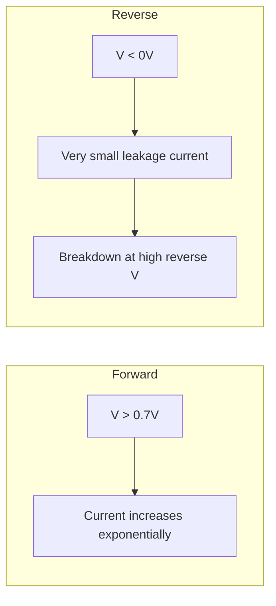

# Basic Electronics Engineering — Sample Paper 1 — Solution

**Pattern:** SPPU 2024 (NEP) | **Total:** 70 Marks | **Time:** 2½ Hours

---

## Q1) OR Q2

### Q1) a) PN Junction Diode VI Characteristics [8]

**Forward Bias:** P-side positive, N-side negative. Depletion region narrows. Current flows when V >
**knee voltage** (0.7V for Si, 0.3V for Ge).

**Reverse Bias:** P-side negative, N-side positive. Depletion region widens. Very small **leakage
current** flows until **breakdown voltage**.



**VI Characteristics:**

- Forward region: Exponential I-V relationship `I = I_s(e^(V/ηV_T) - 1)`
- Reverse region: I ≈ I_s (saturation current)
- Breakdown region: Sharp increase in reverse current

---

### Q1) b) Diode Parameters [6]

- **PIV (Peak Inverse Voltage):** Maximum reverse voltage a diode can withstand without breakdown
- **Breakdown Voltage:** Voltage at which reverse current increases sharply (Zener or Avalanche)
- **Cut-in Voltage (Knee):** Voltage where forward current begins to increase significantly (0.7V
  Si)

---

### Q2) b) Full-wave bridge rectifier [6]

**Given:** 230/12V RMS, diode drop 0.7V

**Peak secondary voltage:** V_peak = 12 × √2 = 16.97 V

**DC output:** V_DC = 2V_peak/π - 2×0.7 = 2×16.97/π - 1.4 = 10.8 - 1.4 = **9.4 V**

**PIV rating:** Each diode must withstand V_peak = **16.97 V** (practically 50V for safety margin)

---

## Q3) OR Q4

### Q3) a) Zener Diode Voltage Regulator [8]

**Circuit:** Zener diode in reverse bias across load, series resistor R_s limits current.

**Working:** When input voltage varies, Zener maintains constant voltage (V_Z) across load by
conducting more/less current through R_s.

**Condition:** `V_in > V_Z`, and `(V_in - V_Z)/R_s > I_L_max`

---

### Q3) b) BJT NPN — CE Configuration [6]

**Construction:** Three regions — Emitter (heavily doped N), Base (thin P), Collector (moderately
doped N).

**Working:** Small base current (I_B) controls large collector current (I_C = β·I_B).

**CE Characteristics:**

- Input: V_BE vs I_B (diode-like)
- Output: I_C vs V_CE (flat region = active mode, saturation mode at low V_CE)

---

### Q4) b) Transistor Q-point [6]

**Given:** V_CC=12V, R_C=2kΩ, R_B=220kΩ, β=100

**Base current:** I_B = (V_CC - V_BE)/R_B = (12 - 0.7)/(220×10³) = **51.36 μA**

**Collector current:** I_C = β·I_B = 100 × 51.36×10⁻⁶ = **5.136 mA**

**V_CE:** V_CE = V_CC - I_C·R_C = 12 - 5.136×10⁻³ × 2×10³ = 12 - 10.272 = **1.728 V**

**Q-point:** (V_CE = 1.728 V, I_C = 5.136 mA)

---

## Q5) OR Q6

### Q5) a) Op-Amp Inverting and Non-Inverting Amplifier [8]

**Inverting Amplifier:**

```
Gain: A = -R_f/R_1
Input applied at inverting (-) terminal
Output is 180° out of phase
```

**Non-Inverting Amplifier:**

```
Gain: A = 1 + R_f/R_1
Input applied at non-inverting (+) terminal
Output is in phase
```

**Ideal Op-Amp assumptions:** Infinite gain, infinite input impedance, zero output impedance.

---

### Q5) b) Design inverting amplifier with gain -50 [6]

**A = -R_f/R₁ = -50**

**Choose R₁ = 1kΩ**, then R_f = 50 × 1kΩ = **50 kΩ**

Circuit: Signal through R₁ to inverting terminal, R_f from output to inverting terminal,
non-inverting terminal grounded.

---

### Q6) b) Non-inverting amplifier calculation [6]

**Given:** R₁=1kΩ, R_f=10kΩ, V_in=50mV

**Gain:** A = 1 + R_f/R₁ = 1 + 10/1 = **11**

**Output:** V_out = A × V_in = 11 × 50mV = **550 mV = 0.55 V**

---

## Q7) OR Q8

### Q7) a) Number System Conversions [8]

**(i) (101101)₂ to decimal:** = 1×2⁵ + 0×2⁴ + 1×2³ + 1×2² + 0×2¹ + 1×2⁰ = 32 + 0 + 8 + 4 + 0 + 1 =
**(45)₁₀**

**(ii) (3A)₁₆ to binary:** 3 = 0011, A = 1010 → **(00111010)₂**

**(iii) (45)₁₀ to binary:** 45 ÷ 2 = 22 R=1, 22÷2=11 R=0, 11÷2=5 R=1, 5÷2=2 R=1, 2÷2=1 R=0, 1÷2=0
R=1 → **(101101)₂**

**(iv) (1101.101)₂ to decimal:** = 8+4+0+1 + 0.5+0+0.125 = **13.625**

---

### Q8) b) Full Adder using Half Adders [6]

**Full Adder:** Sum of three bits (A, B, Cin) → Sum and Carry_out

**Using two Half Adders:**

```
HA1: Sum1 = A⊕B, Carry1 = A·B
HA2: Sum = Sum1⊕Cin, Carry2 = Sum1·Cin
Carry_out = Carry1 + Carry2
```

**Logic:**

```
Sum = A⊕B⊕Cin
Carry_out = AB + BCin + ACin
```

---

## Q9) OR Q10

### Q9) a) Communication System Block Diagram [6]

```
Information Source → Transmitter → Channel → Receiver → Destination
                        ↑                          ↓
                     Noise (interference)      Demodulator
```

**Components:**

1. **Source:** Generates message signal
2. **Transmitter:** Modulates signal for transmission
3. **Channel:** Medium (wireless, cable, fiber)
4. **Receiver:** Demodulates and extracts signal
5. **Destination:** User/display device

---

### Q9) b) Amplitude Modulation [8]

**AM:** Carrier amplitude varies in proportion to message signal amplitude.

**Modulation Index (m):** m = V_m/V_c

- m = 0: No modulation (carrier only)
- 0 < m < 1: Normal modulation
- m > 1: Over-modulation (distortion)
- m = 1: 100% modulation (maximum undistorted)

**Waveform:** Carrier with amplitude envelope following message signal.

---

### Q10) a) AM vs FM [8]

| Parameter          | AM                            | FM                                            |
| ------------------ | ----------------------------- | --------------------------------------------- |
| **Definition**     | Amplitude varies with message | Frequency varies with message                 |
| **Bandwidth**      | 2 × f_m (narrow)              | 2(Δf + f_m) (wider)                           |
| **Noise immunity** | Low (noise affects amplitude) | High (noise affects amplitude, not frequency) |
| **Transmitter**    | Simple, cheaper               | Complex, requires stabilizer                  |
| **Applications**   | Radio broadcasting (MW/SW)    | FM radio, TV audio                            |

---

**Mnemonic:** Diode states = **FORD** — Forward conducts, Reverse blocks, Open circuit (faulty both
ways) **BJT modes:** | Combination | Mode | |-------------|------| | BE FB, BC RB | **Active**
(amplification) | | BE FB, BC FB | **Saturation** (switch ON) | | BE RB, BC RB | **Cut-off** (switch
OFF) |
