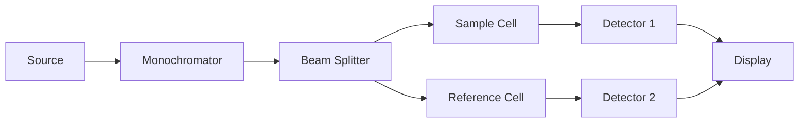

# Engineering Chemistry (2024 Pattern) — Sample Paper 1: Ideal Solution

---

## Q1) Multiple Choice Questions [10]

a) **Option (ii) Ca(HCO₃)₂** — Bicarbonates of Ca and Mg cause temporary hardness.

b) **Option (ii) Eriochrome Black T** — Metal ion indicator that changes from wine red to blue at endpoint.

c) **Option (ii) Conductance vs volume** — Conductometry measures change in conductance during titration.

d) **Option (i) Thermoplastic** — Polycarbonate softens on heating and can be remolded.

e) **Option (iii) 2D** — Single atomic layer of carbon arranged in hexagonal lattice.

f) **Option (ii) Bomb calorimeter** — Measures HCV under constant volume conditions.

g) **Option (ii) Corrosion** — Determines whether oxide film is protective or not.

---

## Unit I — Water Technology

### Q2) [12]

**a) EDTA method:** **EDTA** (Ethylene Diamine Tetraacetic Acid) forms stable complexes with Ca²⁺ and Mg²⁺ ions.

**Procedure:**
1. Take 50 mL water sample in conical flask
2. Add **NH₄Cl-NH₄OH buffer** (pH = 10) and **Eriochrome Black T** indicator (wine red color)
3. Titrate against 0.01 M EDTA until color changes from wine red to **blue** (endpoint)

**Reactions:**
- Before titration: M²⁺ + EBT → [M-EBT] (wine red, unstable)
- During titration: M²⁺ + EDTA → [M-EDTA] (colorless, stable)
- At endpoint: [M-EBT] + EDTA → [M-EDTA] + EBT (free, blue color)

**b)** Volume of EDTA = 20 mL, concentration = 0.01 M, sample = 100 mL.

1 mL of 0.01 M EDTA ≡ 1 mg of CaCO₃ equivalent (since 1 mole EDTA ≡ 1 mole CaCO₃ = 100 g)

Hardness (ppm) = \(\frac{\text{mL EDTA} \times \text{M EDTA} \times 100 \times 1000}{\text{mL sample}}\)
\[= \frac{20 \times 0.01 \times 100 \times 1000}{100} = \frac{20 \times 0.01 \times 1000 \times 100}{100}\]

Actually: Hardness in ppm = \(\frac{V \times N \times 50 \times 1000}{\text{Volume of sample}}\)

Where 50 = equivalent weight of CaCO₃ = 100/2. Using molarity:
Hardness = \(\frac{20 \times 0.01 \times 100 \times 10^6}{100 \times 1000}\) ... Let me be precise:

Hardness (ppm) = \(\frac{\text{Volume of EDTA (mL)} \times \text{Molarity of EDTA} \times 100 \times 1000}{\text{Volume of sample (mL)}}\)

\[= \frac{20 \times 0.01 \times 100 \times 1000}{100} = 200 \text{ ppm (as CaCO₃)}\]

\[ \boxed{\text{Hardness} = 200\text{ ppm}} \]

---

## Unit II — Instrumental Methods

### Q4) [12]

**a) Conductometric titration (Strong acid vs Strong base):**

HCl + NaOH → NaCl + H₂O

**Titration curve:** Initially high conductance (H⁺ ions). As NaOH is added, H⁺ is replaced by Na⁺, conductance decreases. At equivalence point, conductance is minimum (only NaCl). Further addition of NaOH increases conductance (OH⁻ ions added).

**Shape:** V-shaped curve with minimum at equivalence point.

**b) Double beam UV-Visible spectrophotometer:**

**Working:** Light from source is split into two beams — one passes through sample, other through reference. The ratio of intensities gives **absorbance**, eliminating fluctuations.

---

## Unit III — Advanced Engineering Materials

### Q6) [12]

**a) Polycarbonate:** Condensation polymer of **Bisphenol-A** and **phosgene**.

**Properties:** High impact strength, transparent, heat resistant (up to 135°C), dimensional stability, good electrical insulator.

**Applications:** Safety goggles, bullet-proof glass, aircraft windows, CDs/DVDs, electronic components.

**b) Carbon nanotubes (CNTs):**

**Structure:** Rolled graphene sheets forming seamless cylinders. **Types:** Single-walled (SWCNT), Multi-walled (MWCNT).

**Properties:** High tensile strength (~100× steel), excellent electrical conductivity (metallic or semiconducting), high thermal conductivity.

**Applications:** Reinforced composites, nano-electronics, sensors, energy storage (batteries, supercapacitors).

---

## Unit V — Corrosion & Prevention

### Q10) [12]

**a) Wet corrosion — Hydrogen evolution type:**

Occurs in acidic environment where no oxygen is present.

- **Anodic reaction:** Fe → Fe²⁺ + 2e⁻ (metal dissolves)
- **Cathodic reaction:** 2H⁺ + 2e⁻ → H₂ (hydrogen gas evolved)
- **Overall:** Fe + 2H⁺ → Fe²⁺ + H₂↑

**Conditions:** Acidic pH < 7, absence of oxygen. Corrosion products are soluble.

**b) Cathodic protection methods:**

**1. Sacrificial anode method:** A more reactive metal (Mg, Zn, Al) is connected to the structure to be protected. The sacrificial metal corrodes preferentially, protecting the structure (e.g., Mg anodes on ship hulls, underground pipelines).

**2. Impressed current method:** An external DC power supply applies current through an inert anode (graphite, platinum) to make the structure cathodic. Used for large structures (pipelines, storage tanks).

═══════════════════════════════════════════════════════
EXAMINER COMMENTARY
Why this scores full marks: Chemical reactions written for EDTA method. Diagram described for spectrophotometer. Numerical calculation with proper formula. Key terms bolded. Comparison tables where applicable.

Common Deductions:
- Not writing chemical equations for EDTA/Zeolite
- Units error in ppm calculation (missing factor of 1000)
- Confusing conductometric and pH-metric titration curves
- Not specifying CNT types (SWCNT/MWCNT)

Time Budget:
Q1: 10 min | Q2/Q3: 20 min | Q4/Q5: 20 min | Q6/Q7: 20 min | Q8/Q9: 20 min | Q10/Q11: 20 min
═══════════════════════════════════════════════════════
