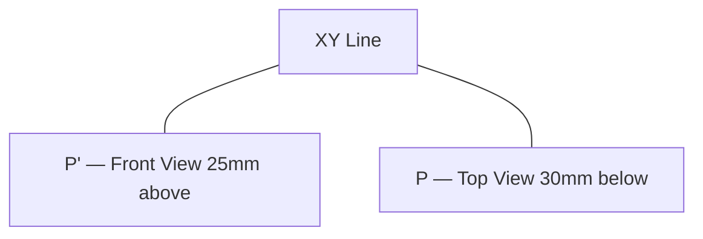

# Engineering Graphics — Sample Paper 1 — Solution

**Pattern:** SPPU 2024 (NEP) | **Total:** 70 Marks | **Time:** 2½ Hours

---

## Q1) OR Q2

### Q1) a) Projections of point P (25 mm above HP, 30 mm in front of VP) [4]

**Time Budget:** 4 min | **Bloom's:** L2

**Procedure:**
1. Draw XY line (reference line between HP and VP)
2. Mark point P in **First Quadrant** (above HP, in front of VP)
3. **Front View (P'):** 25 mm above XY line
4. **Top View (P):** 30 mm below XY line



---

### Q1) b) Projections of line AB (70 mm) [10]

**Given:** A(10,15), B(50,40), AB = 70 mm

**Procedure:**
1. Mark A' (10 above XY) and A (15 below XY)
2. Mark B' (50 above XY) and B (40 below XY)
3. Join A'B' (Front View) and AB (Top View)
4. Find **True Length (TL):** Use auxiliary view method — incline line parallel to VP/HF
5. **True inclination with HP (θ):** Angle between TL and its projection on HP
6. **True inclination with VP (φ):** Angle between TL and its projection on VP

---

### Q2) a) First Angle vs Third Angle Projection [4]

| Parameter | First Angle | Third Angle |
|-----------|-------------|-------------|
| **Object position** | Between observer and plane | Plane between observer and object |
| **Symbol** | Slanted cone with narrow end | Slanted cone with wide end |
| **Plan (Top view)** | Below XY | Above XY |
| **Elevation** | Above XY | Below XY |
| **Used in** | Europe, India | USA |

---

### Q2) b) Line CD (80 mm) inclined at 30° to HP, 45° to VP [10]

**Procedure:**
1. Draw reference point C' and C (15 above, 20 below XY)
2. Draw arc of TL=80 mm at given inclinations
3. Project points using **auxiliary plane method**
4. Front View shows inclination to HP (30°)
5. Top View shows inclination to VP (45°)

---

## Q3) OR Q4

### Q3) Pentagon inclined at 45° to HP, one side parallel to VP [14]

**Procedure:**
1. Draw pentagon of side 30 mm in its true shape (auxiliary view)
2. Incline the surface at **45° to HP**
3. One side must remain **parallel to VP**
4. Project points from auxiliary view to front and top views

**Key steps:**
- Stage 1: Keep surface parallel to HP (draw true shape)
- Stage 2: Incline to 45° (one side parallel to VP)
- Hidden edges shown as dashed lines

---

### Q4) Hexagon parallel to VP, perpendicular to HP [14]

**Procedure:**
1. Draw hexagon of side 25 mm in its **true shape** (surface parallel to VP)
2. Surface is **perpendicular to HP** → projects as a line in top view
3. One side at **30° to HP** in the auxiliary view
4. Complete projections

---

## Q5) OR Q6

### Q5) a) Square pyramid projections [7]

**Given:** Base 30 mm, Axis 50 mm, Resting on HP, All base edges equally inclined to VP

**Procedure:**
1. Top View: Square with all edges equally inclined to VP (diamond orientation)
2. Front View: Triangle (apex above base center)
3. Axis = 50 mm in front view
4. Hidden edges: Base corners hidden behind shown as dashed

---

### Q5) b) Cone with axis inclined 30° to HP [7]

**Given:** Base diameter 50 mm, Axis 60 mm, Axis inclined 30° to HP

**Procedure:**
1. Stage 1: Cone with axis perpendicular to HP (circle with center, triangle side view)
2. Stage 2: Tilt axis by **30° to HP**
3. Re-project all points
4. **Elliptical** base in front view

---

### Q6) a) Section of cylinder [8]

**Given:** Cylinder 40 mm dia, 60 mm axis. Section plane at 45° to HP

**Procedure:**
1. Draw cylinder in front and top view
2. Mark cutting plane at **45° to HP** in front view
3. Project intersection points to top view
4. **Sectional top view:** Hatching at 45°
5. **True shape:** Draw auxiliary view perpendicular to cutting plane

---

### Q6) b) Development of square prism lateral surface [6]

**Given:** Base 30 mm, Axis 60 mm

**Development (unfolded surfaces):**
```
60 mm      30 mm      30 mm      30 mm      30 mm
┌──────────┬──────────┬──────────┬──────────┬──────────┐
│          │          │          │          │          │
│   Face 1 │   Face 2 │   Face 3 │   Face 4 │  Seam    │
│          │          │          │          │          │
└──────────┴──────────┴──────────┴──────────┴──────────┘
            ← Total length = 120 mm (4 × 30) →
```
Each face: 30 mm × 60 mm rectangle. Fold lines between faces.

---

## Q7) OR Q8

### Q7) Development of truncated rectangular pyramid [14]

**Given:** Base 40×25 mm, Axis 50 mm, Cut at 20 mm from apex

**Procedure:**
1. Draw pyramid with base, apex, and cutting plane
2. Find intersection points on each edge
3. **True length of each edge** from auxiliary view
4. Draw development: base edges unfolded, truncated top
5. Hatching on cut surface
6. Remaining lateral surface — each face as trapezoid

---

### Q8) Isometric view of pentagonal prism [14]

**Given:** Base side 25 mm, Axis 60 mm

**Procedure:**
1. Draw **isometric axes** (120° apart)
2. Construct pentagon in isometric (using coordinate method)
3. Extrude axis to 60 mm
4. Draw visible edges with thick lines
5. Hidden edges with dashed lines
6. Complete isometric view with proper proportions

---

## Q9) OR Q10

### Q9) a) Orthographic views from isometric [8]

**Given:** Overall 60×40×30 mm mechanical part

**Orthographic views:**
- **Front View:** Height 30 mm, Width 60 mm (shows shape features)
- **Top View:** Width 60 mm, Depth 40 mm (shows top profile)
- **Side View (Right):** Height 30 mm, Depth 40 mm (shows side details)

Each view aligned with **projection lines** connecting common points.

---

### Q9) b) Isometric Scale [6]

**Isometric Scale:** Since isometric axes are foreshortened, a special scale is required.

**Isometric length = True length × cos(30°) = True length × 0.866**

Construction:
1. Draw horizontal line (true scale)
2. Incline at 30° (isometric axis)
3. Divide true scale into equal parts
4. Project vertically to inclined line
5. The inclined line gives **isometric measurements**

---

### Q10) a) Freehand sketch of stepped block [10]

**Given:** 50×30×40 mm stepped block

Sketch three views freehand:
- Maintain **proportions** (not exact scale)
- Use **construction lines** lightly
- Darken final visible edges
- Hidden edges as dashed lines
- **Front view:** Shows step profile
- **Top view:** Shows width and depth
- **Side view:** Shows height and depth

---

### Q10) b) Definitions [4]

- **Isometric Axis:** Three mutually perpendicular lines drawn at 120° to each other (one vertical, two at 30° to horizontal)
- **Isometric Plane:** A plane parallel to any one of the isometric axes
- **Isometric Scale:** Scale used to measure foreshortened lengths in isometric projection (1 isometric unit = 0.866 true units)

---

## Mnemonic Summary

| Concept | Mnemonic |
|---------|----------|
| **Projection methods** | **FAT** — First Angle (object before plane), similar to European |
| **Angle difference** | **FA3T** — First Angle = 1,3 quadrants; Third Angle = 3,1 reversed |
| **Isometric axes** | **V30** — Vertical + 30° left + 30° right |
| **Section hatching** | **45°** — Always at 45° to horizontal, same direction per part |
| **Development** | **FLATS** — Fold Lines Aligned To Surface |
