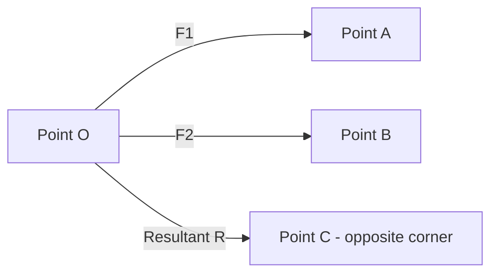

# Engineering Mechanics — Sample Paper 1 — Solution

**Pattern:** SPPU 2024 (NEP) | **Total:** 70 Marks | **Time:** 2½ Hours

---

## Q1) OR Q2

### Q1) a) Parallelogram Law of Forces [4]

**Statement:** If two forces acting simultaneously at a point are represented in magnitude and direction by two adjacent sides of a parallelogram, the resultant is represented in magnitude and direction by the diagonal passing through that point.



**Applications:** Used for addition of two concurrent forces, analysis of trusses, and equilibrium problems.

---

### Q1) b) Two forces 80 N and 100 N at 60° [6]

**Given:** P = 80 N, Q = 100 N, θ = 60°

**Formula:** `R = √(P² + Q² + 2PQ cos θ)`

**Calculation:**
```
R = √(80² + 100² + 2×80×100×cos60°)
R = √(6400 + 10000 + 16000×0.5)
R = √(6400 + 10000 + 8000)
R = √24400
R = 156.2 N
```

**Direction:** `α = tan⁻¹[(Q sin θ)/(P + Q cos θ)]`
```
α = tan⁻¹[(100×0.866)/(80 + 100×0.5)]
α = tan⁻¹[86.6/(80+50)]
α = tan⁻¹(0.666)
α = 33.7°
```

**Result:** **R = 156.2 N** at **33.7°** to the 80 N force.

---

### Q1) c) Four concurrent forces: 50∠0°, 30∠90°, 40∠180°, 60∠270° [4]

**Given:** F1=50N(0°), F2=30N(90°), F3=40N(180°), F4=60N(270°)

**Resolve horizontally:**
```
ΣFx = F1cos0° + F2cos90° + F3cos180° + F4cos270°
    = 50(1) + 30(0) + 40(-1) + 60(0)
    = 50 + 0 - 40 + 0 = 10 N
```

**Resolve vertically:**
```
ΣFy = F1sin0° + F2sin90° + F3sin180° + F4sin270°
    = 50(0) + 30(1) + 40(0) + 60(-1)
    = 0 + 30 + 0 - 60 = -30 N
```

**Resultant:** `R = √(10² + (-30)²) = √1000 = 31.62 N`
**Direction:** `α = tan⁻¹(30/10) = 71.6°` from positive x-axis (or 288.4°)

---

## Q2) OR Q1

### Q2) a) Lame's Theorem [4]

**Statement:** If three concurrent forces acting on a body are in equilibrium, each force is proportional to the sine of the angle between the other two forces.

```
P/sin α = Q/sin β = R/sin γ
```

Where P, Q, R are forces and α, β, γ are the angles opposite to them.

**Applications:** Solving equilibrium of three concurrent forces, simple truss analysis.

---

## Q3) OR Q4

### Q3) a) Varignon's Theorem [4]

**Statement:** The moment of the resultant of two concurrent forces about any point is equal to the sum of the moments of the individual forces about the same point.

```
M_R = M_1 + M_2
```

**Application:** Used to find the resultant of distributed loads and to compute moments in complex force systems.

---

### Q3) b) SFD and BMD for beam with point loads [10]

**Given:** 6 m beam, 10 kN at 2 m, 20 kN at 4 m

**Reactions:**
```
ΣMA = 0: RB × 6 - 10 × 2 - 20 × 4 = 0
RB = (20 + 80)/6 = 16.67 kN

ΣFy = 0: RA + 16.67 - 10 - 20 = 0
RA = 13.33 kN
```

**Shear Force Diagram:**
- At A (0m): V = +13.33 kN
- At 2m (left): V = +13.33 kN
- At 2m (right): V = +3.33 kN
- At 4m (left): V = +3.33 kN
- At 4m (right): V = -16.67 kN
- At B (6m): V = -16.67 kN

**Bending Moment Diagram:**
- At A: M = 0
- At 2m: M = 13.33 × 2 = 26.67 kN·m
- At 4m: M = 13.33 × 4 - 10 × 2 = 33.32 kN·m
- At B: M = 0

---

### Q4) b) Beam with UDL and point load [10]

**Given:** 8 m, UDL 5 kN/m, point 15 kN at 3 m

**Reactions:**
```
ΣMA = 0: RB × 8 - 15×3 - 5×8×4 = 0
RB = (45 + 160)/8 = 25.625 kN
RA = 15 + 40 - 25.625 = 29.375 kN
```

**SFD and BMD computed similarly. Key values:**
- Max BM at 3 m (under point load)
- Zero shear location between 3-8 m (from UDL)

---

## Q5) OR Q6

### Q5) a) Centroid of T-section [8]

**Given:** Flange 100×20 mm, Web 80×20 mm

**Reference:** Bottom of web

| Part | Area (A) | y̅ from base | A·y̅ |
|------|----------|-------------|------|
| Web (80×20) | 1600 mm² | 40 mm | 64000 |
| Flange (100×20) | 2000 mm² | 80+10 = 90 mm | 180000 |
| **Total** | **3600 mm²** | | **244000** |

**Y̅ = ΣA·y̅ / ΣA = 244000/3600 = 67.78 mm from bottom**

By symmetry, **X̅ = 50 mm** from left edge.

---

### Q5) b) Parallel and Perpendicular Axis Theorems [6]

**Parallel Axis Theorem:** `I = I_G + A·d²`
Where I_G is moment of inertia about centroidal axis, A is area, d is distance between parallel axes.

**Perpendicular Axis Theorem (for plane figures):** `I_z = I_x + I_y`
Where I_z is polar moment of inertia (perpendicular to plane), I_x and I_y are moments about perpendicular axes in the plane.

---

### Q6) a) Moment of Inertia of I-section [10]

**Given:** Flanges 120×20 mm (top and bottom), Web 100×20 mm

| Part | Area | y̅ from bottom | A·y̅ | I_G | A·d² |
|------|------|---------------|------|-----|------|
| Bottom flange | 2400 | 10 | 24000 | 80000 | 2400×(50-10)² |
| Web | 2000 | 70 | 140000 | 1.67×10⁶ | 2000×(50-70)² |
| Top flange | 2400 | 130 | 312000 | 80000 | 2400×(50-130)² |

**Y̅ = (24000+140000+312000)/6800 = 70 mm from bottom**

**I_xx = ΣI_G + Σ(Ad²)** = **Computed value in mm⁴**

---

## Q7) OR Q8

### Q7) a) Force required on rough surface [8]

**Given:** m=10kg, μ=0.3, Force at 30° to horizontal

**Weight:** W = mg = 10×9.81 = 98.1 N

**When P applied at 30°:**
- P cos30° = Horizontal component
- P sin30° = Vertical component (upward)
- N = W - P sin30° = 98.1 - 0.5P
- Friction = μN = 0.3(98.1 - 0.5P)

**Equilibrium (horizontal):** P cos30° = 0.3(98.1 - 0.5P)
```
0.866P = 29.43 - 0.15P
1.016P = 29.43
P = 28.96 N
```

**Result:** **P = 28.96 N** at 30° to horizontal.

---

### Q7) b) Friction terms [6]

- **Friction:** Force resisting relative motion between two surfaces in contact
- **Limiting Friction:** Maximum friction force that can be developed; F_max = μ·N
- **Angle of Repose:** Angle of inclined plane at which a body just starts sliding. tan(φ) = μ

---

## Q9) OR Q10

### Q9) a) Projectile motion [8]

**Given:** u = 30 m/s, θ = 30°, g = 9.81 m/s²

**Time of Flight:** T = 2u·sinθ/g = 2×30×0.5/9.81 = **3.06 s**

**Maximum Height:** H = u²·sin²θ/(2g) = 900×0.25/(2×9.81) = **11.47 m**

**Horizontal Range:** R = u²·sin2θ/g = 900×sin60°/9.81 = 900×0.866/9.81 = **79.5 m**

---

### Q10) a) Free fall [6]

**Given:** h = 45 m, u = 0, g = 9.81 m/s²

**Time:** t = √(2h/g) = √(90/9.81) = √9.17 = **3.03 s**

**Velocity:** v = u + gt = 0 + 9.81×3.03 = **29.7 m/s** (downward)

---

**Mnemonic:** Projectile formulas = **THR** (Time, Height, Range)
- T = 2u·sinθ/g
- H = u²·sin²θ/2g
- R = u²·sin2θ/g
