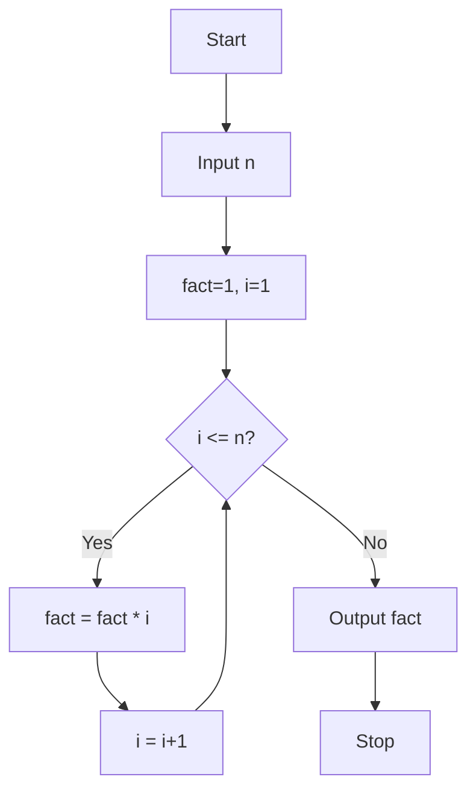

# Fundamentals of Programming Languages (2024 Pattern) — Sample Paper 1: Ideal Solution

---

## Q1) Multiple Choice Questions [10]

a) **Option (ii) `var_2`** — C identifiers can contain letters, digits, and underscores; must start with letter or underscore.

b) **Option (iii) depends on compiler** — `int` size is 2 bytes on 16-bit and 4 bytes on 32/64-bit systems.

c) **Option (ii) `&`** — Address-of operator.

d) **Option (i) 11001** — \(25_{10} = 16+8+1 = 11001_2\)

e) **Option (ii) Diamond** — Decision/condition symbol in flowchart.

f) **Option (ii) 5** — `strlen` counts characters before the first `\0` (null terminator).

---

## Unit I — Introduction to Program Planning

### Q2) [12]

**a) Factorial algorithm and flowchart:**

**Algorithm:**
```
Step 1: Start
Step 2: Read n
Step 3: fact = 1, i = 1
Step 4: If i > n go to Step 7
Step 5: fact = fact * i
Step 6: i = i + 1, go to Step 4
Step 7: Print fact
Step 8: Stop
```



**b) C tokens:**
1. **Keywords:** Reserved words with predefined meaning (e.g., `int`, `if`, `return`, `while`)
2. **Identifiers:** User-defined names for variables, functions (e.g., `myVar`, `sum`, `total`)
3. **Constants:** Fixed values that don't change (e.g., `42`, `3.14`, `'A'`, `"Hello"`)
4. **Operators:** Symbols that perform operations (e.g., `+`, `-`, `*`, `&&`, `=`)

---

## Unit III — Control Flow

### Q6) [12]

**a) Leap year program:**
```c
#include <stdio.h>
int main() {
    int year;
    printf("Enter year: ");
    scanf("%d", &year);
    if ((year % 400 == 0) || (year % 4 == 0 && year % 100 != 0))
        printf("%d is a leap year\n", year);
    else
        printf("%d is not a leap year\n", year);
    return 0;
}
```

**b) `switch` statement:** Used for multi-way branching based on integer/character expression.
```c
switch(choice) {
    case 1: printf("Add"); break;
    case 2: printf("Subtract"); break;
    default: printf("Invalid");
}
```
**Flow:** Expression → matched `case` → execute statements → `break` exits switch.

---

### Q7) [12]

**a) Fibonacci series:**
```c
#include <stdio.h>
int main() {
    int n, a=0, b=1, c, i;
    printf("Enter terms: ");
    scanf("%d", &n);
    printf("%d %d ", a, b);
    for(i = 3; i <= n; i++) {
        c = a + b;
        printf("%d ", c);
        a = b;
        b = c;
    }
    return 0;
}
```

**b) `while` vs `do-while`:**

| Basis | while | do-while |
|---|---|---|
| **Condition check** | Entry controlled (before loop) | Exit controlled (after loop) |
| **Minimum executions** | 0 (may not execute) | 1 (always executes once) |
| **Syntax** | `while(cond) { }` | `do { } while(cond);` |
| **Use case** | When iterations unknown | When at least one iteration needed |

---

## Unit V — User Defined Functions

### Q10) [12]

**a) Function categories:**

1. **No arguments, no return:** `void greet() { printf("Hello"); }`
2. **With arguments, no return:** `void show(int x) { printf("%d", x); }`
3. **No arguments, with return:** `int get() { return 10; }`
4. **With arguments, with return:** `int add(int a, int b) { return a+b; }`

**b) Factorial using recursion:**
```c
#include <stdio.h>
int fact(int n) {
    if (n <= 1) return 1;
    return n * fact(n - 1);
}
int main() {
    int n;
    printf("Enter n: ");
    scanf("%d", &n);
    printf("Factorial: %d\n", fact(n));
    return 0;
}
```

**Recursion:** Function calls itself with smaller input until base case is reached.

---

### Q11) [12]

**a) Structures in C:** User-defined data type grouping different types under one name.
```c
struct Employee {
    int id;
    char name[50];
    float salary;
};
```

**b) Student structure program:**
```c
#include <stdio.h>
struct Student {
    char name[50];
    int roll_no;
    float marks;
};
int main() {
    struct Student s[3] = {
        {"Alice", 101, 85.5},
        {"Bob", 102, 78.0},
        {"Charlie", 103, 92.3}
    };
    for(int i = 0; i < 3; i++)
        printf("Name: %s, Roll: %d, Marks: %.1f\n",
               s[i].name, s[i].roll_no, s[i].marks);
    return 0;
}
```

═══════════════════════════════════════════════════════
EXAMINER COMMENTARY
Why this scores full marks: Runnable C code with proper syntax. Algorithm + flowchart for factorial. Tables for comparisons (loops). Structure and recursion explained with working code. Key terms bolded.

Common Deductions:
- Missing `#include` and `main()` in code snippets
- Indentation errors in code
- Confusing `while` and `do-while` execution counts
- Not handling base case in recursion
- Missing `break` in `switch` cases

Time Budget:
Q1: 10 min | Q2/Q3: 20 min | Q4/Q5: 20 min | Q6/Q7: 20 min | Q8/Q9: 20 min | Q10/Q11: 20 min
═══════════════════════════════════════════════════════
