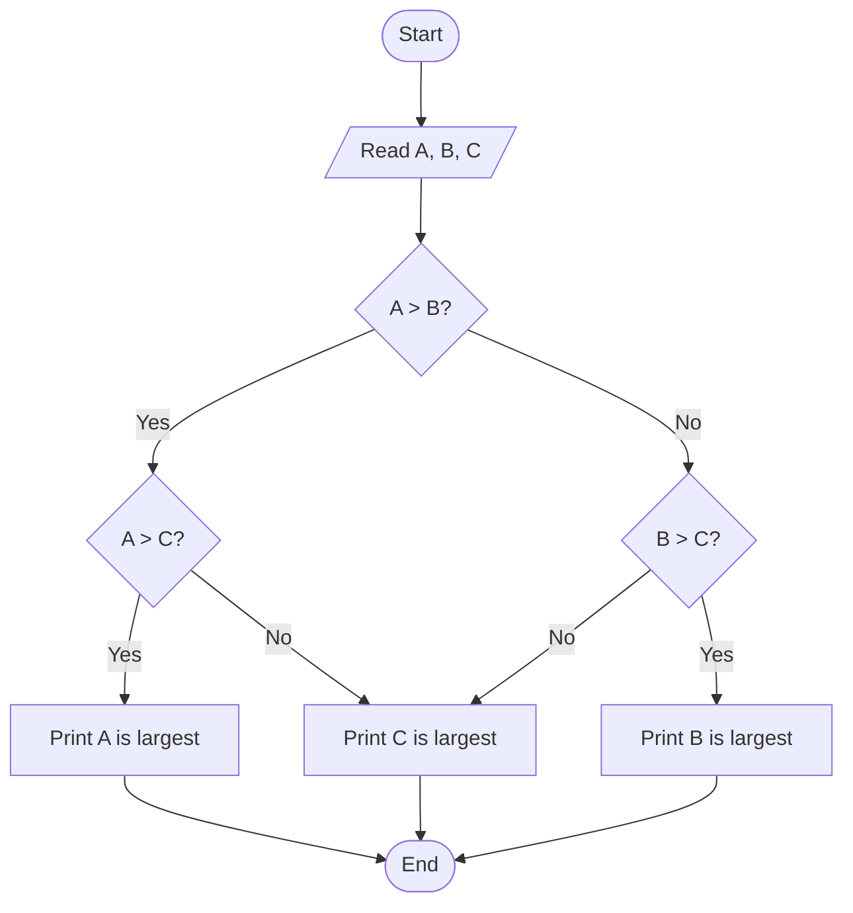

# Programming and Problem Solving — Sample Paper 1 — Solution

**Pattern:** SPPU 2024 (NEP) | **Total:** 70 Marks | **Time:** 2½ Hours

---

## Q1) OR Q2

### Q1) a) Define Algorithm and Flowchart. Explain characteristics of a good algorithm. [6]

**Time Budget:** 6 min | **Bloom's:** L1 (Remember)

**Algorithm:** A step-by-step, unambiguous sequence of instructions to solve a problem in finite time.

**Flowchart:** A graphical representation of an algorithm using standard symbols (oval=start/end, rectangle=process, diamond=decision, parallelogram=I/O).

**Characteristics of a good algorithm:**

1. **Definiteness** — Each step must be precisely defined and unambiguous.
2. **Finiteness** — Must terminate after a finite number of steps.
3. **Input** — Zero or more inputs must be specified.
4. **Output** — At least one output must be produced.
5. **Effectiveness** — Each step must be basic enough to be performed manually.
6. **Feasibility** — Must be implementable with available resources.

---

### Q1) b) Explain data types in C with syntax and examples. [8]

**Time Budget:** 8 min | **Bloom's:** L2 (Understand)

| Data Type | Size | Format Specifier | Range | Example |
|-----------|------|------------------|-------|---------|
| `int` | 2/4 bytes | `%d` | -32,768 to 32,767 | `int a = 10;` |
| `float` | 4 bytes | `%f` | 3.4E-38 to 3.4E+38 | `float b = 3.14;` |
| `double` | 8 bytes | `%lf` | 1.7E-308 to 1.7E+308 | `double c = 3.14159;` |
| `char` | 1 byte | `%c` | -128 to 127 | `char d = 'A';` |
| `void` | 0 bytes | — | No value | `void func();` |

**Modifiers:** `short`, `long`, `unsigned`, `signed`

```c
// Example
int main() {
    int age = 20;
    float pi = 3.14f;
    char grade = 'A';
    printf("Age: %d, PI: %.2f, Grade: %c", age, pi, grade);
    return 0;
}
```

---

## Q2) OR Q1

### Q2) a) What is a flowchart? Draw flowchart to find largest of three numbers. [6]

**Flowchart:** A pictorial representation of an algorithm using standard graphical symbols.



---

### Q2) b) Explain operators in C with examples. [8]

| Operator Type | Operators | Example | Description |
|--------------|-----------|---------|-------------|
| **Arithmetic** | `+`, `-`, `*`, `/`, `%` | `a + b` | Basic math operations |
| **Relational** | `==`, `!=`, `<`, `>`, `<=`, `>=` | `a > b` | Compare values |
| **Logical** | `&&`, `\|\|`, `!` | `(a > b) && (b > c)` | Boolean logic |
| **Bitwise** | `&`, `\|`, `^`, `~`, `<<`, `>>` | `a & b` | Bit-level operations |
| **Assignment** | `=`, `+=`, `-=`, `*=`, `/=` | `a += 5` | Assign values |
| **Ternary** | `?:` | `a > b ? a : b` | Conditional expression |

```c
int a = 10, b = 20, c;
c = (a > b) ? a : b;  // c = 20 (ternary)
c = a & b;             // Bitwise AND
```

---

**Time Budget:** Q2 total = 14 min

---

## Q3) OR Q4

### Q3) a) Explain Arrays. Write program to reverse an array. [8]

**Array:** A collection of elements of the same data type stored in contiguous memory locations, accessed using an index.

```c
#include <stdio.h>
void reverse(int arr[], int n) {
    int temp;
    for (int i = 0; i < n / 2; i++) {
        temp = arr[i];
        arr[i] = arr[n - 1 - i];
        arr[n - 1 - i] = temp;
    }
}
int main() {
    int arr[] = {10, 20, 30, 40, 50};
    int n = 5;
    reverse(arr, n);
    printf("Reversed array: ");
    for (int i = 0; i < n; i++) printf("%d ", arr[i]);
    return 0;
}
```
**Output:** `50 40 30 20 10`

**Complexity:** `O(n)` time, `O(1)` space.

---

### Q3) b) Call by value vs Call by reference. [6]

| Call by Value | Call by Reference |
|--------------|-------------------|
| Copies actual value to formal parameter | Passes address of actual parameter |
| Changes don't affect original | Changes affect original |
| Uses normal variables | Uses pointers |
| `void swap(int a, int b)` | `void swap(int *a, int *b)` |
| Safer (no side effects) | More memory efficient |

**Example:**
```c
void swapByValue(int x, int y) {  // No swap
    int temp = x; x = y; y = temp;
}
void swapByRef(int *x, int *y) {  // Swaps!
    int temp = *x; *x = *y; *y = temp;
}
```

---

## Q4) OR Q3

### Q4) a) Recursive factorial program. [8]

```c
#include <stdio.h>
int factorial(int n) {
    if (n == 0 || n == 1) return 1;     // Base case
    return n * factorial(n - 1);          // Recursive case
}
int main() {
    int n = 5;
    printf("Factorial of %d = %d", n, factorial(n));
    return 0;
}
```
**Output:** `Factorial of 5 = 120`

**Trace for n=5:**
```
factorial(5) = 5 * factorial(4)
            = 5 * 4 * factorial(3)
            = 5 * 4 * 3 * factorial(2)
            = 5 * 4 * 3 * 2 * factorial(1)
            = 5 * 4 * 3 * 2 * 1 = 120
```

---

### Q4) b) Pointer arithmetic with examples. [6]

Pointers store memory addresses. Arithmetic on pointers adjusts by the size of the data type.

| Operation | Meaning | Example (`int *p`, `int a[5]`) |
|-----------|---------|----------------------|
| `p + n` | Address + n * sizeof(type) | `p = &a[0]; p + 2 = &a[2]` |
| `p - n` | Address - n * sizeof(type) | `p = &a[4]; p - 2 = &a[2]` |
| `p++` | Move to next element | `p++ → points to a[1]` |
| `p--` | Move to previous element | `p-- → points to a[3]` |
| `p - q` | Number of elements between | `&a[4] - &a[0] = 4` |

```c
int arr[] = {10, 20, 30, 40, 50};
int *p = arr;          // p = &arr[0]
printf("%d", *(p+2));  // Output: 30 (arr[2])
p++;                   // Now p = &arr[1]
printf("%d", *p);      // Output: 20
```

---

**Time Budget:** Q3/Q4 total = 14 min

---

## Q5) OR Q6

### Q5) a) Structure and program to display student details. [8]

**Structure:** A user-defined data type that groups related variables of different types under one name.

```c
#include <stdio.h>
#include <string.h>

struct Student {
    int roll_no;
    char name[50];
    float marks;
};

int main() {
    struct Student s1 = {101, "Alice", 89.5};
    printf("Roll No: %d\n", s1.roll_no);
    printf("Name: %s\n", s1.name);
    printf("Marks: %.2f\n", s1.marks);
    return 0;
}
```

---

### Q5) b) Differentiate Structure and Union. [6]

| Structure | Union |
|-----------|-------|
| `struct { int a; float b; }` | `union { int a; float b; }` |
| All members get separate memory | All members share same memory |
| Size = sum of all members' sizes | Size = size of largest member |
| `sizeof(struct) = 6` (int 2 + float 4) | `sizeof(union) = 4` (float) |
| All members accessible simultaneously | Only one member accessible at a time |
| `s1.a` and `s1.b` both valid | Modifying `u.a` corrupts `u.b` |
| Used for records | Used for memory-efficient variant storage |

---

## Q6) OR Q5

### Q6) a) Dynamic Memory Allocation functions. [8]

| Function | Syntax | Description |
|----------|--------|-------------|
| **malloc()** | `(type*)malloc(n * sizeof(type))` | Allocates n blocks of uninitialized memory |
| **calloc()** | `(type*)calloc(n, sizeof(type))` | Allocates n blocks initialized to 0 |
| **realloc()** | `realloc(ptr, new_size)` | Resizes previously allocated memory |
| **free()** | `free(ptr)` | Deallocates memory |

```c
int *arr = (int*)malloc(5 * sizeof(int));       // allocate
int *arr2 = (int*)calloc(5, sizeof(int));        // allocate + zero
arr = (int*)realloc(arr, 10 * sizeof(int));       // resize
free(arr);                                        // deallocate
```

---

### Q6) b) File handling functions. [6]

| Function | Syntax | Description |
|----------|--------|-------------|
| **fopen()** | `FILE *fp = fopen("file.txt", "r");` | Opens a file with mode (r/w/a/r+/w+/a+) |
| **fclose()** | `fclose(fp);` | Closes an opened file |
| **fread()** | `fread(&ptr, size, count, fp);` | Reads binary data from file |
| **fwrite()** | `fwrite(&ptr, size, count, fp);` | Writes binary data to file |

```c
FILE *fp = fopen("data.txt", "w");
fprintf(fp, "Hello, File!");
fclose(fp);

fp = fopen("data.txt", "r");
char str[100];
fscanf(fp, "%s", str);
fclose(fp);
```

---

**Time Budget:** Q5/Q6 total = 14 min

---

## Q7) OR Q8

### Q7) a) String concatenation without strcat(). [6]

```c
#include <stdio.h>
void concat(char dest[], char src[]) {
    int i = 0, j = 0;
    while (dest[i] != '\0') i++;      // Find end of dest
    while (src[j] != '\0') {           // Copy src to end
        dest[i] = src[j];
        i++; j++;
    }
    dest[i] = '\0';                    // Null terminate
}
int main() {
    char str1[50] = "Hello ";
    char str2[] = "World!";
    concat(str1, str2);
    printf("%s", str1);                // Output: Hello World!
    return 0;
}
```

---

### Q7) b) Bubble Sort program. [8]

```c
#include <stdio.h>
void bubbleSort(int arr[], int n) {
    int temp;
    for (int i = 0; i < n-1; i++) {
        for (int j = 0; j < n-i-1; j++) {
            if (arr[j] > arr[j+1]) {
                temp = arr[j];
                arr[j] = arr[j+1];
                arr[j+1] = temp;
            }
        }
    }
}
int main() {
    int arr[] = {64, 34, 25, 12, 22, 11, 90};
    int n = 7;
    bubbleSort(arr, n);
    printf("Sorted: ");
    for (int i = 0; i < n; i++) printf("%d ", arr[i]);
    return 0;
}
```
**Output:** `11 12 22 25 34 64 90`
**Complexity:** `O(n²)` time, `O(1)` space.

---

## Q8) OR Q7

### Q8) a) Linear Search vs Binary Search with complexity comparison. [8]

```c
int linearSearch(int arr[], int n, int key) {
    for (int i = 0; i < n; i++)
        if (arr[i] == key) return i;
    return -1;
}

int binarySearch(int arr[], int low, int high, int key) {
    while (low <= high) {
        int mid = low + (high - low) / 2;
        if (arr[mid] == key) return mid;
        if (arr[mid] < key) low = mid + 1;
        else high = mid - 1;
    }
    return -1;
}
```

| Aspect | Linear Search | Binary Search |
|--------|---------------|---------------|
| **Precondition** | Unsorted or sorted | Must be sorted |
| **Approach** | Sequential | Divide and conquer |
| **Time (Best)** | `O(1)` — found at first | `O(1)` — found at middle |
| **Time (Worst)** | `O(n)` | `O(log n)` |
| **Space** | `O(1)` | `O(1)` iterative |
| **When to use** | Small arrays (<100) | Large sorted arrays |

---

### Q8) b) 2D arrays with matrix multiplication example. [6]

```c
#include <stdio.h>
int main() {
    int a[2][2] = {{1,2}, {3,4}};
    int b[2][2] = {{5,6}, {7,8}};
    int c[2][2] = {0};

    for (int i = 0; i < 2; i++)
        for (int j = 0; j < 2; j++)
            for (int k = 0; k < 2; k++)
                c[i][j] += a[i][k] * b[k][j];

    printf("Result:\n");
    for (int i = 0; i < 2; i++) {
        for (int j = 0; j < 2; j++)
            printf("%d ", c[i][j]);
        printf("\n");
    }
    return 0;
}
```
**Output:** `19 22 / 43 50`

---

**Time Budget:** Q7/Q8 total = 14 min

---

## Q9) OR Q10

### Q9) a) Need for Problem Solving and steps. [6]

**Need for Problem Solving:** Computers execute instructions but cannot think. Problem solving provides a structured methodology to convert real-world problems into computer-executable solutions.

**Steps:**
1. **Define Problem** — Understand inputs, outputs, and constraints
2. **Analyze** — Break into smaller sub-problems
3. **Design Algorithm** — Develop step-by-step solution
4. **Flowchart/Pseudocode** — Visual/textual representation
5. **Code** — Implement in programming language
6. **Test & Debug** — Verify correctness
7. **Document** — Explain the solution

---

### Q9) b) Palindrome string check program. [8]

```c
#include <stdio.h>
#include <string.h>
#include <ctype.h>

int isPalindrome(char str[]) {
    int left = 0, right = strlen(str) - 1;
    while (left < right) {
        if (tolower(str[left]) != tolower(str[right]))
            return 0;  // Not palindrome
        left++;
        right--;
    }
    return 1;  // Palindrome
}
int main() {
    char str[] = "Madam";
    if (isPalindrome(str))
        printf("\"%s\" is a palindrome", str);
    else
        printf("\"%s\" is not a palindrome", str);
    return 0;
}
```
**Output:** `"Madam" is a palindrome`

---

## Q10) OR Q9

### Q10) a) Storage classes in C. [8]

| Class | Keyword | Storage | Scope | Lifetime | Default Value |
|-------|---------|---------|-------|----------|---------------|
| **Automatic** | `auto` | RAM | Local | Function | Garbage |
| **Register** | `register` | CPU Register | Local | Function | Garbage |
| **Static** | `static` | RAM | Local (global for file) | Program execution | Zero |
| **External** | `extern` | RAM | Global | Program execution | Zero |

```c
void counter() {
    static int count = 0;  // Retains value across calls
    count++;
    printf("%d ", count);
}
int main() {
    counter(); counter(); counter();  // Output: 1 2 3
    return 0;
}
```

---

### Q10) b) Command line arguments program. [6]

```c
#include <stdio.h>
#include <stdlib.h>

int main(int argc, char *argv[]) {
    int sum = 0;
    printf("Number of arguments: %d\n", argc);
    for (int i = 1; i < argc; i++) {  // Start from 1 (skip program name)
        sum += atoi(argv[i]);           // Convert string to int
    }
    printf("Sum = %d\n", sum);
    return 0;
}
```

**Execution:** `./sum 10 20 30 40`
**Output:** `Number of arguments: 5` / `Sum = 100`

---

**Time Budget:** Q9/Q10 total = 14 min

---

## Mnemonic Summary

| Topic | Mnemonic |
|-------|----------|
| **Algorithm characteristics** | **DIFOEF** — Definiteness, Input, Finiteness, Output, Effectiveness, Feasibility |
| **Storage classes** | **ARSE** — Auto, Register, Static, Extern |
| **Dynamic allocation** | **MCRF** — Malloc, Calloc, Realloc, Free |
| **Operator types** | **ARLBAT** — Arithmetic, Relational, Logical, Bitwise, Assignment, Ternary |
| **File modes** | **RWA+** — Read, Write, Append, Append+Read |
