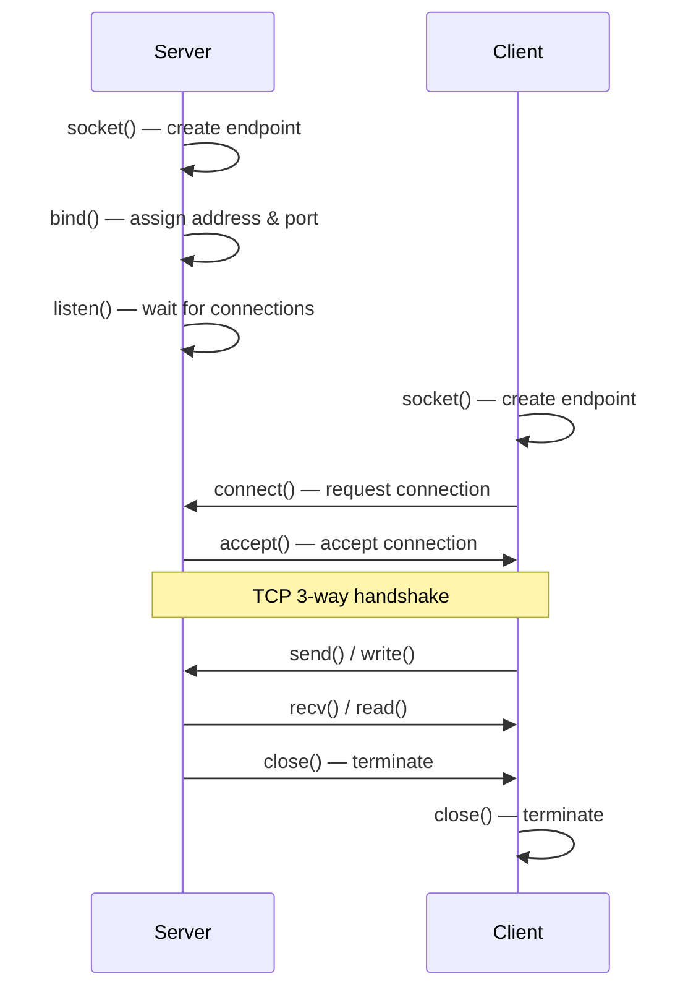
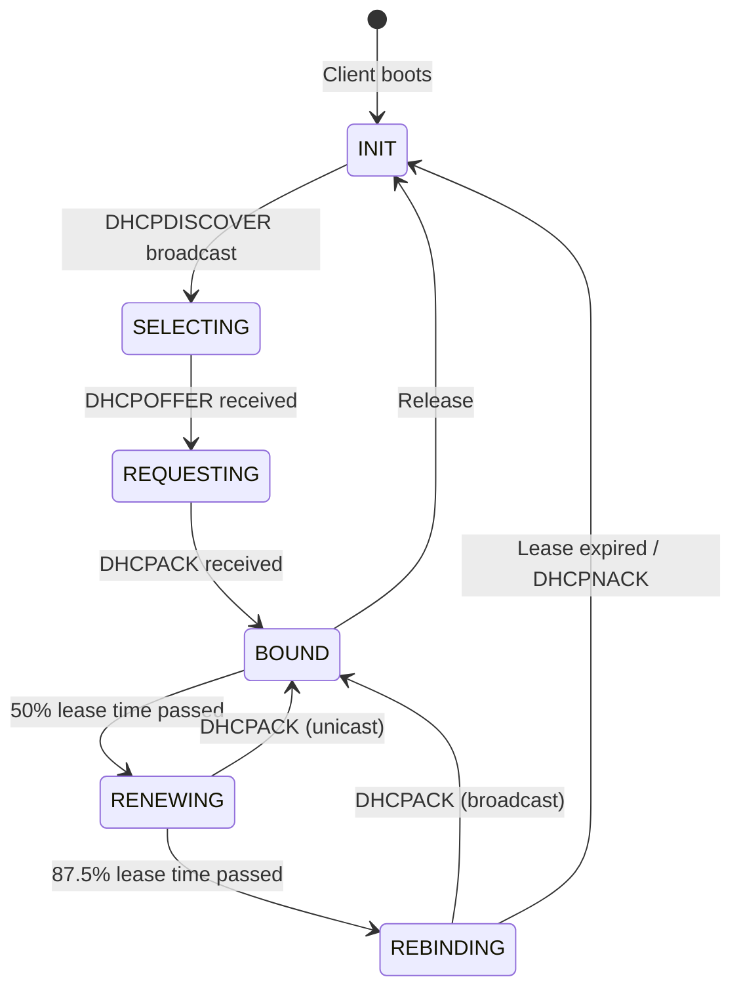

---

# COMPUTER NETWORKS AND SECURITY — Sample Solution

**Paper Code:** [6262]-38 | **Total Marks:** 70 | **Time:** 2½ Hours

---

## Q1) a) Circuit Switching vs Packet Switching [6]

| Parameter           | Circuit Switching                       | Packet Switching                             |
| ------------------- | --------------------------------------- | -------------------------------------------- |
| Resource allocation | Dedicated path reserved for entire call | Resources shared on demand                   |
| Path                | Fixed, established before communication | Dynamic, each packet may take different path |
| Delay               | Fixed (propagation only)                | Variable (queuing + propagation)             |
| Efficiency          | Wasted bandwidth during silence         | Efficient bandwidth utilization              |
| Store-and-forward   | No                                      | Yes                                          |
| Call setup          | Required (connection establishment)     | Not required (connectionless)                |
| Example             | Traditional telephone network           | Internet (IP)                                |

---

## Q1) b) Routing Information Protocol (RIP) [6]

**RIP** is a **distance-vector** routing protocol used in small to medium-sized networks.

- **Metric:** Hop count (max 15 hops — 16 = infinity/unreachable)
- **Algorithm:** Bellman-Ford distance vector
- **Updates:** Every 30 seconds (full routing table broadcast)
- **Port:** UDP port 520
- **Versions:** RIPv1 (classful), RIPv2 (classless, supports CIDR/VLSM)

**Features:**

- **Split horizon**: Never advertise a route back on the interface it was learned from
- **Poison reverse**: Advertise failed routes with metric 16
- **Hold-down timer**: 180 seconds before accepting new routes for a failed network

**Limitations:** Slow convergence, limited to 15 hops, high bandwidth usage for updates.

---

## Q1) c) IP Subnetting [6]

**Given:** 192.168.5.71 / 26

**/26** means 26 network bits, **6 host bits**.

**i) Subnet mask:** 255.255.255.192 (binary: 11111111.11111111.11111111.11000000)

**ii) Network address:**

- 71 in binary = 01000111
- With /26 mask (11000000): 01000000 = 64
- **Network address:** 192.168.5.64

**iii) First usable IP:** 192.168.5.65

**iv) Last usable IP:** 192.168.5.126 (broadcast is 192.168.5.127)

**v) Broadcast address:** 192.168.5.127

```
[ANSWER BOX]
Subnet mask:      255.255.255.192
Network address:  192.168.5.64
First usable:     192.168.5.65
Last usable:      192.168.5.126
Broadcast:        192.168.5.127
```

---

## Q2) a) IPv6 Header Format [6]

**IPv6 Header (40 bytes fixed):**

```
┌───────────────────────────────────────────────────────────────┐
| Version | Traffic Class |           Flow Label                |
| (4 bit) |   (8 bit)     |           (20 bit)                  |
├───────────────────────────────────────────────────────────────┤
|         Payload Length          |  Next Header |  Hop Limit   |
|            (16 bit)             |   (8 bit)    |   (8 bit)    |
├───────────────────────────────────────────────────────────────┤
|                                                               |
|                    Source Address (128 bit)                    |
|                                                               |
├───────────────────────────────────────────────────────────────┤
|                                                               |
|                  Destination Address (128 bit)                |
|                                                               |
└───────────────────────────────────────────────────────────────┘
```

**Improvements over IPv4:**

- Larger address space (128-bit vs 32-bit)
- Simplified header (no checksum, no fragmentation in routers)
- Built-in security (IPSec mandatory)
- Better multicast support (anycast introduced)
- No NAT required (true end-to-end connectivity)
- Autoconfiguration (stateless address autoconfiguration/SLAAC)

---

## Q2) b) Border Gateway Protocol (BGP) [6]

**BGP** is the **path-vector** routing protocol that governs routing between **Autonomous Systems
(AS)** on the internet.

- **Type:** Exterior Gateway Protocol (EGP)
- **Transport:** TCP port 179
- **Metric:** Path attributes (AS-path, next-hop, local preference)
- **Versions:** BGP-4 (current)

**Key concepts:**

- **eBGP**: Between different ASes
- **iBGP**: Within the same AS
- **Path attributes**: AS_PATH, NEXT_HOP, LOCAL_PREF, MED
- **Route selection**: Shortest AS_PATH → lowest MED → eBGP > iBGP

**Advantages:** Policy-based routing, loop-free (AS_PATH contains all ASes), scalable for global
internet.

---

## Q2) c) Network Layer Functions [6]

1. **Logical Addressing**: Assigns IP addresses (IPv4/IPv6) to uniquely identify hosts
2. **Routing**: Determines the best path from source to destination
3. **Forwarding**: Moves packets from input to output port of a router
4. **Fragmentation & Reassembly**: Splits packets when MTU differs across networks
5. **Error Handling**: ICMP messages for unreachable hosts, TTL exceeded
6. **Quality of Service (QoS)**: Traffic prioritization, congestion notification

---

## Q3) a) TCP Header Format [6]

```
┌────────────────┬───────────────────────────────────────────┐
│ Source Port                │   Destination Port            │
│ (16 bit)                   │   (16 bit)                    │
├────────────────┼───────────────────────────────────────────┤
│                    Sequence Number (32 bit)                 │
├─────────────────────────────────────────────────────────────┤
│                 Acknowledgment Number (32 bit)              │
├──────┬─────────┬────┬────┬────┬────┬────┬────┬─────────────┤
│ Data │Reserved │U A │ P  │ R  │ S  │ F  │    Window     │
│Offset│(3 bits) │ R  │ S  │ S  │ Y  │ I  │  (16 bit)     │
│ 4bit │         │ G  │ H  │ T  │ N  │ N  │               │
├──────┴─────────┴────┴────┴────┴────┴────┴────┴─────────────┤
│ Checksum (16 bit)          │   Urgent Pointer (16 bit)     │
├─────────────────────────────────────────────────────────────┤
│                    Options (0-40 bytes)                     │
├─────────────────────────────────────────────────────────────┤
│                         Data                                │
└─────────────────────────────────────────────────────────────┘
```

**Flags:** URG, ACK, PSH, RST, SYN, FIN — used for connection management.

---

## Q3) b) Transport Layer Services [6]

1. **Process-to-Process Delivery**: Data delivered to the correct application (via port numbers)
2. **Connection Establishment/Release**: TCP uses 3-way handshake; UDP is connectionless
3. **Flow Control**: Prevents sender from overwhelming receiver (TCP sliding window)
4. **Error Control**: Checksum verification, retransmission of lost segments
5. **Congestion Control**: TCP uses AIMD (Additive Increase Multiplicative Decrease)
6. **Multiplexing/Demultiplexing**: Multiple applications share the same network layer connection

---

## Q3) c) UDP Header Parsing [6]

**UDP Header Format:** Source Port(2B) | Dest Port(2B) | Length(2B) | Checksum(2B)

**Hex dump:** `e2 a7 00 0d 00 20 74 9e 0e ff 00 00 00 01 00 00 00`

First 8 bytes = UDP header:

- **Source Port**: `e2 a7` = 58023 (decimal)
- **Dest Port**: `00 0d` = 13 (decimal) — Daytime protocol
- **Length**: `00 20` = 32 bytes (total UDP datagram including header)
- **Checksum**: `74 9e` — (validated at receiver)

```
[ANSWER BOX]
Source Port:      58023
Destination Port: 13 (Daytime)
Total Length:     32 bytes
Data Length:      24 bytes (32 - 8 header)
```

---

## Q4) a) UDP Header Format [6]

```
┌────────────────┬───────────────────────────────────────────┐
│ Source Port                │   Destination Port            │
│ (16 bit)                   │   (16 bit)                    │
├────────────────┼───────────────────────────────────────────┤
│ Length (16 bit)            │   Checksum (16 bit)           │
└────────────────┴───────────────────────────────────────────┘
```

**Length:** Header + data in bytes (minimum 8 for empty data). **Checksum:** Optional in IPv4,
mandatory in IPv6.

**Advantages over TCP:** Lower overhead (8 bytes vs 20+), no connection setup, no ACK delay.
**Limitations:** No reliability, no ordering, no congestion control.

---

## Q4) b) Sockets [6]

**Socket** is an endpoint for communication between two machines. Identified by IP address + port
number.

**Types:**

1. **Stream Socket (SOCK_STREAM)**: TCP — reliable, connection-oriented, ordered
2. **Datagram Socket (SOCK_DGRAM)**: UDP — unreliable, connectionless
3. **Raw Socket (SOCK_RAW)**: Direct IP access (for custom protocols, ping)

**Socket Functions (Connection-Oriented — TCP):**



---

## Q4) c) SCTP Protocol [6]

**SCTP (Stream Control Transmission Protocol)** is a reliable, message-oriented transport protocol.

**Features:**

1. **Multihoming**: An SCTP endpoint can have multiple IP addresses for redundancy
2. **Multistreaming**: Multiple independent streams within one connection (avoids head-of-line
   blocking)
3. **Message-oriented**: Preserves message boundaries (unlike TCP's byte stream)
4. **Four-way handshake**: Uses COOKIE mechanism to prevent SYN flood attacks
5. **Selective ACK**: Only missing chunks are retransmitted

**Comparison:** | Feature | TCP | UDP | SCTP | |---------|-----|-----|------| | Reliability | Yes |
No | Yes | | Ordered delivery | Yes | No | Optional | | Multistreaming | No | No | Yes | |
Multihoming | No | No | Yes |

---

## Q5) a) HTTP [9]

**HTTP (HyperText Transfer Protocol)** is an application-layer protocol for distributed,
collaborative hypermedia systems (the web).

**HTTP Request Message Format:**

```
METHOD /path HTTP/version\r\n
Header1: value\r\n
Header2: value\r\n
\r\n
body (optional)
```

**HTTP Response Message Format:**

```
HTTP/version StatusCode StatusText\r\n
Header1: value\r\n
\r\n
body (HTML/content)
```

**HTTP/1.1 vs HTTP/2:**

| Feature            | HTTP/1.1                        | HTTP/2                                     |
| ------------------ | ------------------------------- | ------------------------------------------ |
| Multiplexing       | No (one request per connection) | Yes (multiple streams over one connection) |
| Header compression | No (plain text headers)         | HPACK compression                          |
| Server push        | No                              | Server can push resources proactively      |
| Binary protocol    | Text-based                      | Binary                                     |
| Latency            | Head-of-line blocking           | Reduced latency via multiplexing           |

---

## Q5) b) SMTP and MIME [9]

**SMTP (Simple Mail Transfer Protocol):** Used for sending emails between mail servers.

- Port: 25 (default), 587 (submission)
- Commands: HELO, MAIL FROM, RCPT TO, DATA, QUIT
- Push protocol (sender pushes to receiver)

**MIME (Multipurpose Internet Mail Extensions):** Extends SMTP to support non-text data.

- Types: text/plain, text/html, image/jpeg, application/pdf
- Encoding: Base64, quoted-printable

**Email Delivery Flow:**

```
Sender → MUA (Outlook) → MSA (port 587) → MTA (SMTP) →
  → MDA → POP3/IMAP server → MUA (Receiver)
```

**POP3 (Post Office Protocol v3):** Downloads emails to the client, deletes from server.
**Webmail:** Browser-based email access via HTTP (uses IMAP for server-side storage).

---

## Q6) a) DHCP [9]

**DHCP (Dynamic Host Configuration Protocol)** automatically assigns IP addresses and network
configuration to hosts.

**Client State Diagram:**



**DORA Process:**

1. **D**iscover — Client broadcasts "I need an IP"
2. **O**ffer — DHCP server offers an IP
3. **R**equest — Client requests the offered IP
4. **A**ck — Server acknowledges

---

## Q6) b) DNS and FTP [9]

**i) DNS (Domain Name System):** Resolves human-readable domain names to IP addresses.

**Recursive Query:** DNS server resolves the query completely (may query other servers on behalf of
client).

```
Client → Local DNS → Root DNS → TLD DNS → Authoritative DNS → IP
```

**Iterative Query:** DNS server returns the best answer or referral to the next server.

```
Client → Local DNS → (referral to root) → Client queries root → (referral to .com) → ...
```

**ii) FTP (File Transfer Protocol):** Transfers files between client and server.

- **Control connection**: Port 21 (persistent, carries commands/responses)
- **Data connection**: Port 20 (for actual file transfer, created per transfer)
- **Active mode**: Server connects to client's data port
- **Passive mode**: Client connects to server's data port (for clients behind NAT)

---

## Q7) a) X.800 Security Architecture [6]

**ITU-T X.800** defines a comprehensive framework for network security.

**Three main concepts:**

**1. Security Attacks:**

- **Passive**: Eavesdropping, traffic analysis
- **Active**: Masquerade, replay, modification, denial of service

**2. Security Services:**

- **Authentication**: Verifies identity (peer entity, data origin)
- **Access Control**: Prevents unauthorized use
- **Data Confidentiality**: Protects from unauthorized disclosure
- **Data Integrity**: Ensures data is not modified
- **Non-repudiation**: Sender/receiver cannot deny involvement

**3. Security Mechanisms:**

- Encipherment, digital signatures, access control, data integrity
- Authentication exchange, traffic padding, routing control, notarization

```
┌─────────────────────────────────────────────────────────┐
│                    X.800 Architecture                    │
├────────────┬──────────────────┬─────────────────────────┤
│  Attacks   │   Services       │     Mechanisms          │
├────────────┼──────────────────┼─────────────────────────┤
│ Passive    │ Authentication   │ Encipherment            │
│ Active     │ Access Control   │ Digital Signatures      │
│            │ Confidentiality  │ Access Control Lists    │
│            │ Integrity        │ Authentication Exchange │
│            │ Non-repudiation  │ Traffic Padding         │
└────────────┴──────────────────┴─────────────────────────┘
```

---

## Q7) b) HTTPS [6]

**HTTPS (HTTP Secure)** is HTTP over TLS/SSL — encrypts all communication between browser and web
server.

- **Port:** 443
- **Protocol:** HTTP + SSL/TLS
- **Encryption:** Symmetric (session key) + Asymmetric (certificate exchange)
- **Certificate:** X.509 digital certificate binds identity to public key

**Benefits:**

- Confidentiality (no eavesdropping)
- Integrity (no tampering)
- Authentication (verifies server identity via CA-signed certificates)

---

## Q7) c) Intrusion Detection Systems (IDS) [5]

**IDS** monitors network traffic and system activity for malicious behavior.

**Types:**

1. **NIDS (Network-based)**: Monitors network traffic passively
2. **HIDS (Host-based)**: Monitors OS logs, file integrity on a single host
3. **DIDS (Distributed)**: Combines NIDS + HIDS sensors with central analysis

**Detection Methods:**

- **Signature-based**: Matches known attack patterns (low false positives, misses zero-day)
- **Anomaly-based**: Detects deviations from normal behavior (catches zero-day, high false
  positives)
- **Hybrid**: Combines both approaches

---

## Q8) a) Symmetric vs Asymmetric Cryptography [6]

| Parameter        | Symmetric                         | Asymmetric                       |
| ---------------- | --------------------------------- | -------------------------------- |
| Keys             | Single shared key                 | Public/private key pair          |
| Speed            | Fast (suitable for bulk data)     | Slow (100-1000× slower)          |
| Key exchange     | Problematic (must share securely) | No shared secret needed          |
| Key size         | 128-256 bits                      | 2048-4096 bits                   |
| Security service | Confidentiality                   | Confidentiality + authentication |
| Algorithms       | AES, DES, 3DES, Blowfish          | RSA, ECC, Diffie-Hellman         |
| Use case         | Data encryption at rest           | Key exchange, digital signatures |

---

## Q8) b) SSL (Secure Socket Layer) [6]

**SSL** provides secure communication between client and server.

**SSL Protocol Stack:**

```
┌──────────────────────────────────────┐
│       HTTP, FTP, SMTP, etc.          │  ← Application
├──────────────────────────────────────┤
│      Handshake Protocol              │  ← Authentication & key exchange
│      Change Cipher Spec Protocol     │
│      Alert Protocol                  │
├──────────────────────────────────────┤
│         Record Protocol              │  ← Fragmentation, compression,
│                                      │    encryption, MAC
├──────────────────────────────────────┤
│            TCP                       │  ← Transport
└──────────────────────────────────────┘
```

**SSL Handshake (simplified):**

1. Client sends **ClientHello** (SSL version, cipher suites, random)
2. Server responds **ServerHello** (chosen cipher, certificate, random)
3. Client verifies certificate, generates **pre-master secret**, encrypts with server's public key
4. Both compute **master secret** and **session keys**
5. Client sends **ChangeCipherSpec** + **Finished** (encrypted)
6. Server sends **ChangeCipherSpec** + **Finished** (encrypted)
7. **Secure channel established**

**TLS** is the successor to SSL (TLS 1.3 is current standard).

---

## Q8) c) Firewalls [5]

**Firewall** is a network security system that monitors and controls incoming/outgoing traffic based
on predetermined rules.

**Types:**

1. **Packet Filter Firewall**: Examines packet headers (IP, port, protocol). Fast but stateless.
2. **Stateful Inspection Firewall**: Tracks connection state. More secure than packet filter.
3. **Application Gateway (Proxy)**: Inspects application-layer data. Most secure but slowest.
4. **Next-Gen Firewall (NGFW)**: Combines firewall + IDS/IPS + application awareness.

**Architectures:**

- **Screened host**: Single firewall protects the entire network
- **DMZ (Demilitarized Zone)**: Three-leg firewall — public servers in DMZ, internal network
  protected

**Advantages:** Traffic filtering, network segmentation, logging, attack prevention.

---

═══════════════════════════════════════════════════════

## EXAMINER COMMENTARY

**Why this scores full marks:**

- Subnetting answer includes complete hex-to-decimal conversion steps
- UDP dump parsed field-by-field from hex to decimal
- Tables used for all comparisons (circuit vs packet, TCP vs UDP vs SCTP, symmetric vs asymmetric)
- Diagrams for TCP/UDP headers, SSL stack, firewall architectures
- X.800 answer shows the three-part architecture clearly
- Socket programming includes sequence diagram

**Common Deductions:**

- Forgetting to show the binary conversion in subnetting problems
- Mistaking UDP header length for data length
- Confusing HTTP request vs response format
- Mixing up POP3 vs IMAP behavior (POP3 downloads + deletes; IMAP manages server-side)
- Not distinguishing between symmetric key exchange problem and asymmetric solution
- Omitting the checksum in TCP/UDP header diagrams

**Time Budget:**

- Q1 (18 min): Circuit/Packet 6 min + RIP 6 min + Subnetting 6 min
- Q2 (18 min): IPv6 6 min + BGP 6 min + Network layer 6 min
- Q3 (18 min): TCP header 6 min + Transport services 6 min + UDP parsing 6 min
- Q4 (18 min): UDP header 6 min + Sockets 6 min + SCTP 6 min
- Q5 (18 min): HTTP 9 min + SMTP/MIME 9 min
- Q6 (18 min): DHCP 9 min + DNS/FTP 9 min
- Q7 (17 min): X.800 6 min + HTTPS 6 min + IDS 5 min
- Q8 (17 min): Crypto 6 min + SSL 6 min + Firewall 5 min
- **Total: ~142 min** (within 150 min limit)

═══════════════════════════════════════════════════════

---
