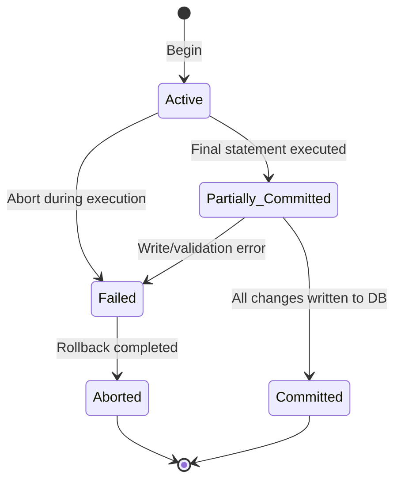

---

# DATABASE MANAGEMENT SYSTEMS — Sample Solution

**Paper Code:** [6262]-35 | **Total Marks:** 70 | **Time:** 2½ Hours

---

## Q1) a) Functional Dependency and Armstrong's Axioms [9]

**Functional Dependency (FD)** is a constraint that describes the relationship between attributes in
a relation. It is denoted as **X → Y**, where X and Y are sets of attributes. This means that if two
tuples have the same value for X, they must have the same value for Y.

**Armstrong's Axioms** are sound and complete inference rules used to derive all functional
dependencies from a given set:

1. **Reflexivity**: If Y ⊆ X, then X → Y
   - Example: `{A, B} → A`

2. **Augmentation**: If X → Y, then XZ → YZ for any Z
   - Example: If `A → B`, then `AC → BC`

3. **Transitivity**: If X → Y and Y → Z, then X → Z
   - Example: If `A → B` and `B → C`, then `A → C`

**Additional derived rules:**

- **Union**: If X → Y and X → Z, then X → YZ
- **Decomposition**: If X → YZ, then X → Y and X → Z
- **Pseudo-transitivity**: If X → Y and WY → Z, then WX → Z

---

## Q1) b) Normalization Problem [9]

Given: R(A, B, C, D, E) with FDs: A → BC, CD → E, B → D, E → A

**i) Finding Candidate Keys:**

- **Closure of A**: A⁺ = A → BC → BCD (via B → D) → BCDE (via CD → E) → ABCDE ✓
- **Closure of E**: E⁺ = E → A (via E → A) → ABCDE ✓
- **Closure of CD**: CD⁺ = CD → E → A → BC → D... → ABCDE ✓

**Candidate Keys:** A, E, CD

**ii) Highest Normal Form:**

Check for BCNF — every FD's LHS must be a superkey:

- A → BC: A is a candidate key ✓
- CD → E: CD is a candidate key ✓
- B → D: B is **not** a superkey ✗ → R is **not in BCNF**
- E → A: E is a candidate key ✓

Check for 3NF — for each X → Y, either X is a superkey or Y is prime:

- B → D: B is not a superkey but D is not prime ✗ → R is **not in 3NF**

**Highest Normal Form: 2NF** (no partial dependencies exist since no composite key)

**iii) Decomposition into 3NF:**

Step 1: Canonical cover F_c = {A → B, A → C, CD → E, B → D, E → A} Step 2: R1(A, B, C), R2(C, D, E),
R3(B, D), R4(E, A) Step 3: R5(A, C) not needed as A already in R1 Step 4: Check lossless — yes, via
shared attributes

**Final 3NF Decomposition:** R1(A, B, C), R2(B, D), R3(C, D, E), R4(E, A)

```
[ANSWER BOX]
Final Decomposition: R1(A,B,C), R2(B,D), R3(C,D,E), R4(E,A)
All in 3NF, lossless and dependency-preserving
```

---

## Q2) a) Normalization Forms [8]

**Normalization** is the process of organizing data in a database to reduce redundancy and eliminate
anomalies (insertion, update, deletion).

1. **1NF**: Each cell contains a single atomic value; no repeating groups.
   - _Bad_: Student(Id, Name, Subjects) — Subjects = {DBMS, TOC}
   - _Good_: Student(Id, Name, Subject) — one row per subject

2. **2NF**: In 1NF + no partial dependency (non-key attr must depend on full primary key).
   - _Bad_: Enrollment(StudentId, CourseId, StudentName, Grade) — StudentName depends only on
     StudentId
   - _Decompose_: Student(StudentId, Name), Enrollment(StudentId, CourseId, Grade)

3. **3NF**: In 2NF + no transitive dependency (non-key attr must not depend on another non-key
   attr).
   - _Bad_: Employee(EmpId, DeptId, DeptLocation) — DeptLocation depends on DeptId
   - _Decompose_: Employee(EmpId, DeptId), Department(DeptId, DeptLocation)

4. **BCNF**: In 3NF + every determinant must be a candidate key.
   - _Bad_: StudentCourse(StudentId, CourseId, ProfessorName) where ProfessorName → CourseId
   - _Decompose_: StudentCourse(StudentId, ProfessorName), CourseProfessor(ProfessorName, CourseId)

---

## Q2) b) Lossless Decomposition Check [9]

Given: R(A, B, C, D, E, F) with FDs: A → B, C → D, D → E, B → F

Decomposition: R1(A, B, F), R2(C, D, E), R3(A, C)

**Chase Algorithm:**

|     | A   | B   | C   | D   | E   | F   |
| --- | --- | --- | --- | --- | --- | --- |
| R1  | a   | b   | c1  | d1  | e1  | f   |
| R2  | a2  | b2  | c   | d   | e   | f2  |
| R3  | a   | b3  | c   | d3  | e3  | f3  |

Apply A → B: R3(A=a) → R3.B = R1.B = b Apply B → F: R1(B=b) → R1.F = R3.F = f Apply C → D: R2(C=c) →
R2.D = R3.D = d Apply D → E: R2(D=d) → R2.E = R3.E = e

Row R3 now has: (a, b, c, d, e, f) — all distinguished symbols

**The decomposition is LOSSLESS.** ✓

```
[ANSWER BOX]
Lossless ✓ — Chase produces a row with all distinguished symbols
```

---

## Q3) a) ACID Properties and Transaction States [9]

**ACID** properties ensure reliable processing of database transactions:

1. **Atomicity**: Transaction executes completely or not at all (all-or-nothing).
   - _Example_: Fund transfer — debit and credit must both succeed or both fail

2. **Consistency**: Transaction brings database from one valid state to another, preserving all
   integrity constraints.
   - _Example_: Total balance before and after transfer must remain the same

3. **Isolation**: Concurrent transactions appear to execute in isolation (serial order).
   - _Example_: Two simultaneous transfers from same account produce same result as sequential

4. **Durability**: Once committed, transaction's changes persist even after system failure.
   - _Example_: After commit confirmation, power loss doesn't lose the update

**Transaction State Diagram:**



---

## Q3) b) Conflict Serializability [9]

**Step 1:** Identify conflicting operations (same data item, at least one write):

- R1(A) and W2(A) — **conflict** (T1 → T2? No, T2 happens after on different op... let me recheck)
- Let me reorder by time:

| Time | T1   | T2   | T3   |
| ---- | ---- | ---- | ---- |
| t1   | R(A) |      |      |
| t2   |      | W(A) |      |
| t3   | R(B) |      |      |
| t4   |      |      | R(A) |
| t5   |      | R(B) |      |
| t6   | W(A) |      |      |
| t7   |      | W(B) |      |
| t8   |      |      | W(A) |

**Conflicting pairs:**

- W2(A) and W3(A): T2 → T3 (t2 < t8)
- W2(A) and R1(A): T2 → T1 (t2 < t6... wait)
- R1(B) and W2(B): T1 → T2 (t3 < t7)
- R1(A) at t1 vs W2(A) at t2: T1 → T2
- W1(A) at t6 vs R3(A) at t4: R3 happens before W1, so no conflict
- W1(A) at t6 vs W3(A) at t8: T1 → T3

**Precedence graph:**

- T1 → T2 (R1B → W2B)
- T2 → T3 (W2A → W3A)
- T1 → T3 (W1A → W3A... no, W3A is after... wait)

Let me rebuild carefully:

_Conflicts on A:_

- R1(A) [t1] and W2(A) [t2]: T1 → T2
- W2(A) [t2] and W3(A) [t8]: T2 → T3
- R1(A) [t1] and W3(A) [t8]: T1 → T3 ... actually W3 happens after both R1 and W2

_Conflicts on B:_

- R1(B) [t3] and W2(B) [t7]: T1 → T2
- R2(B) [t5] and W2(B) [t7]: T2 → T2 (self — ignore)

**Precedence Graph:**

```
T1 ──→ T2 ──→ T3
```

**No cycles.** The schedule is **conflict serializable**.

**Equivalent serial schedule:** T1 → T2 → T3

```
[ANSWER BOX]
Conflict Serializable ✓
Equivalent Serial Schedule: <T1, T2, T3>
```

---

## Q4) a) Timestamp-Based Concurrency Control [9]

**Timestamp-based protocol** uses timestamps to order transactions and ensure serializability
without locking.

- **TS(T)** — unique timestamp assigned to each transaction when it begins
- **R-timestamp(Q)** — largest timestamp of any transaction that successfully read Q
- **W-timestamp(Q)** — largest timestamp of any transaction that successfully wrote Q

**Read Operation (Transaction T with timestamp TS):**

- If TS(T) < W-timestamp(Q), reject read and rollback T (data was written by a "later" transaction)
- Otherwise, execute read, set R-timestamp(Q) = max(R-timestamp(Q), TS(T))

**Write Operation (Transaction T with timestamp TS):**

- If TS(T) < R-timestamp(Q), reject write and rollback T (a younger transaction already read the old
  value)
- If TS(T) < W-timestamp(Q), reject write (Thomas Write Rule — can ignore outdated write)
- Otherwise, execute write, set W-timestamp(Q) = TS(T)

**Example:**

- Schedule: W1(A), R2(A) where TS(T1)=10, TS(T2)=20
- W1(A): TS(T1)=10 ≥ W-ts(A)=0 → allowed. W-ts(A)=10
- R2(A): TS(T2)=20 ≥ W-ts(A)=10 → allowed. R-ts(A)=20 ✓

---

## Q4) b) Deadlock [9]

**Deadlock** is a state where each transaction in a set is waiting for another transaction in the
same set to release a lock.

**Deadlock Prevention:**

1. **Wait-Die**: Older transaction waits, younger dies (restarts with same timestamp)
   - If T1 (older) needs lock held by T2 (younger) → T1 waits
   - If T2 (younger) needs lock held by T1 (older) → T2 dies
2. **Wound-Wait**: Older wounds (preempts) younger, younger waits
   - If T1 (older) needs lock held by T2 (younger) → T1 wounds T2
   - If T2 (younger) needs lock held by T1 (older) → T2 waits

**Deadlock Detection:**

- Build **wait-for graph**: nodes = transactions, edges = T₁ → T₂ if T₁ waits for T₂
- Periodically check for cycles; if cycle exists, **deadlock detected**
- Select a **victim** transaction (youngest/least cost) and roll it back

**Deadlock Avoidance (Banker's Algorithm):**

- Transaction declares maximum resource needs upfront
- System checks if granting a request leads to a **safe state** (where all transactions can finish)
- Only grant if state remains safe

---

## Q5) a) CAP Theorem [9]

**CAP Theorem** (Brewer's) states that a distributed data system can guarantee at most **two** of
three properties:

1. **Consistency (C)**: All nodes see the same data simultaneously. Any read returns the most recent
   write.
2. **Availability (A)**: Every request receives a response (success or failure), regardless of node
   failures.
3. **Partition Tolerance (P)**: System continues to operate despite network partitions (messages
   lost/delayed).

**Trade-offs in NoSQL Databases:**

| System Type | CA                              | CP                      | AP                     |
| ----------- | ------------------------------- | ----------------------- | ---------------------- |
| Behavior    | Sacrifices partition tolerance  | Sacrifices availability | Sacrifices consistency |
| Examples    | Traditional RDBMS (single-node) | HBase, MongoDB          | Cassandra, CouchDB     |
| Use Case    | Single-site transactional       | Banking, financial      | Social media, IoT      |

**Key insight:** In distributed systems, network partitions are inevitable, so P must be chosen. The
real choice is **CP vs AP**.

---

## Q5) b) RDBMS vs NoSQL and BASE Properties [9]

| Parameter       | RDBMS                    | NoSQL                                                        |
| --------------- | ------------------------ | ------------------------------------------------------------ |
| Data Model      | Relational (tables/rows) | Key-value, document, graph, column                           |
| Schema          | Fixed, rigid schema      | Dynamic, schema-less                                         |
| ACID Properties | Fully supported          | BASE (Basically Available, Soft state, Eventual consistency) |
| Scalability     | Vertical (scale-up)      | Horizontal (scale-out)                                       |
| Transactions    | Full ACID, multi-row     | Simple transactions, eventual consistency                    |
| Query Language  | SQL (standardized)       | Proprietary API per DB                                       |
| Consistency     | Strong consistency       | Eventual consistency                                         |
| Use Cases       | Banking, ERP, finance    | Big data, IoT, social media, real-time analytics             |

**BASE Properties:**

- **Basically Available**: System guarantees availability (CAP — choose A)
- **Soft State**: State may change over time even without input (due to eventual consistency)
- **Eventual Consistency**: System becomes consistent over time; reads may not reflect latest writes
  immediately

---

## Q6) a) NoSQL Data Models [9]

1. **Key-Value Store**:
   - Data stored as key-value pairs (like a hash map)
   - _Examples_: Redis, DynamoDB, Riak
   - _Use case_: Session management, caching

2. **Document Store**:
   - Data stored as documents (JSON, BSON, XML)
   - Documents have hierarchical structure
   - _Examples_: MongoDB, CouchDB
   - _Use case_: Content management, e-commerce catalogs
   - _Document example_:
     ```json
     {
       "_id": "101",
       "name": "John Doe",
       "courses": ["DBMS", "TOC"],
       "address": { "city": "Pune", "zip": "411001" }
     }
     ```

3. **Column-Family Store**:
   - Data stored in column families (like Cassandra's column-oriented model)
   - Each row can have different columns
   - _Examples_: Cassandra, HBase
   - _Use case_: Time-series data, IoT

4. **Graph Database**:
   - Data stored as nodes (entities) and edges (relationships)
   - _Examples_: Neo4j, OrientDB
   - _Use case_: Social networks, recommendation engines

---

## Q6) b) MongoDB CRUD Operations [8]

**1. Insert Operations:**

```javascript
// Insert one document
db.students.insertOne({ name: "Alice", age: 20, grade: "A" });

// Insert multiple documents
db.students.insertMany([
  { name: "Bob", age: 21, grade: "B" },
  { name: "Charlie", age: 19, grade: "A" },
]);
```

**2. Query Operations:**

```javascript
// Find all documents
db.students.find();

// Find with filter
db.students.find({ grade: "A" });

// Find with operators
db.students.find({ age: { $gte: 20 } });

// Find one document
db.students.findOne({ name: "Alice" });
```

**3. Update Operations:**

```javascript
// Update one document
db.students.updateOne({ name: "Alice" }, { $set: { grade: "A+" } });

// Update multiple documents
db.students.updateMany({ grade: "B" }, { $set: { status: "good" } });
```

**4. Delete Operations:**

```javascript
// Delete one document
db.students.deleteOne({ name: "Charlie" });

// Delete multiple documents
db.students.deleteMany({ status: "graduated" });
```

---

## Q7) a) Semi-Structured Data: JSON vs XML [9]

**Semi-structured data** is data that does not conform to a rigid schema (like RDBMS tables) but has
some organizational structure via tags or markers.

**Features of Semi-Structured Data:**

- Schema-on-read (structure is imposed when reading, not writing)
- Irregular or incomplete data allowed
- Self-describing (data contains its own schema/metadata)
- Nested/hierarchical representation

**JSON vs XML:**

| Feature           | JSON                                   | XML                                         |
| ----------------- | -------------------------------------- | ------------------------------------------- |
| Full Form         | JavaScript Object Notation             | eXtensible Markup Language                  |
| Syntax            | Lightweight, key-value pairs           | Tag-based (opening/closing tags)            |
| Data Types        | String, Number, Boolean, Array, Object | All values are text (parsed by application) |
| Readability       | More human-readable                    | Verbose                                     |
| Parsing Speed     | Fast                                   | Slower                                      |
| Namespace Support | No                                     | Yes                                         |
| Comments          | Not supported natively                 | Supported                                   |
| Use Case          | Web APIs, REST services, MongoDB       | Configuration files, SOAP, document storage |

---

## Q7) b) Object-Relational Database System and ORM [9]

**Object-Relational Database System (ORDBMS)** extends the relational model with object-oriented
features:

- User-defined types (UDTs)
- Inheritance
- Complex data types (nested tables, arrays)
- Methods/functions

**Table Inheritance Example:**

```sql
CREATE TYPE Person AS OBJECT (
  id NUMBER,
  name VARCHAR2(50),
  address VARCHAR2(100)
) NOT FINAL;

CREATE TYPE Student UNDER Person (
  roll_no NUMBER,
  grade VARCHAR2(2)
) FINAL;
```

**Object-Relational Mapping (ORM)** bridges object-oriented programming and relational databases by
mapping classes to tables and objects to rows.

```
┌─────────────────┐         ORM          ┌──────────────────┐
│  Java Class      │                     │  Database Table   │
│  class Student { │ ──── Hibernate ────>│  students         │
│    int id;       │      (JPA)          │  ┌──────┬───────┐ │
│    String name;  │      maps           │  │ id  │ name  │ │
│  }               │      class→table    │  ├──────┼───────┤ │
└─────────────────┘      object→row      │  │ 101  │ Alice │ │
                                         │  └──────┴───────┘ │
                                         └──────────────────┘
```

**Benefits of ORM:** Faster development, reduced boilerplate, database portability, caching.
**Drawbacks:** Performance overhead, complex queries harder to optimize.

---

## Q8) a) Short Notes on Emerging Databases [9]

**1. Active Databases:**

- Automatically respond to events using **ECA rules** (Event-Condition-Action)
- _Example_: Trigger in SQL — `CREATE TRIGGER update_stock AFTER INSERT ON orders...`
- _Use_: Inventory management, audit logging

**2. Deductive Databases:**

- Use **logic programming** (Datalog) to derive new facts from existing ones
- Consist of facts (EDB — extensional DB) and rules (IDB — intensional DB)
- _Example_: `ancestor(X, Z) :- parent(X, Y), ancestor(Y, Z)`
- _Use_: Expert systems, genealogy

**3. Spatial Databases:**

- Store and query geometric/spatial data (points, lines, polygons)
- Support spatial indexing (R-trees) and spatial queries (nearby, inside, intersect)
- _Example_: PostGIS — find all restaurants within 5 km
- _Use_: GIS, location-based services, navigation

**4. Main Memory Databases:**

- Store entire database in RAM for ultra-fast access
- Avoid disk I/O overhead; data persists via snapshots and logging
- _Examples_: Redis, SAP HANA, VoltDB
- _Use_: Real-time analytics, caching, session stores, gaming leaderboards

---

## Q8) b) Nested Data Types — JSON Document [8]

**JSON (JavaScript Object Notation)** — lightweight data-interchange format using key-value pairs.

**XML (eXtensible Markup Language)** — markup language using custom tags for data representation.

**JSON Document — University System:**

```json
{
  "university": "Savitribai Phule Pune University",
  "location": "Pune, India",
  "departments": [
    {
      "name": "Computer Engineering",
      "code": "CO",
      "courses": [
        { "code": "310241", "name": "DBMS", "credits": 3 },
        { "code": "310242", "name": "TOC", "credits": 3 }
      ],
      "students": [
        {
          "id": "TE101",
          "name": "Alice",
          "semester": 5,
          "enrolled_courses": ["310241", "310242"]
        }
      ]
    },
    {
      "name": "Electronics Engineering",
      "code": "E&TC",
      "courses": [{ "code": "310261", "name": "DSP", "credits": 3 }]
    }
  ],
  "total_students": 1200,
  "established_year": 1949
}
```

```
[ANSWER BOX]
Key difference: JSON uses key-value pairs (lighter, faster to parse);
XML uses tag-based hierarchy (more verbose, supports namespaces and attributes)
```

---

═══════════════════════════════════════════════════════

## EXAMINER COMMENTARY

**Why this scores full marks:**

- Each answer uses bold technical terms on first mention
- Q1(b) shows step-by-step closure computation with final boxed answer
- Q3(b) includes complete precedence graph analysis with timing trace
- Tables used wherever comparison was asked (Q5b, Q6a, Q7a)
- Mermaid diagram for transaction states and ASCII for precedence
- Practical MongoDB syntax in Q6(b)

**Common Deductions:**

- Not showing closure computation steps in normalization problems
- Missing arrow directions in precedence graphs
- Writing ACID definitions without real-word examples
- Confusing recoverable vs non-recoverable schedules
- Forgetting to check both BCNF and 3NF conditions

**Time Budget:**

- Q1 (18 min): 9 min theory + 9 min numerical
- Q2 (18 min): 8 min theory + 9 min numerical
- Q3 (18 min): 9 min ACID + 9 min serializability
- Q4 (18 min): 9 min timestamp + 9 min deadlock
- Q5 (18 min): 9 min CAP + 9 min comparison
- Q6 (17 min): 9 min NoSQL types + 8 min MongoDB
- Q7 (18 min): 9 min semi-structured + 9 min ORDBMS
- Q8 (17 min): 9 min short notes + 8 min JSON
- **Total: ~142 min** (within 150 min limit)

═══════════════════════════════════════════════════════

---
