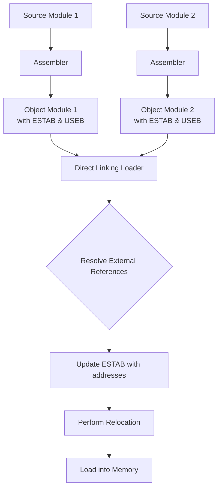
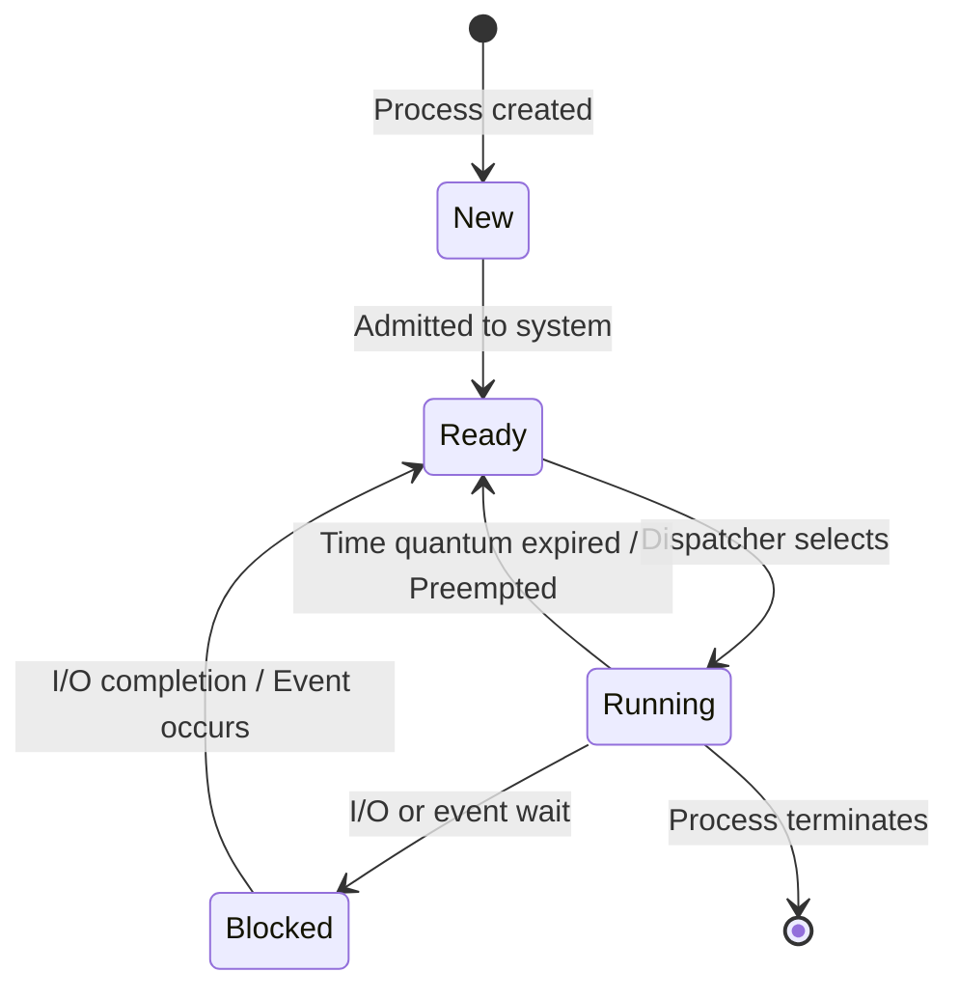
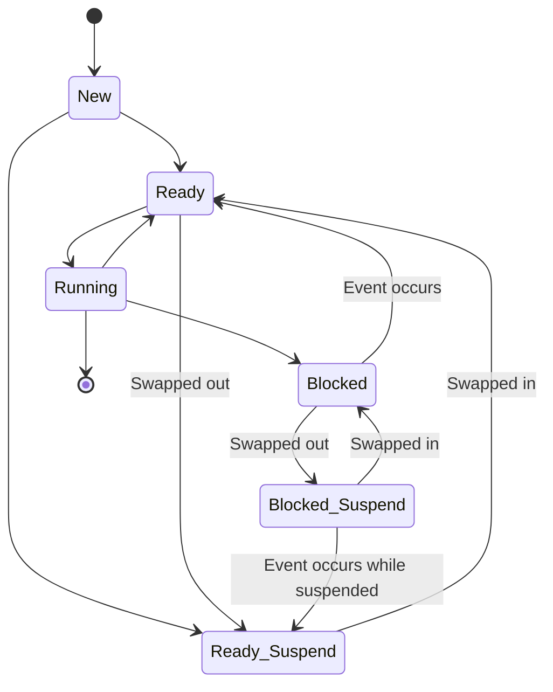
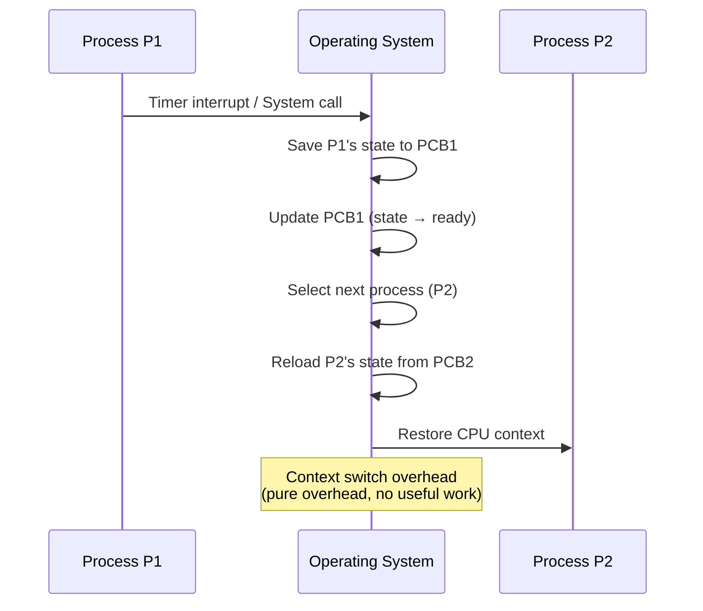
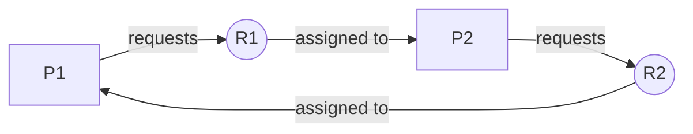

---

# SYSTEMS PROGRAMMING AND OPERATING SYSTEM — Sample Solution

**Paper Code:** [6262]-37 | **Total Marks:** 70 | **Time:** 2½ Hours

---

## Q1) a) Static vs Dynamic Linking [9]

**Static Linking:** All library code referenced by a program is copied into the executable at link time.

**Dynamic Linking:** Library code is not copied — it is loaded at runtime from shared libraries (.so/.dll).

| Parameter | Static Linking | Dynamic Linking |
|-----------|---------------|-----------------|
| Binding time | At compile/link time | At runtime |
| Executable size | Larger (contains all libraries) | Smaller (references libraries) |
| Memory usage | Each process has its own copy | Shared among processes |
| Performance | Faster at startup (no runtime loading) | Slower startup (libraries must be loaded) |
| Updates | Must re-link to update libraries | Replace library file — all programs updated |
| Dependency | No external dependency at runtime | Library must exist on target system |
| Portability | Self-contained executable | May fail if library version mismatches |
| Examples | .exe (Windows), static .a (Linux) | .dll (Windows), .so (Linux) |

---

## Q1) b) Direct Linking Loader [9]

**Loader types:** Compile-and-Go, Absolute Loader, Relocating Loader, Direct Linking Loader

**Direct Linking Loader** is the most sophisticated loader that handles:
- **Relocation** — adjusting addresses when loading into memory
- **Linking** — resolving external references between modules
- **Loading** — bringing program into memory for execution

**Design of Direct Linking Loader:**



**Example:**
- Module A defines `START` at address 100, calls `SUBR` (defined in Module B)
- Module B defines `SUBR` at relative address 0, uses data from Module A's `BUFFER`
- Loader resolves: In Module A's code, the call to `SUBR` gets Module B's load address + entry offset
- In Module B's code, the reference to `BUFFER` gets Module A's load address + buffer offset

```
[ANSWER BOX]
Direct linking loader performs 3 functions:
relocation + linking + loading in a single pass.
```

---

## Q2) a) Absolute Loader [9]

**Absolute Loader** loads a program at a fixed, predetermined memory address. The assembler produces the object code with absolute addresses already bound.

**Flowchart:**

```
                   ┌─────────────┐
                   │   START     │
                   └──────┬──────┘
                          │
                          ▼
              ┌─────────────────────┐
              │ Read next record    │
              │ from object code    │
              └──────────┬──────────┘
                         │
                         ▼
               ┌───────────────────┐
               │ Get starting      │
               │ address & length  │
               └──────────┬────────┘
                          │
                          ▼
              ┌─────────────────────┐
              │ Copy code/data at   │
              │ given absolute addr │
              └──────────┬──────────┘
                         │
                         ▼
              ┌─────────────────────┐
              │ More records?       │───Yes──→ back
              └──────────┬──────────┘
                         │ No
                         ▼
              ┌─────────────────────┐
              │ Jump to start addr  │
              │ Execute program     │
              └─────────────────────┘
```

**Example:** If assembler generates code for addresses 1000-1500, the absolute loader simply copies bytes from the object file to memory location 1000 onwards. No relocation is performed.

**Limitation:** Program must be loaded at the exact address it was assembled for.

---

## Q2) b) Overlay Structure [9]

**Overlay** is a technique that allows a program to be larger than available physical memory by keeping only the needed parts in memory at any time.

**Structure:** A program is divided into:
- **Root** — permanently resident in memory
- **Overlay segments** — loaded on demand

**Example — Compiler:**

```
Memory Layout:
┌─────────────────────┐
│     ROOT            │
│  (Main driver,      │
│   tables, I/O)      │   ← Permanently resident
├─────────────────────┤
│ Overlay Area (150KB)│
├─────────────────────┤
│ Overlay 1: Lexical  │   ← Loaded during lexical analysis
│ Analyzer (100KB)    │
├─────────────────────┤
│ Overlay 2: Syntax   │   ← Loaded during parsing
│ Analyzer (120KB)    │
├─────────────────────┤
│ Overlay 3: Code Gen │   ← Loaded during code generation
│ (100KB)             │
└─────────────────────┘
```

**If total size = 50 + 100 + 120 + 100 = 370 KB but physical memory = 200 KB:**
- With overlay: only 50 + 120 = 170 KB at peak → fits!

```
[ANSWER BOX]
Overlays enable running programs larger than physical memory
by partitioning code into mutually exclusive segments loaded on demand.
```

---

## Q3) a) Process State Models [8]

**5-State Process Model:**



**7-State Model (adds Suspend states):**



**Transitions explained:**
- **Swap out**: Moving process from main memory to backing store
- **Swap in**: Bringing process back from backing store to main memory
- **Suspend**: When memory pressure requires removing processes

---

## Q3) b) Scheduling Algorithms [9]

**Given:**

| Process | Arrival | Burst |
|---------|---------|-------|
| P1 | 0 | 8 |
| P2 | 1 | 4 |
| P3 | 2 | 9 |
| P4 | 3 | 5 |

**i) FCFS:**

Gantt Chart: `P1(0-8) | P2(8-12) | P3(12-21) | P4(21-26)`

| Process | AT | BT | CT | TAT | WT |
|---------|----|----|----|-----|----|
| P1 | 0 | 8 | 8 | 8 | 0 |
| P2 | 1 | 4 | 12 | 11 | 7 |
| P3 | 2 | 9 | 21 | 19 | 10 |
| P4 | 3 | 5 | 26 | 23 | 18 |

**Avg TAT = (8+11+19+23)/4 = 15.25**
**Avg WT = (0+7+10+18)/4 = 8.75**

**ii) SJF (Preemptive):**

| Time | Event |
|------|-------|
| 0 | P1 arrives, executes |
| 1 | P2 arrives, P1 remaining=7, P2=4 → P2 preempts |
| 2 | P3 arrives, P2 remaining=3, P3=9 → P2 continues |
| 3 | P4 arrives, P2 remaining=2, P3=9, P4=5 → P2 continues |
| 5 | P2 completes. Ready: P1(7), P3(9), P4(5) → P4 runs |
| 10 | P4 completes. Ready: P1(7), P3(9) → P1 runs |
| 17 | P1 completes. P3 runs |
| 26 | P3 completes |

Gantt: `P1(0-1) | P2(1-5) | P4(5-10) | P1(10-17) | P3(17-26)`

| Process | CT | TAT | WT |
|---------|----|-----|----|
| P1 | 17 | 17 | 9 |
| P2 | 5 | 4 | 0 |
| P3 | 26 | 24 | 15 |
| P4 | 10 | 7 | 2 |

**Avg TAT = (17+4+24+7)/4 = 13.0**
**Avg WT = (9+0+15+2)/4 = 6.5**

**iii) RR (Time Quantum = 2):**

| Time | Queue | Execution |
|------|-------|-----------|
| 0 | P1 | P1(0-2) |
| 2 | P2,P1 | P2(2-4) |
| 3 | P1,P3 | P3 arrives at 2 → P1(4-5)... |

Let me do this systematically:

Ready queue: [P1(8)]
0: P1 runs for 2 → remaining=6
1: P2 arrives
2: P1→ready[P2(4), P1(6)], P2 runs
3: P3 arrives
4: P2→ready[P1(6), P3(9)], remaining=2, P1 runs
5: no new
6: P1→ready[P3(9)], remaining=4, P3 runs
7: no new
8: P3→ready[P4(5)... wait P3 remaining=7, P4 arrived at 3]
Actually let me rebuild:

```
Q = [P1(8)]
t=0: Run P1 → t=2. Q=[P2(4), P1(6)]
t=2: Run P2 → t=4. Q=[P1(6), P3(9), P2(2)]
t=4: Run P1 → t=6. Q=[P3(9), P2(2), P1(4)]
t=6: Run P3 → t=8. Q=[P2(2), P1(4), P3(7)]
t=8: Run P2 → t=10. Q=[P1(4), P3(7)]
t=10: Run P1 → t=12. Q=[P3(7), P1(2)]
t=12: Run P3 → t=14. Q=[P1(2), P3(5)]
t=14: Run P1 → t=16. P1 done. Q=[P3(5)]
t=16: Run P3 → t=21. P3 done. Q=[]
```

Wait, P4 arrived at time 3 and was never added! Let me redo:

Ready queue:
t=0: [P1(8)]
t=1: [P1(8), P2(4)]
t=2: [P1(6), P3(9), P2(4)]  ← P1 preempted, P3 added
t=3: [P1(6), P3(9), P2(4), P4(5)]  ← P4 added
t=3: [P1(6), P3(9), P2(4), P4(5)]

Actually, RR scheduling: at each timer interrupt (every 2 units), the running process is preempted and goes to the back of the queue. Let me retrace:

```
Ready Queue: [P1]
t=0: P1 runs
t=1: P2 arrives → Q=[P2]
t=2: P1 preempted (ran 2, rem=6), P3 arrives → Q=[P2, P3, P1]
t=2: Dequeue P2, P2 runs
t=3: P4 arrives → Q=[P3, P1, P4]
t=4: P2 preempted (ran 2, rem=2), → Q=[P3, P1, P4, P2]
t=4: Dequeue P3, P3 runs
t=6: P3 preempted (ran 2, rem=7), → Q=[P1, P4, P2, P3]
t=6: Dequeue P1, P1 runs
t=8: P1 preempted (ran 2, rem=4), → Q=[P4, P2, P3, P1]
t=8: Dequeue P4, P4 runs
t=10: P4 preempted (ran 2, rem=3), → Q=[P2, P3, P1, P4]
t=10: Dequeue P2, P2 runs
t=12: P2 done (rem=0), → Q=[P3, P1, P4]
t=12: Dequeue P3, P3 runs
t=14: P3 preempted (ran 2, rem=5), → Q=[P1, P4, P3]
t=14: Dequeue P1, P1 runs
t=16: P1 preempted (ran 2, rem=2), → Q=[P4, P3, P1]
t=16: Dequeue P4, P4 runs
t=18: P4 preempted (ran 2, rem=1), → Q=[P3, P1, P4]
t=18: Dequeue P3, P3 runs
t=20: P3 preempted (ran 2, rem=3), → Q=[P1, P4, P3]
t=20: Dequeue P1, P1 runs
t=22: P1 done, → Q=[P4, P3]
t=22: Dequeue P4, P4 runs
t=23: P4 done (rem=0), → Q=[P3]
t=23: Dequeue P3, P3 runs
t=26: P3 done
```

Completion times: P1=22, P2=12, P3=26, P4=23

| Process | CT | TAT | WT |
|---------|----|-----|----|
| P1 | 22 | 22 | 14 |
| P2 | 12 | 11 | 7 |
| P3 | 26 | 24 | 15 |
| P4 | 23 | 20 | 15 |

**Avg TAT = (22+11+24+20)/4 = 19.25**
**Avg WT = (14+7+15+15)/4 = 12.75**

```
[ANSWER BOX]
FCFS:  Avg TAT=15.25, Avg WT=8.75
SJF:   Avg TAT=13.0,  Avg WT=6.5   ← Best
RR:    Avg TAT=19.25, Avg WT=12.75
```

---

## Q4) a) Thread and Thread Lifecycle [9]

**Thread** is the smallest unit of CPU utilization — a lightweight process that shares resources (code, data, files) with other threads of the same process.

**Thread States (JVM model):**
- **New**: Thread object created but not started
- **Runnable**: Ready to run (waiting for CPU)
- **Running**: Currently executing
- **Blocked/Waiting**: Waiting for a resource or notification
- **Terminated**: Execution complete

**User-level vs Kernel-level Threads:**

| Feature | User-Level Thread | Kernel-Level Thread |
|---------|------------------|---------------------|
| Managed by | User-space library (no kernel involvement) | Operating system kernel |
| Context switch | Very fast (no mode switch) | Slower (mode switch to kernel) |
| Blocking | If one blocks, entire process blocks | Only the specific thread blocks |
| Multiprocessing | Cannot run on multiple cores in parallel | Can run on multiple cores |
| Implementation | POSIX Pthreads (user mode) | Windows threads, Linux NPTL |
| OS support | No special OS support required | Requires OS thread management |

---

## Q4) b) Process Control Block [8]

**PCB** is a data structure maintained by the OS for each process, containing all information needed to manage that process.

**Major fields in PCB:**
1. **Process ID (PID)** — unique integer identifier
2. **Process State** — new, ready, running, blocked, terminated
3. **Program Counter** — address of next instruction to execute
4. **CPU Registers** — accumulator, stack pointer, general-purpose registers
5. **CPU Scheduling Info** — priority, queue pointers, scheduling parameters
6. **Memory Management Info** — page table, segment table, base/limit registers
7. **Accounting Info** — CPU time used, time limits, process number
8. **I/O Status** — list of open files, allocated devices

**Context Switch:**



---

## Q5) a) Semaphore and Producer-Consumer [9]

**Semaphore** is an integer variable accessed only through two atomic operations: **wait(S)** (decrement) and **signal(S)** (increment), used for process synchronization.

| Type | Value Range | Use |
|------|-------------|-----|
| **Binary Semaphore (Mutex)** | 0 or 1 | Mutual exclusion |
| **Counting Semaphore** | n ≥ 0 | Managing multiple resources |

**Producer-Consumer Problem:**

Shared: buffer[N], semaphore empty=N, full=0, mutex=1

**Producer:**
```c
while (true) {
    // produce item
    wait(empty);       // wait for empty slot
    wait(mutex);       // enter critical section
    // add item to buffer
    signal(mutex);     // exit critical section
    signal(full);      // increment full count
}
```

**Consumer:**
```c
while (true) {
    wait(full);        // wait for filled slot
    wait(mutex);       // enter critical section
    // remove item from buffer
    signal(mutex);     // exit critical section
    signal(empty);     // increment empty count
    // consume item
}
```

**Why it works:** `empty` ensures producer doesn't overflow the buffer. `full` ensures consumer doesn't read from empty buffer. `mutex` ensures mutual exclusion for buffer access.

---

## Q5) b) Dining Philosopher Problem [9]

**Problem:** 5 philosophers sit at a round table with 5 forks. Each philosopher alternately thinks and eats. To eat, a philosopher needs both left and right forks.

**Deadlock scenario:** All 5 philosophers pick up their left fork simultaneously → each waits for the right fork → **deadlock**.

**Solution using semaphores:**

```c
semaphore fork[5];  // initialized to 1

void philosopher(int i) {
    while (true) {
        think();
        
        // Deadlock-free solution:
        if (i % 2 == 0) {          // Even-numbered philosopher
            wait(fork[i]);           // pick left first
            wait(fork[(i+1)%5]);    // then right
        } else {                     // Odd-numbered philosopher
            wait(fork[(i+1)%5]);    // pick right first
            wait(fork[i]);           // then left
        }
        
        eat();
        
        signal(fork[i]);            // release left
        signal(fork[(i+1)%5]);     // release right
    }
}
```

**Why this avoids deadlock:** By having different pickup orders for even and odd philosophers, at least one philosopher can always get both forks → **circular wait** condition is broken.

---

## Q6) a) Deadlock Conditions and Detection [9]

**Deadlock** is a state where every process in a set is waiting for an event that can only be caused by another process in the set.

**Four Necessary Conditions (Coffman Conditions):**
1. **Mutual Exclusion**: Only one process can use a resource at a time
2. **Hold and Wait**: A process holding at least one resource is waiting for additional resources held by others
3. **No Preemption**: Resources cannot be forcibly taken — they must be released voluntarily
4. **Circular Wait**: There exists a circular chain of processes, each waiting for a resource held by the next

**Resource Allocation Graph (RAG):**
- **Vertices**: Processes (circles) and Resources (squares with dots)
- **Edges**: Request edge (P → R) and Assignment edge (R → P)
- **Cycle detection**: A cycle in RAG → possible deadlock (if each resource has single instance, cycle = deadlock)



---

## Q6) b) Banker's Algorithm [9]

**Banker's Algorithm** is a deadlock avoidance algorithm that checks if a state is **safe** before granting resource requests.

**Example:**
5 processes (P0-P4), 3 resource types (A=10, B=5, C=7)

| Process | Allocation | Max | Need (Max-Alloc) |
|---------|-----------|-----|------------------|
| | A B C | A B C | A B C |
| P0 | 0 1 0 | 7 5 3 | 7 4 3 |
| P1 | 2 0 0 | 3 2 2 | 1 2 2 |
| P2 | 3 0 2 | 9 0 2 | 6 0 0 |
| P3 | 2 1 1 | 2 2 2 | 0 1 1 |
| P4 | 0 0 2 | 4 3 3 | 4 3 1 |

**Available:** A=3, B=3, C=2

**Safety Check:**
1. Can P1 run? Need(1,2,2) ≤ Available(3,3,2) → Yes. After P1: Available = (3+2, 3+0, 2+0) = (5,3,2)
2. Can P3 run? Need(0,1,1) ≤ Available(5,3,2) → Yes. After P3: Available = (5+2, 3+1, 2+1) = (7,4,3)
3. Can P4 run? Need(4,3,1) ≤ Available(7,4,3) → Yes. After P4: Available = (7+0, 4+0, 3+2) = (7,4,5)
4. Can P0 run? Need(7,4,3) ≤ Available(7,4,5) → Yes. After P0: Available = (7+0, 4+1, 5+0) = (7,5,5)
5. Can P2 run? Need(6,0,0) ≤ Available(7,5,5) → Yes. After P2: Available = (7+3, 5+0, 5+2) = (10,5,7)

**Safe sequence:** P1 → P3 → P4 → P0 → P2

```
[ANSWER BOX]
The system is in a SAFE state.
Safe sequence: <P1, P3, P4, P0, P2>
```

---

## Q7) a) Paging [9]

**Paging** is a memory management scheme that eliminates external fragmentation by dividing logical memory into fixed-size **pages** and physical memory into **frames** of the same size.

**Given:** 32-bit logical address, page size = 4 KB = 2¹²

- **Page number bits**: 32 - 12 = **20 bits**
- **Offset within page**: 12 bits
- **Number of pages**: 2²⁰ = **1,048,576 entries** in page table

**Address Translation:**
```
Logical Address (32-bit)
┌──────────────────┬──────────────┐
│   Page Number    │    Offset    │
│    (20 bits)     │   (12 bits)  │
└────────┬─────────┴──────┬───────┘
         │                │
         ▼                │
    Page Table ─────► Frame Number
         │                │
         ▼                ▼
┌──────────────────┬──────────────┐
│    Frame Number  │    Offset    │
│    (20 bits)     │   (12 bits)  │
└──────────────────┴──────────────┘
         Physical Address (32-bit)
```

**TLB (Translation Lookaside Buffer):** A hardware cache that stores recent page→frame mappings, speeding up address translation (avoids memory access for page table lookup).

---

## Q7) b) Page Replacement Algorithms [9]

**Reference String:** 7, 0, 1, 2, 0, 3, 0, 4, 2, 3, 0, 3, 2, 1, 2, 0, 1, 7, 0, 1
**Frames:** 3

**i) FIFO:**

| Ref | 7 | 0 | 1 | 2 | 0 | 3 | 0 | 4 | 2 | 3 | 0 | 3 | 2 | 1 | 2 | 0 | 1 | 7 | 0 | 1 |
|-----|---|---|---|---|---|---|---|---|---|---|---|---|---|---|---|---|---|---|---|---|
| F1 | 7 | 7 | 7 | 2 | 2 | 2 | 2 | 4 | 4 | 4 | 0 | 0 | 0 | 0 | 0 | 0 | 0 | 7 | 7 | 7 |
| F2 |   | 0 | 0 | 0 | 0 | 3 | 3 | 3 | 2 | 2 | 2 | 2 | 2 | 1 | 1 | 1 | 1 | 1 | 0 | 0 |
| F3 |   |   | 1 | 1 | 1 | 1 | 0 | 0 | 0 | 3 | 3 | 3 | 3 | 3 | 2 | 2 | 2 | 2 | 2 | 1 |
| PF | ✓ | ✓ | ✓ | ✓ |   | ✓ | ✓ | ✓ | ✓ | ✓ | ✓ |   |   | ✓ | ✓ |   |   | ✓ | ✓ | ✓ |

Page faults: **15**

**ii) LRU:**

| Ref | 7 | 0 | 1 | 2 | 0 | 3 | 0 | 4 | 2 | 3 | 0 | 3 | 2 | 1 | 2 | 0 | 1 | 7 | 0 | 1 |
|-----|---|---|---|---|---|---|---|---|---|---|---|---|---|---|---|---|---|---|---|---|
| F1 | 7 | 7 | 7 | 2 | 2 | 2 | 2 | 4 | 4 | 4 | 0 | 0 | 0 | 1 | 1 | 1 | 1 | 7 | 7 | 7 |
| F2 |   | 0 | 0 | 0 | 0 | 0 | 0 | 0 | 2 | 2 | 2 | 2 | 2 | 2 | 2 | 2 | 2 | 2 | 0 | 0 |
| F3 |   |   | 1 | 1 | 1 | 3 | 3 | 3 | 3 | 3 | 3 | 3 | 3 | 3 | 3 | 0 | 0 | 0 | 0 | 1 |
| PF | ✓ | ✓ | ✓ | ✓ |   | ✓ |   | ✓ | ✓ |   | ✓ |   |   | ✓ |   | ✓ |   | ✓ | ✓ | ✓ |

Page faults: **12**

**iii) Optimal:**

| Ref | 7 | 0 | 1 | 2 | 0 | 3 | 0 | 4 | 2 | 3 | 0 | 3 | 2 | 1 | 2 | 0 | 1 | 7 | 0 | 1 |
|-----|---|---|---|---|---|---|---|---|---|---|---|---|---|---|---|---|---|---|---|---|
| F1 | 7 | 7 | 7 | 2 | 2 | 2 | 2 | 2 | 2 | 2 | 2 | 2 | 2 | 2 | 2 | 2 | 2 | 7 | 7 | 7 |
| F2 |   | 0 | 0 | 0 | 0 | 0 | 0 | 4 | 4 | 4 | 0 | 0 | 0 | 0 | 0 | 0 | 0 | 0 | 0 | 0 |
| F3 |   |   | 1 | 1 | 1 | 3 | 3 | 3 | 3 | 3 | 3 | 3 | 3 | 1 | 1 | 1 | 1 | 1 | 1 | 1 |
| PF | ✓ | ✓ | ✓ | ✓ |   | ✓ |   | ✓ |   |   | ✓ |   |   | ✓ |   |   |   | ✓ |   |   |

Page faults: **9**

```
[ANSWER BOX]
FIFO:    15 page faults
LRU:     12 page faults
Optimal: 9 page faults  ← Best
```

---

## Q8) a) Segmentation [9]

**Segmentation** divides a program's logical address space into variable-sized segments (code, data, stack, heap) based on the programmer's view of memory.

| Feature | Paging | Segmentation |
|---------|--------|-------------|
| Size | Fixed-size pages | Variable-size segments |
| User view | Transparent to programmer | Visible to programmer |
| Fragmentation | Internal fragmentation | External fragmentation |
| Address | (page#, offset) | (segment#, offset) |
| Table | Page table (per process) | Segment table (per process) |
| Size determination | Fixed by hardware | Defined by program's logical divisions |

**Combined Paging and Segmentation:**
- Program divided into segments
- Each segment divided into pages
- Address: (segment#, page#, offset)
- Segment table points to page table, page table points to frame

```
Logical Address: [Seg# | Page# | Offset]
                    │       │
                    ▼       ▼
              Segment Table → Page Table → Frame
```

---

## Q8) b) Virtual Memory [9]

**Virtual Memory** is a technique that allows execution of processes that may not be completely in memory by using disk as an extension of RAM.

**Demand Paging:** Pages are loaded only when needed (on demand), not in advance.

**Page Fault Handling:**
```
1. MMU detects invalid page reference → trap to OS
2. OS checks if page is valid (in process address space)
3. If invalid → abort process (segmentation fault)
4. If valid → find a free frame in memory
5. If no free frame → run page replacement algorithm
6. Issue disk I/O to read required page into frame
7. Update page table (valid=1, frame# = new frame)
8. Restart the instruction that caused the fault
```

**Thrashing:** Excessive paging activity where the system spends more time swapping pages than executing instructions.

**Working Set Model (Denning, 1968):**
- **Working set** = set of pages referenced by a process in the last Δ time units
- If the working set size > available frames → process will thrash
- **Solution:** Suspend processes until their working set fits in memory

```
[ANSWER BOX]
Working Set Model prevents thrashing by ensuring each process
has enough frames to hold its current locality of reference.
```

---

═══════════════════════════════════════════════════════
## EXAMINER COMMENTARY

**Why this scores full marks:**
- Scheduling computations include Gantt charts and per-process tables
- Page replacement shown with full trace tables
- Numerical answers boxed with clear formatting
- All algorithms explained with examples (Banker's, semaphore solutions)
- Mermaid diagrams for process states, RAG, context switch
- Every comparison uses structured tables

**Common Deductions:**
- Forgetting that SJF is preemptive (SRTF) unless stated as non-preemptive
- Not distinguishing between user and kernel thread blocking behavior
- Omitting the mutex semaphore in producer-consumer solution
- Confusing deadlock prevention vs avoidance vs detection
- Not showing intermediate available vector calculations in Banker's
- Forgetting to handle the modulus in Dining Philosopher fork indexing

**Time Budget:**
- Q1 (18 min): Static/Dynamic 9 min + Loader design 9 min
- Q2 (18 min): Absolute loader 9 min + Overlay 9 min
- Q3 (18 min): Process states 8 min + Scheduling 9 min
- Q4 (18 min): Threads 9 min + PCB 8 min
- Q5 (18 min): Semaphore + Prod-Cons 9 min + Dining Phil 9 min
- Q6 (18 min): Deadlock 9 min + Banker's 9 min
- Q7 (18 min): Paging 9 min + Page replacement 9 min
- Q8 (18 min): Segmentation 9 min + Virtual memory 9 min
- **Total: ~144 min** (within 150 min limit)

═══════════════════════════════════════════════════════

---
