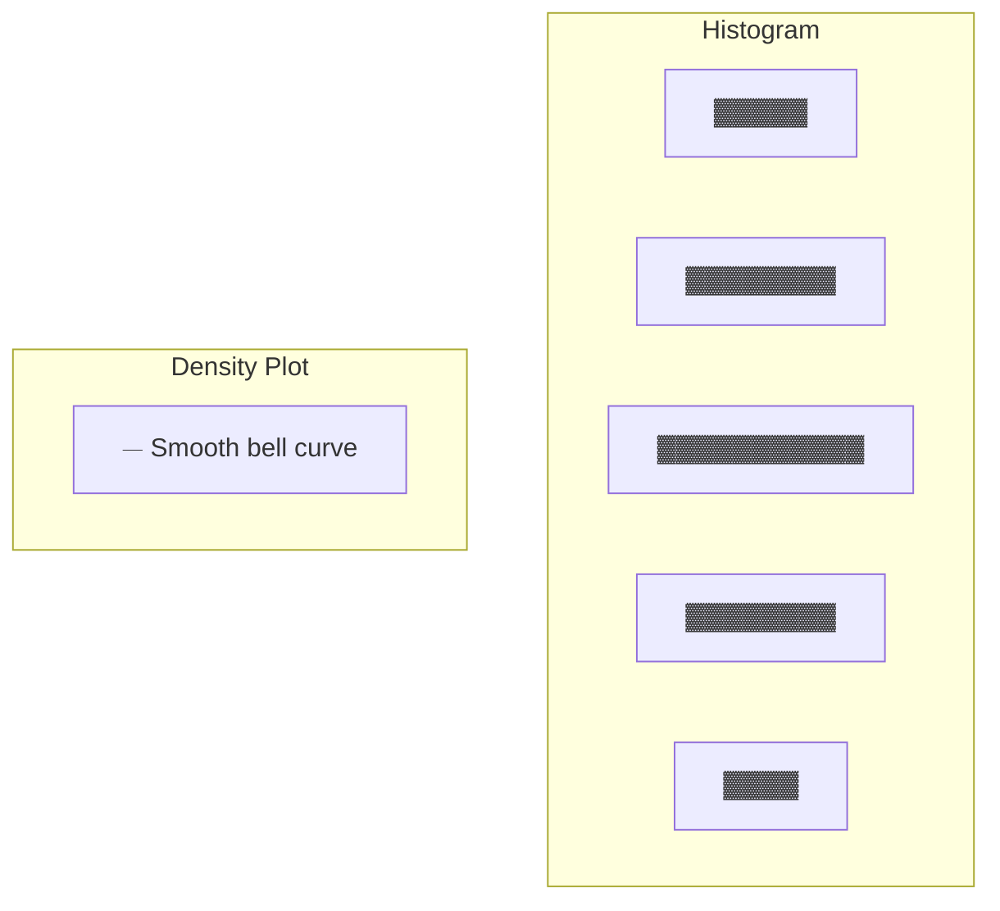
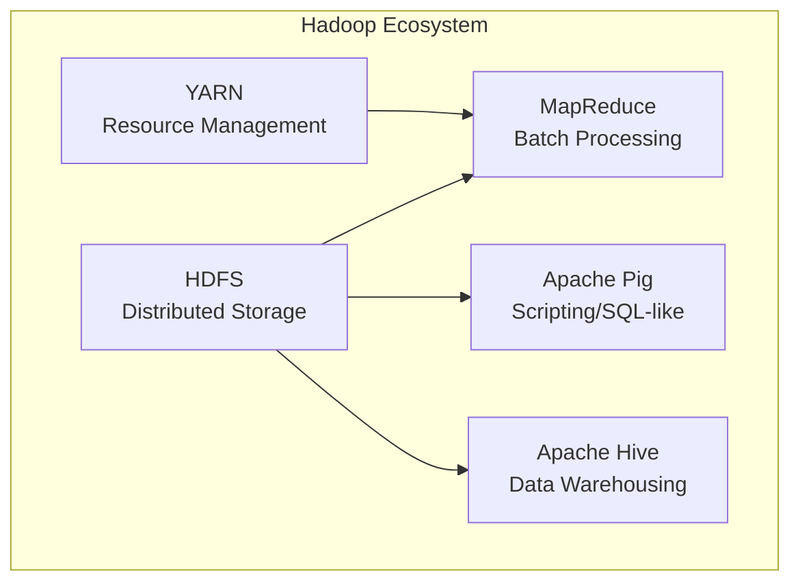

---

# DATA SCIENCE AND BIG DATA ANALYTICS — Sample Solution

**Paper Code:** [6262]-43 | **Total Marks:** 70 | **Time:** 2½ Hours

---

## Q1) a) Data Preparation Phase and ETLT [9]

**Data Preparation** is the second phase of the Data Analytics Lifecycle where raw data is
transformed into a clean, structured format suitable for analysis.

**Key activities:**

1. Data exploration and profiling
2. Data cleaning (handling missing values, outliers)
3. Data transformation (normalization, encoding)
4. Feature engineering (creating new derived variables)
5. Data integration (combining multiple sources)

**Analytics Sandbox:** A secure, isolated environment where data scientists can:

- Experiment with data without affecting production systems
- Install custom tools and libraries
- Access a subset of the data for analysis
- Collaborate with team members

**ETLT Process (Extract, Load, Transform):**

```
Source
  │
  ├── E (Extract) — Extract raw data from source systems
  │
  ├── L (Load) — Load raw data into staging area/sandbox
  │
  ├── T (Transform) — Clean, filter, aggregate within the sandbox
  │
  └── Load — Load processed data into analytics database
```

**ETLT vs ELT:** In ETLT, data is loaded raw into the environment first, then transformed within the
analytics platform — more flexible for exploratory work.

---

## Q1) b) Stakeholders and Key Outputs [8]

| Stakeholder              | Role                                | Expected Output                            |
| ------------------------ | ----------------------------------- | ------------------------------------------ |
| **Project Sponsor**      | Funds the project, sets vision      | ROI analysis, business value assessment    |
| **Business Stakeholder** | Domain expert, defines requirements | Actionable insights, recommendations       |
| **Data Scientist**       | Builds models                       | Model accuracy reports, feature importance |
| **Data Engineer**        | Manages data pipelines              | Clean, accessible datasets                 |
| **IT Operations**        | Maintains infrastructure            | Scalable, production-ready deployment      |
| **End Users**            | Consume the analytics               | Dashboards, reports, predictions           |

**Key outputs at project conclusion:**

- Final report with findings and recommendations
- Deployed model or dashboard
- Model performance metrics
- Presentation to stakeholders

---

## Q2) a) Model Planning and Model Building Phases [8]

**Model Planning Phase:**

1. Determine analytical methods (classification, regression, clustering)
2. Select appropriate algorithms based on data types and business needs
3. Design training and testing strategies
4. Identify evaluation metrics
5. Conduct exploratory data analysis to validate assumptions

**Model Building Phase:**

1. Split data into training, validation, and test sets
2. Train initial models on training data
3. Tune hyperparameters using validation data
4. Compare multiple models
5. Select the best-performing model
6. Test final model on unseen test data

**Tools:** Python (scikit-learn, TensorFlow, PyTorch), R, RapidMiner, SAS, Spark MLlib

---

## Q2) b) Linear Regression [9]

**Linear Regression** models the relationship between a dependent variable (target) and one or more
independent variables (features) using a linear equation.

**Primary Objectives:**

1. **Prediction** — Predict Y given new X values
2. **Explanation** — Understand how X affects Y
3. **Trend analysis** — Identify direction and strength of relationships

**Simple vs Multiple Linear Regression:**

| Aspect           | Simple            | Multiple                          |
| ---------------- | ----------------- | --------------------------------- |
| Formula          | Y = β₀ + β₁X      | Y = β₀ + β₁X₁ + β₂X₂ + ... + βₙXₙ |
| Independent vars | 1                 | 2 or more                         |
| Visualization    | 2D scatter + line | Multi-dimensional                 |

**Performance Evaluation Metrics:**

- **R² (R-squared)**: Proportion of variance explained (0 to 1)
- **MSE (Mean Squared Error)**: Average squared difference between predicted and actual values
- **RMSE (Root Mean Squared Error)**: √MSE — in same units as target
- **MAE (Mean Absolute Error)**: Average absolute difference

---

## Q3) a) Logistic Regression and Sigmoid Function [9]

**Logistic Regression** is a classification algorithm that predicts the probability of a binary
outcome.

**Difference from Linear Regression:** | Feature | Linear Regression | Logistic Regression |
|---------|-------------------|---------------------| | Output | Continuous (unbounded) |
Probability [0,1] | | Equation | Y = β₀ + β₁X | P(Y=1) = 1 / (1 + e^-(β₀ + β₁X)) | | Loss function |
MSE | Log loss / Cross-entropy | | Use case | Regression problems | Classification problems |

**Sigmoid Function:**

```
σ(z) = 1 / (1 + e^(-z))
```

The sigmoid function maps any real-valued input to a value between 0 and 1, making it suitable for
probability estimation. The decision boundary is typically at P=0.5:

- If σ(z) ≥ 0.5 → predict class 1
- If σ(z) < 0.5 → predict class 0

**Role in logistic regression:** The linear combination β₀ + β₁X is passed through sigmoid to get a
probability — enabling the model to classify while maintaining interpretability.

---

## Q3) b) Naive Bayes Calculation [9]

**Given:** New email with Offer=1, Free=1

**Training Data:**

| Email | Offer | Free | Spam |
| ----- | ----- | ---- | ---- |
| 1     | 1     | 0    | No   |
| 2     | 0     | 1    | Yes  |
| 3     | 1     | 1    | Yes  |
| 4     | 0     | 1    | No   |
| 5     | 1     | 1    | Yes  |

**Step 1: Prior probabilities**

- P(Spam=Yes) = 3/5 = 0.6
- P(Spam=No) = 2/5 = 0.4

**Step 2: Likelihoods** P(Offer=1 | Spam=Yes) = 2/3 (emails 3,5 out of 2,3,5) P(Free=1 | Spam=Yes) =
3/3 = 1 (emails 2,3,5 all have Free=1)

P(Offer=1 | Spam=No) = 1/2 (email 1 out of 1,4) P(Free=1 | Spam=No) = 1/2 (email 4 out of 1,4)

**Step 3: Posterior probabilities (Naive assumption — features are independent)**

P(Spam=Yes | Offer=1, Free=1) ∝ P(Spam=Yes) × P(Offer=1|Yes) × P(Free=1|Yes) = 0.6 × (2/3) × 1 = 0.4

P(Spam=No | Offer=1, Free=1) ∝ P(Spam=No) × P(Offer=1|No) × P(Free=1|No) = 0.4 × (1/2) × (1/2) = 0.1

**Step 4: Normalize**

P(Spam=Yes | Offer=1, Free=1) = 0.4 / (0.4 + 0.1) = 0.4 / 0.5 = 0.8

```
[ANSWER BOX]
P(Spam = Yes | Offer=1, Free=1) = 0.8 (80%)
The email is classified as SPAM.
```

---

## Q4) a) Apriori Algorithm [9]

**Apriori Algorithm** discovers frequent itemsets in a transactional dataset.

**Key concepts:**

- **Support**: Fraction of transactions containing an itemset
  - Support(A) = (Transactions containing A) / (Total transactions)
- **Confidence**: Conditional probability Y given X
  - Confidence(X → Y) = Support(X ∪ Y) / Support(X)

**Apriori Principle:** If an itemset is frequent, all its subsets are frequent. Conversely, if an
itemset is infrequent, all its supersets are infrequent.

**Algorithm:**

```
1. Find all frequent 1-itemsets (above min_support)
2. Generate candidate k-itemsets from frequent (k-1)-itemsets
3. Prune candidates that have infrequent subsets
4. Count support for remaining candidates
5. Keep those above min_support
6. Repeat k=2,3,... until no new frequent itemsets found
7. Generate association rules from frequent itemsets using min_confidence
```

**Example:** Transactions = { {milk, bread}, {bread, eggs}, {milk, bread, eggs} } With
min_support=2/3:

- Frequent 1-items: milk(2), bread(3), eggs(2)
- Frequent 2-items: milk→bread(2), bread→eggs(2)

---

## Q4) b) Decision Trees [9]

**Decision Tree** is a tree-structured classification/regression model where internal nodes test
features, branches represent outcomes, and leaves represent class labels.

**Building Process (CART algorithm):**

1. Start with all training data at the root
2. For each feature, evaluate all possible split points
3. Choose the split that maximizes information gain (or minimizes impurity)
4. Split the data into child nodes
5. Recursively repeat steps 2-4 for each child node
6. Stop when: max depth reached, min samples per leaf, or no further gain

**Splitting Criteria:**

**1. Gini Index:**

```
Gini = 1 - Σ(pᵢ)²
```

Lower Gini = purer node. Used by CART.

**2. Entropy:**

```
Entropy = -Σ(pᵢ × log₂(pᵢ))
```

**Information Gain = Entropy(parent) - Σ(weighted Entropy(children))**

**3. Classification Error:**

```
Error = 1 - max(pᵢ)
```

**Example:** If a node has 5 Yes and 3 No:

- Gini = 1 - (5/8)² - (3/8)² = 1 - 0.391 - 0.141 = 0.468
- Entropy = -(0.625×log₂0.625 + 0.375×log₂0.375) = 0.954

---

## Q5) a) K-Means Clustering [9]

**Given:** K=2, Initial centroids: C₁=(2,3), C₂=(8,6)

**Iteration 1:**

Compute distances from each point to centroids:

| Point  | Dist to C₁(2,3)                    | Dist to C₂(8,6)                   | Assigned |
| ------ | ---------------------------------- | --------------------------------- | -------- |
| A(2,3) | √((2-2)²+(3-3)²) = 0               | √((2-8)²+(3-6)²) = √(36+9) = 6.71 | C₁       |
| B(4,7) | √((4-2)²+(7-3)²) = √(4+16) = 4.47  | √((4-8)²+(7-6)²) = √(16+1) = 4.12 | C₂       |
| C(3,5) | √((3-2)²+(5-3)²) = √(1+4) = 2.24   | √((3-8)²+(5-6)²) = √(25+1) = 5.10 | C₁       |
| D(6,9) | √((6-2)²+(9-3)²) = √(16+36) = 7.21 | √((6-8)²+(9-6)²) = √(4+9) = 3.61  | C₂       |
| E(8,6) | √((8-2)²+(6-3)²) = √(36+9) = 6.71  | √((8-8)²+(6-6)²) = 0              | C₂       |
| F(7,8) | √((7-2)²+(8-3)²) = √(25+25) = 7.07 | √((7-8)²+(8-6)²) = √(1+4) = 2.24  | C₂       |

**Cluster 1:** {A, C} → New centroid: ((2+3)/2, (3+5)/2) = (2.5, 4.0) **Cluster 2:** {B, D, E, F} →
New centroid: ((4+6+8+7)/4, (7+9+6+8)/4) = (6.25, 7.5)

**Iteration 2:**

| Point  | Dist to C₁(2.5,4) | Dist to C₂(6.25,7.5) | Assigned |
| ------ | ----------------- | -------------------- | -------- |
| A(2,3) | 1.12              | 5.70                 | C₁       |
| B(4,7) | 3.35              | 2.66                 | C₂       |
| C(3,5) | 1.12              | 3.91                 | C₁       |
| D(6,9) | 5.59              | 1.52                 | C₂       |
| E(8,6) | 5.85              | 2.37                 | C₂       |
| F(7,8) | 5.85              | 0.90                 | C₂       |

Same assignment → **Converged**.

```
[ANSWER BOX]
Final centroids: C₁ = (2.5, 4.0), C₂ = (6.25, 7.5)
Cluster 1: {A, C}
Cluster 2: {B, D, E, F}
```

---

## Q5) b) Text Preprocessing and Feature Extraction [9]

**Handling noise in text data:**

1. **Lowercasing**: Convert all text to lowercase
2. **Removing punctuation**: Strip punctuation marks
3. **Removing stop words**: Filter common words (the, is, at)
4. **Stemming**: Reduce words to root form (running → run)
5. **Lemmatization**: Morphological analysis (better → good)
6. **Removing numbers and special characters** (if irrelevant)
7. **Handling HTML tags** (regex removal)
8. **Spelling correction** (optional)

**Bag of Words (BoW):**

- Represents text as a multiset of words, ignoring grammar and word order
- Creates a vocabulary of all unique words in the corpus
- Each document is a vector of word counts

```
Document 1: "Data science is fun"
Document 2: "Data science is hard"

Vocabulary: {Data, science, is, fun, hard}
BoW Vectors:
  Doc1: [1, 1, 1, 1, 0]
  Doc2: [1, 1, 1, 0, 1]
```

**TF-IDF (Term Frequency — Inverse Document Frequency):**

```
TF(t) = Frequency of term t in document / Total terms in document
IDF(t) = log(Total documents / Documents containing term t)
TF-IDF(t) = TF(t) × IDF(t)
```

**Advantage over BoW:** TF-IDF downweights common words (high document frequency) and upweights rare
but meaningful words.

---

## Q6) a) Hierarchical Clustering [9]

**Hierarchical Clustering** creates a tree-like hierarchy (dendrogram) of clusters without requiring
K to be specified in advance.

**Types:**

1. **Agglomerative (bottom-up)**: Each point starts as its own cluster; merge nearest clusters
   iteratively
2. **Divisive (top-down)**: All points start in one cluster; split recursively

**Linkage Criteria:**

- **Single linkage**: Distance between closest points of two clusters
- **Complete linkage**: Distance between farthest points
- **Average linkage**: Average of all pairwise distances
- **Ward's method**: Minimize variance increase when merging

**Example Dendrogram:**

```
        ┌──── A
   ─────┤
        │    ┌──── B
        └────┤    ┌──── C
             └────┤    ┌──── D
                  └────┤    ┌──── E
                       └────┘
```

Cut at different heights → different numbers of clusters.

**Real-world applications:**

- Customer segmentation (retail, marketing)
- Document clustering
- Gene sequence analysis (bioinformatics)
- Image segmentation
- Social network analysis (community detection)

---

## Q6) b) Holdout Method [9]

**Holdout Method** splits the dataset into separate subsets for training and evaluation.

**Split:** | Set | Purpose | Typical % | |-----|---------|-----------| | **Training set** | Model
learns patterns, updates weights | 60-70% | | **Validation set** | Hyperparameter tuning, model
selection | 10-20% | | **Test set** | Final, unbiased evaluation | 10-20% |

**Process:**

1. Shuffle data randomly
2. Split into training (60%), validation (15%), test (25%)
3. Train models on training set
4. Tune hyperparameters using validation set
5. Select best model
6. Evaluate once on test set — this gives an unbiased estimate of generalization performance

**Advantages:** Simple, fast, easy to implement **Disadvantages:** High variance (result depends on
single split), less data for training

**Alternative:** k-fold cross-validation — split into k folds, train on k-1 folds, test on remaining
fold, repeat k times.

---

## Q7) a) Histogram vs Density Plot [9]

**Histogram** is a graphical representation of data distribution using bars of equal width.

**Construction:**

1. Divide data range into equal-width bins
2. Count data points in each bin
3. Draw bars with height proportional to frequency

**Interpretation:**

- Shape (bell-shaped, skewed, bimodal)
- Spread (range, variance)
- Central tendency (where bars are tallest)
- Outliers (isolated bars)

**Histogram vs Density Plot:**

| Feature        | Histogram                         | Density Plot                       |
| -------------- | --------------------------------- | ---------------------------------- |
| Representation | Discrete bars                     | Smooth curve                       |
| Y-axis         | Frequency / Count                 | Probability density                |
| Parameters     | Bin width (k)                     | Bandwidth (h)                      |
| Dependency     | Heavily dependent on bin width    | Depends on kernel and bandwidth    |
| Smoothed       | No                                | Yes (kernel smoothing)             |
| Use case       | Quick visualization, exact counts | Underlying distribution estimation |



---

## Q7) b) Hadoop Ecosystem [9]

**Hadoop** is an open-source framework for distributed storage and processing of big data across
clusters of commodity hardware.

**Primary Components:**



**1. HDFS (Hadoop Distributed File System):**

- Stores data across multiple nodes in 128 MB blocks
- Each block replicated 3× (fault tolerance)
- NameNode manages metadata; DataNodes store blocks

**2. YARN (Yet Another Resource Negotiator):**

- Cluster resource management and job scheduling
- ResourceManager + NodeManager per node

**3. MapReduce:**

- Programming model for parallel processing
- **Map**: Processes input key-value pairs → intermediate pairs
- **Shuffle/Sort**: Groups intermediate data by key
- **Reduce**: Aggregates values per key → final output

**MapReduce Word Count Example:**

```
Map phase:
  Input: "hello world hello"
  → (hello, 1), (world, 1), (hello, 1)

Reduce phase:
  Input: (hello, [1,1]), (world, [1])
  → (hello, 2), (world, 1)
```

---

## Q8) a) Box Plot [9]

**Box Plot** (Box-and-Whisker plot) displays the five-number summary of a dataset.

**Components:**

```
     ───  Maximum (Q3 + 1.5×IQR or actual max)
          ┌─────────┐
          │         │
     ─────│─ Median │──── Q3 (75th percentile)
          │   Q2    │
          │         │
     ─────│─────────│──── Q1 (25th percentile)
          └─────────┘
     ───  Minimum (Q1 - 1.5×IQR or actual min)

     *    Outliers (beyond whiskers)
```

**Key Elements:**

- **Median (Q2)**: Middle value (50th percentile) — line inside box
- **Q1 (First Quartile)**: 25th percentile — bottom of box
- **Q3 (Third Quartile)**: 75th percentile — top of box
- **IQR (Interquartile Range)**: Q3 - Q1 — height of box (spread of middle 50%)
- **Whiskers**: Extend to max/min within 1.5×IQR from quartiles
- **Outliers**: Points beyond whiskers (plotted as dots/\*)

**Interpretation:**

- Median position → skewness (if median is off-center, data is skewed)
- IQR → spread of the bulk of data
- Whisker length → tail behavior
- Outliers → extreme values requiring investigation

---

## Q8) b) Apache Pig and Apache Spark [9]

**Apache Pig:** A high-level platform for creating MapReduce programs using **Pig Latin**, a
SQL-like scripting language.

**Role in Hadoop:**

- **Abstraction**: Pig Latin scripts are compiled into MapReduce jobs
- **Operations**: LOAD, FOREACH, FILTER, GROUP, JOIN, STORE
- **Schema-on-read**: No schema declaration needed at load time
- **Use case**: ETL pipelines, data transformation

**Pig Latin Example:**

```pig
logs = LOAD 'server.log' USING PigStorage(',')
        AS (timestamp:long, ip:chararray, status:int);
filtered = FILTER logs BY status == 404;
grouped = GROUP filtered BY ip;
counts = FOREACH grouped GENERATE group, COUNT(filtered);
STORE counts INTO 'output';
```

**Apache Spark:** A fast, in-memory data processing engine.

**How Spark complements Hadoop:**

| Feature     | Hadoop MapReduce                                 | Apache Spark                                   |
| ----------- | ------------------------------------------------ | ---------------------------------------------- |
| Processing  | Disk-based (writes intermediate results to disk) | In-memory processing (faster)                  |
| Latency     | High (batch-oriented)                            | Low (supports streaming, interactive queries)  |
| APIs        | Java only                                        | Scala, Python, R, Java, SQL                    |
| Libraries   | Limited                                          | MLlib (ML), Spark Streaming, GraphX, Spark SQL |
| Performance | Baseline                                         | 10-100× faster for in-memory workloads         |

**Integration:** Spark can read from and write to HDFS, replacing MapReduce as the processing engine
while leveraging Hadoop's distributed storage.

---

═══════════════════════════════════════════════════════

## EXAMINER COMMENTARY

**Why this scores full marks:**

- Naive Bayes calculation shown with step-by-step probability computation
- K-means shown with full Euclidean distance calculations per iteration
- Box plot drawn with labeled components
- Apriori algorithm explained with support/confidence formulas
- Tables used for all comparisons (regression, histogram vs density, Hadoop vs Spark)
- Mathematical formulas for sigmoid, Gini, entropy, TF-IDF included

**Common Deductions:**

- Forgetting the "Naive" assumption (feature independence) in Naive Bayes
- Not normalizing posterior probabilities (neither summing to 1)
- Confusing ETLT (Load then Transform) vs traditional ETL
- Using Euclidean distance but not showing the square root
- Forgetting to specify K=2 or number of iterations in K-means
- Confusing training set vs validation set vs test set purposes

**Time Budget:**

- Q1 (18 min): Data prep 9 min + Stakeholders 8 min
- Q2 (18 min): Model phases 8 min + Regression 9 min
- Q3 (18 min): Logistic regression 9 min + Naive Bayes 9 min
- Q4 (18 min): Apriori 9 min + Decision trees 9 min
- Q5 (18 min): K-means 9 min + Text preprocessing 9 min
- Q6 (18 min): Hierarchical clustering 9 min + Holdout 9 min
- Q7 (18 min): Histogram 9 min + Hadoop 9 min
- Q8 (18 min): Box plot 9 min + Pig/Spark 9 min
- **Total: ~144 min** (within 150 min limit)

═══════════════════════════════════════════════════════

---
