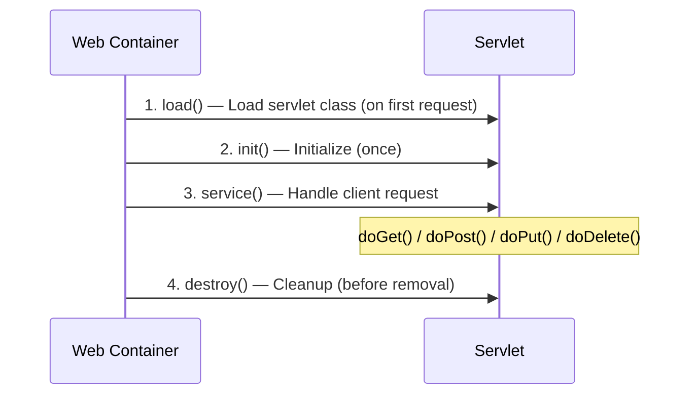
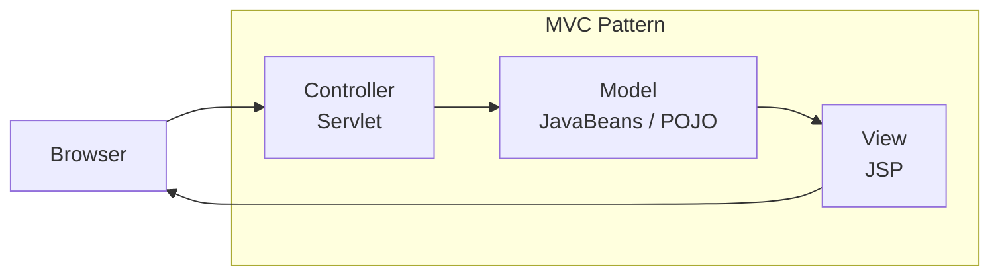

---

# WEB TECHNOLOGY — Sample Solution

**Paper Code:** [6262]-44 | **Total Marks:** 70 | **Time:** 2½ Hours

---

## Q1) a) doGet() vs doPost() Methods [9]

**doGet():** Handles HTTP GET requests. Data is appended to the URL as query parameters.
**doPost():** Handles HTTP POST requests. Data is sent in the HTTP request body.

**Servlet Example:**

```java
public class MyServlet extends HttpServlet {
    protected void doGet(HttpServletRequest req, HttpServletResponse resp)
            throws ServletException, IOException {
        resp.getWriter().println("GET request handled");
    }

    protected void doPost(HttpServletRequest req, HttpServletResponse resp)
            throws ServletException, IOException {
        String data = req.getParameter("input");
        resp.getWriter().println("POST data: " + data);
    }
}
```

| Parameter       | doGet()                                                  | doPost()                                     |
| --------------- | -------------------------------------------------------- | -------------------------------------------- |
| Data location   | URL query string                                         | HTTP request body                            |
| Security        | Less secure (data visible in URL)                        | More secure (data hidden in body)            |
| Bookmarking     | Can be bookmarked                                        | Cannot be bookmarked                         |
| Data size limit | Limited (2048 chars approx)                              | Unlimited (subject to server limits)         |
| Idempotent      | Yes (safe for repeated requests)                         | No (may have side effects)                   |
| Use case        | Search queries, form submissions with non-sensitive data | Login forms, file uploads, data modification |

---

## Q1) b) XML DTD and Schema [9]

**XML DTD (Document Type Definition)** defines the structure and legal elements/attributes of an XML
document.

**DTD Example:**

```xml
<!DOCTYPE bookstore [
  <!ELEMENT bookstore (book+)>
  <!ELEMENT book (title, author, price)>
  <!ATTLIST book isbn CDATA #REQUIRED>
  <!ELEMENT title (#PCDATA)>
  <!ELEMENT author (#PCDATA)>
  <!ELEMENT price (#PCDATA)>
]>
<bookstore>
  <book isbn="123-456">
    <title>DBMS Concepts</title>
    <author>Silberschatz</author>
    <price>799</price>
  </book>
</bookstore>
```

| Feature           | XML DTD                            | XML Schema (XSD)                                |
| ----------------- | ---------------------------------- | ----------------------------------------------- |
| Syntax            | Non-XML syntax (EBNF)              | XML-based syntax                                |
| Data types        | Limited (PCDATA, CDATA, ID, IDREF) | Rich (string, int, date, decimal, custom types) |
| Namespace support | Limited                            | Full namespace support                          |
| Extensibility     | Not extensible                     | Supports inheritance and reuse                  |
| Validation        | Basic structure validation         | Detailed validation (type, range, pattern)      |
| XML processing    | Cannot be parsed with XML parser   | Can be parsed like any XML document             |

---

## Q2) a) Servlet Lifecycle and Session Management [12]

**Servlet Lifecycle:**



**Lifecycle Methods:**

1. **init()**: Called once when servlet is first loaded. Used for initialization (DB connections,
   config reading)
2. **service()**: Called for each request. Dispatches to doGet/doPost based on HTTP method
3. **destroy()**: Called when servlet is being removed. Used for cleanup

**Session Management using Cookies:**

```java
// Creating a cookie
Cookie c = new Cookie("username", "john");
c.setMaxAge(3600);  // 1 hour
response.addCookie(c);

// Reading a cookie
Cookie[] cookies = request.getCookies();
for (Cookie c : cookies) {
    if (c.getName().equals("username")) {
        String user = c.getValue();
    }
}
```

**Session Management using URL Rewriting:**

```java
// Encode URL with session ID
String encodedURL = response.encodeURL("nextpage.jsp");
// Output: nextpage.jsp;jsessionid=ABC123XYZ
```

**Key difference:** Cookies store session ID in the browser's cookie file; URL rewriting appends
session ID to every URL link in the response.

---

## Q2) b) AJAX [6]

**AJAX (Asynchronous JavaScript and XML)** enables web pages to send and receive data from a server
asynchronously without reloading the page.

**How AJAX works:**

```javascript
var xhttp = new XMLHttpRequest();
xhttp.onreadystatechange = function () {
  if (this.readyState == 4 && this.status == 200) {
    document.getElementById("result").innerHTML = this.responseText;
  }
};
xhttp.open("GET", "getdata.jsp?id=5", true);
xhttp.send();
```

**Key concepts:**

- **XMLHttpRequest** object handles asynchronous communication
- **readyState**: 0=unsent, 1=opened, 2=headers_received, 3=loading, 4=done
- **Status**: 200=OK, 404=Not found, 500=Server error
- **Response formats**: XML, JSON, plain text, HTML

**Benefits:** Better user experience (no full page reloads), reduced bandwidth, faster
interactivity.

---

## Q3) a) JSP MVC Paradigm [8]

**MVC (Model-View-Controller)** separates application concerns into three components:



**JSP roles in MVC:**

- **Model**: JavaBeans, POJOs — business logic and data access
- **View**: JSP pages — presentation, HTML generation using JSP tags and expressions
- **Controller**: Servlets — request handling, validation, flow control

**JSP MVC example:**

```jsp
<!-- View (user-list.jsp) -->
<jsp:useBean id="userDAO" class="com.UserDAO" scope="request"/>
<html>
<body>
    <table>
        <c:forEach items="${userDAO.allUsers}" var="user">
            <tr><td>${user.name}</td><td>${user.email}</td></tr>
        </c:forEach>
    </table>
</body>
</html>
```

---

## Q3) b) Struts Framework [9]

**Struts** is an open-source MVC framework for building Java web applications.

**Architecture:**

```
Controller: ActionServlet (central servlet)
  → Reads struts-config.xml
  → Routes requests to appropriate Action classes
Model: ActionForm beans (form data), Action classes (business logic)
View: JSP with Struts tag libraries
```

**Components:**

- **ActionServlet**: Front controller — intercepts all requests
- **Action**: Handles business logic, returns ActionForward
- **ActionForm**: Captures and validates form data
- **ActionForward**: Maps logical outcomes to JSP pages

**Interceptors (Struts 2):** Interceptors wrap action execution to provide cross-cutting concerns:

- Validation, file upload, exception handling, logging
- Configured in `struts.xml` as interceptor stacks

**Exception Handling:**

```xml
<global-results>
    <result name="error">/error.jsp</result>
</global-results>
<global-exception-mappings>
    <exception-mapping exception="java.sql.SQLException" result="error"/>
</global-exception-mappings>
```

---

## Q4) a) JSP Lifecycle and Servlet Comparison [9]

**JSP Lifecycle:**

1. **Translation**: JSP file (.jsp) is translated into a servlet (.java)
2. **Compilation**: The generated servlet is compiled (.class)
3. **Loading**: Servlet class is loaded by the container
4. **Instantiation**: Object is created
5. **Initialization**: `jspInit()` is called
6. **Request processing**: `_jspService()` handles requests (includes `out`, `request`, `response`
   objects)
7. **Destruction**: `jspDestroy()` is called

| Feature             | JSP                                    | Servlet                            |
| ------------------- | -------------------------------------- | ---------------------------------- |
| Primary use         | Presentation (HTML generation)         | Business logic and request control |
| Code type           | HTML with embedded Java (tags)         | Java with embedded HTML            |
| Ease of development | Easier for UI developers               | Requires good Java knowledge       |
| Performance         | Slightly slower (translation overhead) | Faster (direct Java execution)     |
| Session management  | Implicit session object                | Requires explicit getSession()     |
| File extension      | .jsp                                   | .java                              |

---

## Q4) b) Web Services, WSDL, and SOAP [8]

**Web Services** are standardized methods for communication between applications over a network,
typically using XML-based protocols.

**WSDL (Web Services Description Language):** An XML document that describes:

- **Types**: Data types used
- **Messages**: Parameters and return values
- **PortTypes/Interfaces**: Operations exposed
- **Bindings**: Protocol and data format details
- **Service**: Endpoint URL

**SOAP (Simple Object Access Protocol):** An XML-based messaging protocol for web services.

**SOAP Message Structure:**

```xml
<soap:Envelope xmlns:soap="http://schemas.xmlsoap.org/soap/envelope/">
  <soap:Header>
    <auth:Authentication xmlns:auth="http://example.com">
      <auth:Username>admin</auth:Username>
    </auth:Authentication>
  </soap:Header>
  <soap:Body>
    <getPrice xmlns="http://example.com/stock">
      <symbol>GOOG</symbol>
    </getPrice>
  </soap:Body>
  <soap:Fault>
    <faultcode>soap:Server</faultcode>
    <faultstring>Internal error</faultstring>
  </soap:Fault>
</soap:Envelope>
```

---

## Q5) a) PHP Arrays [9]

**1. Indexed Array (Numeric keys):**

```php
$colors = array("Red", "Green", "Blue");
// or: $colors = ["Red", "Green", "Blue"];
echo $colors[0];  // Red
$colors[] = "Yellow";  // Append
```

**2. Associative Array (Named keys):**

```php
$student = array(
    "name" => "Alice",
    "age" => 20,
    "grade" => "A"
);
echo $student["name"];  // Alice
$student["city"] = "Pune";  // Add new key
```

**3. Multidimensional Array:**

```php
$matrix = array(
    array(1, 2, 3),
    array(4, 5, 6),
    array(7, 8, 9)
);
echo $matrix[1][2];  // 6
```

**4. Array Functions:**

```php
sort($arr);            // Sort ascending
count($arr);           // Number of elements
array_merge($a, $b);   // Merge arrays
array_push($arr, $v);  // Add element at end
array_pop($arr);       // Remove last element
in_array($v, $arr);    // Search for value
```

---

## Q5) b) WAP/WML and C# vs Java [9]

**i) WAP and WML:**

- **WAP (Wireless Application Protocol)**: A protocol stack for accessing internet content on mobile
  devices with limited bandwidth and small screens
- **WML (Wireless Markup Language)**: An XML-based markup language for WAP browsers
- WAP uses **WML** instead of HTML, optimized for low-bandwidth mobile networks
- WAP 2.0 supports XHTML MP (XHTML Mobile Profile)

**ii) C# vs Java:**

| Feature              | C#                                 | Java                             |
| -------------------- | ---------------------------------- | -------------------------------- |
| Platform             | .NET framework (primarily Windows) | JVM (cross-platform)             |
| Properties           | Built-in property syntax           | getters/setters convention       |
| Delegates            | Supported (function pointers)      | Not directly supported           |
| Multiple inheritance | Not supported (uses interfaces)    | Not supported (uses interfaces)  |
| LINQ                 | Yes (Language Integrated Query)    | No (requires external libraries) |
| Checked exceptions   | No                                 | Yes (compile-time checked)       |

---

## Q6) a) PHP with MySQL [6]

**Database connectivity and CRUD:**

```php
<?php
// Connection
$conn = new mysqli("localhost", "root", "", "university");

// Check connection
if ($conn->connect_error) {
    die("Connection failed: " . $conn->connect_error);
}

// CREATE
$sql = "INSERT INTO students (name, age, grade) VALUES ('John', 21, 'A')";
$conn->query($sql);

// READ
$result = $conn->query("SELECT * FROM students");
while ($row = $result->fetch_assoc()) {
    echo $row['name'] . " - " . $row['grade'] . "<br>";
}

// UPDATE
$sql = "UPDATE students SET grade='A+' WHERE name='John'";
$conn->query($sql);

// DELETE
$sql = "DELETE FROM students WHERE name='John'";
$conn->query($sql);

// Prepared Statement (SQL injection prevention)
$stmt = $conn->prepare("INSERT INTO students (name, age) VALUES (?, ?)");
$stmt->bind_param("si", $name, $age);
$name = "Bob";
$age = 22;
$stmt->execute();

$conn->close();
?>
```

---

## Q6) b) Session Tracking, .NET, Node.js [12]

**i) Session Tracking in PHP:**

```php
<?php
session_start();  // Start session

// Store data
$_SESSION["user_id"] = 101;
$_SESSION["username"] = "john_doe";

// Access data
echo $_SESSION["username"];

// Destroy session
session_destroy();
?>
```

Session data is stored server-side (default: files in /tmp/). Client receives a session cookie.

**ii) .NET Framework:** Microsoft's framework for building Windows applications and web services.

- **CLR (Common Language Runtime)**: Executes .NET code (JIT compilation, garbage collection)
- **FCL (Framework Class Library)**: Extensive library of classes for I/O, networking, data access
- **ASP.NET**: Web application framework (Web Forms, MVC, Web API)
- **Languages**: C#, VB.NET, F#

**iii) Node.js:** A JavaScript runtime built on Chrome's V8 engine for server-side applications.

- **Event-driven, non-blocking I/O**: Handles concurrent requests efficiently
- **npm (Node Package Manager)**: Largest ecosystem of open-source libraries
- **Common use cases**: REST APIs, real-time applications (chat, gaming), microservices
- **Express.js**: Popular Node.js web framework

---

## Q7) a) Ruby and Control Statements [10]

**Ruby** is a dynamic, object-oriented programming language known for simplicity and productivity.

**Advantages of Ruby:**

1. **Elegant syntax**: Readable and expressive, close to natural language
2. **Pure OOP**: Everything is an object (including numbers and classes)
3. **Dynamic typing**: No type declarations needed
4. **Metaprogramming**: Can modify classes and methods at runtime
5. **Garbage collection**: Automatic memory management
6. **Large standard library**: Built-in support for web, networking, threading
7. **Ruby on Rails**: Powerful web framework built on Ruby

**Control Statements:**

```ruby
# if-else
age = 18
if age >= 18
    puts "Adult"
elsif age >= 13
    puts "Teenager"
else
    puts "Child"
end

# unless (opposite of if)
unless age < 18
    puts "Can vote"
end

# while loop
x = 0
while x < 5
    puts x
    x += 1
end

# for loop
for i in 0..4  # Range 0 to 4 inclusive
    puts i
end

# each iterator (Ruby-idiomatic)
[1, 2, 3].each { |n| puts n }

# case/when (switch equivalent)
grade = "A"
case grade
when "A" then puts "Excellent"
when "B" then puts "Good"
else puts "Needs improvement"
end
```

---

## Q7) b) EJB (Enterprise JavaBeans) [7]

**EJB** is a server-side component architecture for building distributed, transactional, and secure
enterprise applications.

**Types of EJBs:**

1. **Session Beans**: Business logic
   - **Stateless**: No client state maintained
   - **Stateful**: Client state maintained across calls
   - **Singleton**: Single instance shared across clients
2. **Message-Driven Beans (MDB)**: Asynchronous message processing (JMS)
3. **Entity Beans** (deprecated — replaced by JPA)

**Five basic uses of EJB:**

1. **Transaction management**: Container-managed transactions (declarative via annotations)
2. **Security**: Declarative role-based access control
3. **Concurrency management**: Container handles concurrent access
4. **Pooling/Clustering**: Automatic instance pooling and load balancing
5. **Remote access**: RMI/IIOP for distributed communication

---

## Q8) a) Ruby Arrays and Rails AJAX [10]

**Ruby Arrays:**

```ruby
# Creating arrays
arr = [1, 2, 3, 4, 5]
arr = Array.new(5, 0)  # [0, 0, 0, 0, 0]

# Accessing elements
arr[0]       # First element
arr[-1]      # Last element
arr[1..3]    # Sublist (index 1 to 3)
arr.first    # 1
arr.last     # 5

# Common methods
arr << 6           # Append
arr.push(7)        # Append
arr.pop            # Remove last
arr.include?(3)    # Check existence
arr.map { |x| x*2 }  # Transform: [2, 4, 6, 8, 10]
arr.select { |x| x > 2 }  # Filter: [3, 4, 5]
arr.sort           # Sort
arr.length         # Size
```

**Rails with AJAX:**

```ruby
# Controller action (posts_controller.rb)
def create
    @post = Post.new(post_params)
    respond_to do |format|
        if @post.save
            format.html { redirect_to @post }
            format.js   # Renders create.js.erb
        end
    end
end
```

```javascript
// create.js.erb
$("#posts").append("<%= j render(@post) %>");
$("#post_form").reset();
```

```ruby
# View link with AJAX
<%= link_to "Delete", @post, method: :delete, remote: true %>
```

---

## Q8) b) Document Request in Rails [4]

In Rails, document request handling involves:

1. **Routes** map URLs to controller actions
2. **Controller** processes the request and prepares data
3. **View** renders the response (HTML, JSON, XML, PDF)

```ruby
# config/routes.rb
Rails.application.routes.draw do
    resources :documents
end

# app/controllers/documents_controller.rb
class DocumentsController < ApplicationController
    def show
        @document = Document.find(params[:id])
        respond_to do |format|
            format.html  # app/views/documents/show.html.erb
            format.json  { render json: @document }
            format.pdf   { render pdf: @document.name }
        end
    end
end
```

**RESTful routing** uses the HTTP verb + URL to determine the action:

- GET /documents → index
- GET /documents/1 → show
- POST /documents → create
- PUT /documents/1 → update
- DELETE /documents/1 → destroy

---

## Q8) c) Advantages of Ruby on Rails [3]

1. **Convention over Configuration**: Sensible defaults reduce configuration files
2. **DRY (Don't Repeat Yourself)**: Code reuse through partials, layouts, helpers
3. **Rapid development**: Scaffolding generates full CRUD with minimal code
4. **Active Record**: Elegant ORM that simplifies database interactions
5. **Built-in testing**: RSpec, Minitest ready out of the box
6. **Gem ecosystem**: 50,000+ gems for rapid feature addition
7. **MVC architecture**: Clean separation of concerns

```
[ANSWER BOX]
RoR advantages: Convention over Configuration, DRY principle,
rapid development via scaffolding, Active Record ORM,
built-in testing, large gem ecosystem, clean MVC architecture.
```

---

═══════════════════════════════════════════════════════

## EXAMINER COMMENTARY

**Why this scores full marks:**

- Code examples for servlets, PHP, Ruby arrays — practical ready-to-use snippets
- XML DTD example shows a complete valid document
- JSP lifecycle uses a sequence diagram format
- Web services answer includes a real SOAP message structure
- Tables used for all comparison questions (doGet vs doPost, DTD vs Schema, JSP vs Servlet)
- Each answer closes with a summary or key takeaway

**Common Deductions:**

- Not showing actual code examples when asked for PHP/Ruby concepts
- Confusing servlet lifecycle (init → service → destroy) with JSP lifecycle (translate → compile →
  load → init → service → destroy)
- Omitting `session_start()` in PHP session management answers
- Forgetting to mention the `remote: true` option for Rails AJAX
- Mixing up XML DTD syntax with XML Schema syntax
- Not distinguishing between application state and session state

**Time Budget:**

- Q1 (18 min): doGet/doPost 9 min + DTD/Schema 9 min
- Q2 (18 min): Servlet lifecycle 12 min + AJAX 6 min
- Q3 (18 min): JSP MVC 8 min + Struts 9 min
- Q4 (18 min): JSP lifecycle 9 min + Web services 8 min
- Q5 (18 min): PHP arrays 9 min + WAP/C# 9 min
- Q6 (18 min): PHP MySQL 6 min + Session/.NET/Node 12 min
- Q7 (18 min): Ruby 10 min + EJB 7 min
- Q8 (18 min): Ruby arrays 10 min + Rails doc 4 min + Advantages 3 min
- **Total: ~144 min** (within 150 min limit)

═══════════════════════════════════════════════════════

---
