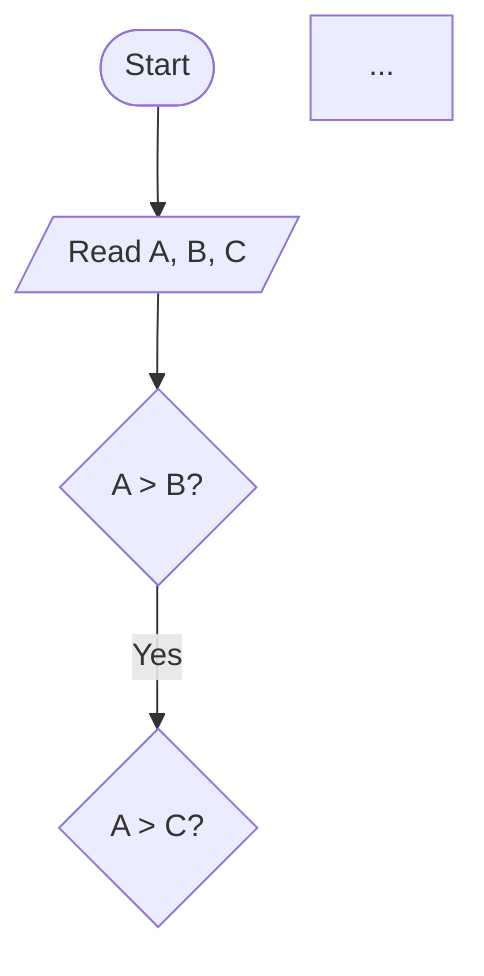
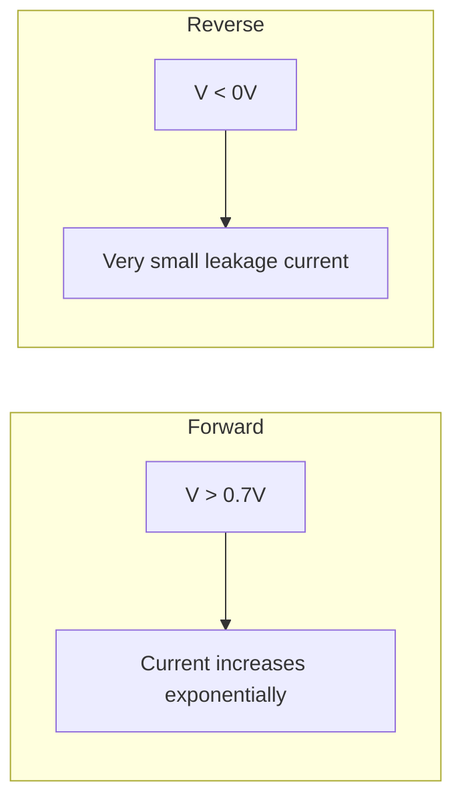
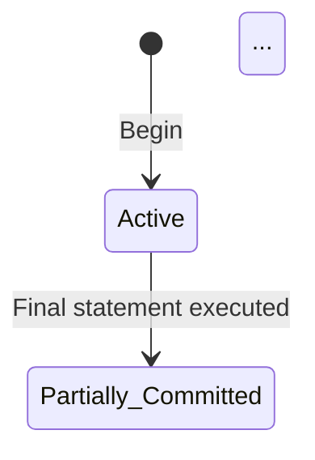

# Formatting Requirements for Non-Math Subjects — PDF Pipeline

> **Generated:** 2026-06-20
> **Scope:** All non-math subjects in the `examples/` directory
> **Purpose:** Comprehensive inventory of markdown constructs that the PDF pipeline must render correctly.

---

## Table of Contents

1. [Headings and Document Structure](#1-headings-and-document-structure)
2. [Tables](#2-tables)
3. [Code Blocks and Syntax Highlighting](#3-code-blocks-and-syntax-highlighting)
4. [Inline Code and Monospace Text](#4-inline-code-and-monospace-text)
5. [LaTeX Math (Inline and Display)](#5-latex-math-inline-and-display)
6. [Unicode Math Characters and Greek Letters](#6-unicode-math-characters-and-greek-letters)
7. [Mermaid Diagrams](#7-mermaid-diagrams)
8. [ASCII Art and Monospace Diagrams](#8-ascii-art-and-monospace-diagrams)
9. [Lists (Ordered and Unordered)](#9-lists-ordered-and-unordered)
10. [Bold, Italic, and Styled Text](#10-bold-italic-and-styled-text)
11. [Horizontal Rules and Section Separators](#11-horizontal-rules-and-section-separators)
12. [Special Block Types](#12-special-block-types)
13. [Answer Boxes](#13-answer-boxes)
14. [YAML Front Matter](#14-yaml-front-matter)
15. ["OR" Separators](#15-or-separators)
16. [Page Break / Newpage Markers](#16-page-break--newpage-markers)
17. [Subscript and Superscript Text](#17-subscript-and-superscript-text)
18. [Mnemonic Summary Tables](#18-mnemonic-summary-tables)
19. [Examiner Commentary and Scoring Guides](#19-examiner-commentary-and-scoring-guides)
20. [Time Budget Blocks](#20-time-budget-blocks)
21. [Mathematical Subscripts and Engineering Notation](#21-mathematical-subscripts-and-engineering-notation)
22. [Images and Visual Content](#22-images-and-visual-content)
23. [Cross-Subject Summary Matrix](#23-cross-subject-summary-matrix)

---

## 1. Headings and Document Structure

### Used in: ALL subjects

| Heading Level | Typical Usage | Example Subjects |
|---|---|---|
| `# H1` | Paper title, solution title | ALL |
| `## H2` | Section headers (Unit names, Q1/Q2 groups) | ALL |
| `### H3` | Sub-section headers (Q1a, Q1b), solution parts | ALL |
| `#### H4` | Deeper sub-sections, sub-parts | Occasionally in solutions |

### Specific patterns found:
- **Paper titles:** `# Programming and Problem Solving — Sample Paper 1`
- **Solution titles:** `# Programming and Problem Solving — Sample Paper 1 — Solution`
- **Unit headers:** `## Unit III — Searching and Game Playing`, `### Unit III — Relational Database Design`
- **Question headers:** `### Q1) a) Define Algorithm and Flowchart...`
- **Sub-parts:** `#### i) Universal Generalization`

### Rendering requirements:
- H1: 15pt, bold, centered, uppercase with letter-spacing (already in renderer CSS)
- H2: 13pt, bold, centered
- H3: 12pt, bold, left-aligned, with bottom border
- H4: 11pt, bold, left-aligned
- Headings must not break across pages awkwardly (widow/orphan control)

---

## 2. Tables

### Used in: ALL non-math subjects — THE most heavily used construct

Tables appear in two primary roles:

### 2a. Comparison / Parameter Tables
Used to compare two or more items across multiple criteria. Found in EVERY subject.

**Examples:**
- "Call by value vs Call by reference" (Programming)
- "Structure vs Union" (Programming)
- "AM vs FM" (Electronics)
- "Symmetric vs Asymmetric Cryptography" (Networks)
- "RDBMS vs NoSQL" (DBMS)
- "HTTP/1.1 vs HTTP/2" (Networks)
- "Propositional vs Predicate Logic" (AI)
- "TTL vs CMOS" (Digital Logic)
- "RGB vs HSV" (Computer Graphics)
- "Simple vs Multiple Linear Regression" (Data Science)

**Format used:**
```markdown
| Parameter       | Item A                          | Item B                          |
| --------------- | ------------------------------- | ------------------------------- |
| **Key feature** | Description here                | Description here                |
```

**Rendering requirements:**
- Full page width
- Borders on all cells (1px solid)
- Header row with gray background (#eee)
- Bold header text
- Even/odd row shading for readability
- Font size: 10pt (slightly smaller than body)
- Padding: 4px 8px for th, 3px 8px for td
- Text inside table cells may contain bold, inline code, inline math
- **Tables with code inside cells** (e.g., `int a = 10;` inside a table cell) must render the code in monospace
- **Tables with math inside cells** (e.g., formula expressions) must render math in KaTeX

### 2b. Data / Schedule / Trace Tables
Specialized tables used in specific subjects:

**DBMS — Schedule tables:**
```markdown
| T1   | T2   | T3   |
| ---- | ---- | ---- |
| R(A) |      |      |
|      | W(A) |      |
```

**DBMS — Chase algorithm tables:**
```markdown
|     | A   | B   | C   | D   | E   | F   |
| --- | --- | --- | --- | --- | --- | --- |
| R1  | a   | b   | c1  | d1  | e1  | f   |
```

**Data Science — K-means distance tables:**
```markdown
| Point  | Dist to C1(2,3)  | Dist to C2(8,6) | Assigned |
| ------ | ---------------- | --------------- | -------- |
| A(2,3) | 0                | 6.71            | C1       |
```

**Data Science — Training data tables:**
```markdown
| Email | Offer | Free | Spam |
| ----- | ----- | ---- | ---- |
| 1     | 1     | 0    | No   |
```

**Rendering requirements:**
- Schedule tables: Compact, centered columns, narrow padding
- Dense trace tables: May need reduced font size (9pt) to fit
- All table borders and horizontal alignment preserved
- No column overflow — columns should not be truncated

### 2c. Multi-row comparison "table as list" format
Used in programming (storage classes, operators), electronics:
```markdown
| Operator Type  | Operators                        | Example              | Description            |
| -------------- | -------------------------------- | -------------------- | ---------------------- |
| **Arithmetic** | `+`, `-`, `*`, `/`, `%`          | `a + b`              | Basic math operations  |
```

### Known rendering issues:
- Tables wider than page width (need font-size reduction or auto-shrink)
- Tables with inline code + bold + math in same cell
- Tables that must break across pages
- Empty cells in tables

---

## 3. Code Blocks and Syntax Highlighting

### Used in: Programming, Web Technology, DBMS, Data Science, AI, Computer Networks

### Languages found in code blocks:

| Language | Extension Used | Subjects |
|---|---|---|
| C | ` ```c ` | Programming, FPL |
| C++ | ` ```cpp ` | Computer Graphics |
| Java | ` ```java ` | Web Technology (Servlets) |
| JavaScript | ` ```javascript ` | Web Technology (AJAX) |
| Python | ` ```python ` | AI (Minimax) |
| PHP | ` ```php ` | Web Technology |
| Ruby | ` ```ruby ` | Web Technology |
| SQL | ` ```sql ` | DBMS (Oracle types, DDL) |
| XML | ` ```xml ` | Web Technology (DTD, SOAP) |
| JSON | ` ```json ` | DBMS (MongoDB, documents) |
| JSP | ` ```jsp ` | Web Technology |
| Pig | ` ```pig ` | Data Science (Pig Latin) |
| Plain text | ` ``` ` or ` ```text ` | All subjects (outputs, traces) |

### Code block content includes:
- **Complete programs** with `#include`, `main()`, etc.
- **Function snippets** (algorithms, search, sort)
- **Configuration files** (XML configs, struts-config)
- **Database examples** (MongoDB CRUD)
- **API examples** (RESTful routes)
- **Trace output** (recursion traces, execution sequences)
- **In-code comments** that must be rendered differently

### Specific formatting issues:
- Code blocks contain `// comments` that should be distinguishable
- Code blocks contain `/* ... */` block comments
- Code blocks contain string literals with special characters
- Some code blocks use syntax that may break markdown (e.g., `<?php`, `<?xml`)
- Long code lines (e.g., 100+ chars) must wrap or scroll
- Indentation must be preserved (critical for Python, indented C blocks)
- **Nested markdown inside code blocks** (e.g., comments with `**bold**`) should not be processed

### Rendering requirements:
- Monospace font: 'Cask NFM' / 'CaskaydiaCove Nerd Font Mono'
- Font size: 8.5pt (compact)
- Light gray background (#f4f4f4)
- 1px solid border (#ddd)
- Padding: 8px 10px
- `white-space: pre-wrap` for wrapping
- `overflow-x: auto` for horizontal scroll
- Line height: 1.3 (compact for code)
- **Syntax highlighting** is NOT currently implemented but would be beneficial

---

## 4. Inline Code and Monospace Text

### Used in: ALL subjects with programming content

- Backtick inline code: `` `int a = 10;` ``, `` `malloc()` ``, `` `strlen` ``
- Inline code inside tables (extremely common)
- Inline code inside lists
- Inline code inside bold text: **`malloc()`**

### Rendering requirements:
- Monospace font same as code blocks
- Background: #f0f0f0
- Padding: 1px 4px
- Font size: 8.5pt (or match surrounding)
- Must work inside table cells, list items, bold/italic text, and headings

---

## 5. LaTeX Math (Inline and Display)

### Used in: Electronics, Electrical, Computer Graphics, Data Science, AI (some), DBMS (minimal)

### 5a. Inline math (single `$...$`):
- `$I = I_s(e^(V/ηV_T) - 1)$` — Electronics (diode equation)
- `$V_peak = 12 * √2$` — Electronics
- `$V_DC = 2V_peak/π - 2*0.7$` — Electronics
- `$E = 4.44 f φ_m N$` — Electrical (EMF equation)
- `$η = (kVA*pf)/(kVA*pf + P_i + P_cu)$` — Electrical
- `$E_b = V - I_a * R_a$` — Electrical
- `$s = (Ns-Nr)/Ns$` — Electrical
- `$σ(z) = 1 / (1 + e^(-z))$` — Data Science
- `$Y = β_0 + β_1X$` — Data Science
- `$N = (120f)/P$` — Electrical
- `$O(log n)$`, `$O(n)$` — Programming (complexity)
- `$Q = P(tan φ_1 - tan φ_2)$` — Electrical
- `$Gini = 1 - Σ(p_i)^2$` — Data Science
- `$Entropy = -Σ(p_i × log_2(p_i))$` — Data Science
- `$25_{10} = 16+8+1 = 11001_2$` — Fundamentals (number systems)

### 5b. Display math (`$$...$$`):
- Transform matrices in Computer Graphics
- Complex formulas in Electrical (efficiency, power factor)
- Long mathematical derivations

### 5c. LaTeX delimiters used:
- `$...$` — inline (standard)
- `$$...$$` — display (standard)
- `\(...\)` — inline (also found in some files)
- `\[...\]` — display (also found in some files)

### Rendering requirements:
- Use KaTeX (already configured in pipeline)
- KaTeX CSS must be loaded properly
- Inline math must align with surrounding text baseline
- Display math must be centered
- Math inside tables must render correctly
- Math inside lists must render correctly
- Fallback for any KaTeX errors (throwOnError: false)

---

## 6. Unicode Math Characters and Greek Letters

### Used in: Electronics, Electrical, AI, Data Science

The pipeline currently converts these via `unicode-math.js`:

| Unicode | Rendered As | Used In |
|---|---|---|
| α (U+03B1) | `\alpha` | Multiple |
| β (U+03B2) | `\beta` | Electronics (transistor gain), Statistics |
| γ (U+03B3) | `\gamma` | Electrical, AI |
| δ (U+03B4) | `\delta` | Multiple |
| η (U+03B7) | `\eta` | Electronics (efficiency) |
| φ (U+03C6) | `\phi` | Electrical (flux, power factor angle) |
| π (U+03C0) | `\pi` | Electronics, Electrical |
| μ (U+03BC) | `\mu` | Electronics (micro) |
| Σ (U+03A3) | `\Sigma` | Summation in formulas |
| Δ (U+0394) | `\Delta` | Change in value |
| → (U+2192) | `\to` | Functional dependencies (FD), FOL |
| ∀ (U+2200) | `\forall` | AI (FOL quantifiers) |
| ∃ (U+2203) | `\exists` | AI (FOL quantifiers) |
| ≠ (U+2260) | `\neq` | Math expressions |
| ≤ (U+2264) | `\leq` | Math expressions |
| ≥ (U+2265) | `\geq` | Math expressions |
| ∞ (U+221E) | `\infty` | Math expressions |
| √ (U+221A) | `\sqrt` | Electronics, Electrical |
| ∈ (U+2208) | `\in` | Set notation |
| ∩ (U+2229) | `\cap` | Set notation |
| ∪ (U+222A) | `\cup` | Set notation |
| ⊨ (U+22A8) | `\models` | AI (entailment) |
| ² (U+00B2) | squared | Engineering units |
| ³ (U+00B3) | cubed | Engineering units |

### Rendering requirements:
- Unicode-to-LaTeX conversion must be correct
- Greek letters in both upper and lower case
- Greek letters appearing in both text context and math context
- Some Greek letters appear inside code blocks (should NOT be converted there)
- **Current pipeline may have gaps** — any Unicode math char not in the map will render as a literal Unicode character, which may not appear in PDF if the font lacks those glyphs

---

## 7. Mermaid Diagrams

### Used in: Programming (flowcharts), Electronics (block diagrams), DBMS (state diagrams), Networks (sequence/state diagrams), AI (hierarchy trees), Data Science (flowcharts)

### Types of Mermaid diagrams found:

| Diagram Type | Syntax | Subjects |
|---|---|---|
| Flowchart (TD) | ` ```mermaid flowchart TD ... ``` ` | Programming, Data Science |
| Flowchart (LR) | ` ```mermaid graph LR ... ``` ` | Electronics, Web Tech |
| State Diagram | ` ```mermaid stateDiagram-v2 ... ``` ` | DBMS, Networks |
| Sequence Diagram | ` ```mermaid sequenceDiagram ... ``` ` | Networks, Web Tech |
| Graph with subgraphs | ` ```mermaid graph TD ... subgraph ... end ``` ` | Electronics, Data Science |

### Specific Mermaid diagrams found:

**Programming (flowcharts):**


**Electronics (graph with subgraphs):**


**DBMS (state diagram):**


**Networks (sequence diagram):**
```mermaid
sequenceDiagram
    participant Server
    participant Client
    Server->>Server: socket()
    Client->>Server: connect()
    ...
```

### Rendering requirements:
- Mermaid code blocks must be extracted, rendered to SVG/image, and embedded in PDF
- Mermaid within fenced code blocks with ` ```mermaid ` language tag
- Support for: node shapes (rectangles, diamonds, circles), edges with labels, subgraphs, styling, participant ordering in sequence diagrams
- Diagram size should fit within page margins (may need scaling)
- Diagrams should not break across pages
- Font inside diagrams should match document font
- Color rendering in diagrams

### Known issues:
- Mermaid rendering requires a JavaScript engine (Playwright/browser) — currently done via Playwright
- Complex diagrams may overflow page width
- Sequence diagrams with many participants may need horizontal scrolling or scaling

---

## 8. ASCII Art and Monospace Diagrams

### Used in: Computer Graphics, Digital Electronics, Computer Networks, DBMS, Data Science

ASCII art diagrams appear inside fenced code blocks or indented preformatted text. These require MONOSPACE FONT PRESERVATION.

### Types found:

**Transformation matrices (Computer Graphics):**
```
T(dx, dy, dz) = | 1  0  0  dx |
                | 0  1  0  dy |
                | 0  0  1  dz |
                | 0  0  0   1 |
```

**Circuit diagrams (Digital Electronics / Electronics):**
```
      Vdd
       |
   Q1 (PMOS)
       |
Input--+--Output
       |
   Q2 (NMOS)
       |
      GND
```

**PLA block diagram (Digital Electronics):**
```
          +-------------------+
Inputs -->| Programmable AND  |--> Product terms
          | Array             |
          +-------------------+
                   |
                   v
          +-------------------+
          | Programmable OR   |--> Outputs
          | Array             |
          +-------------------+
```

**TCP/UDP header formats (Networks):**
```
+----------------------------------------------+
| Source Port (16 bit)  | Dest Port (16 bit)   |
+----------------------------------------------+
| Sequence Number (32 bit)                      |
+----------------------------------------------+
```

**SSL Protocol Stack (Networks):**
```
+--------------------------------------+
| HTTP, FTP, SMTP, etc.                |
+--------------------------------------+
| Handshake Protocol                   |
+--------------------------------------+
```

**Precedence graph (DBMS):**
```
T1 ---> T2 ---> T3
```

**N-Queens board (AI):**
```
  Q . . .
  . . . Q
  . Q . .
  . . Q .
```

**Game tree (AI):**
```
                   MAX
                  /    \
              MIN       MIN
             / | \     / | \
           MAX MAX MAX MAX MAX MAX
           / \ / \ / \ / \ / \ / \
          3  5 6  2 2  1 9  4 7  8
```

**Dendrogram (Data Science):**
```
        +---- A
   -----+
        |    +---- B
        +----+    +---- C
             +----+    +---- D
                  +----+    +---- E
                       +----+
```

**Box plot (Data Science):**
```
     ---  Maximum
          +---------+
          |         |
     -----|- Median |---- Q3
          |   Q2    |
          |         |
     -----|---------|---- Q1
          +---------+
     ---  Minimum
```

**Cryptarithmetic (AI):**
```
   B A S E
 + B A L L
 ---------
 G A M E S
```

**Recursion trace (Programming):**
```
factorial(5) = 5 * factorial(4)
            = 5 * 4 * factorial(3)
            = 5 * 4 * 3 * factorial(2)
            = 5 * 4 * 3 * 2 * factorial(1)
            = 5 * 4 * 3 * 2 * 1 = 120
```

### Rendering requirements:
- Must use monospace font (Cask NFM) at appropriate size
- Line breaks and spaces must be **exactly preserved**
- Box-drawing characters (─, ┌, ┐, └, ┘, ├, ┤, ┬, ┴, ┼, │, etc.) must render correctly
- Font must include box-drawing glyphs
- These should be enclosed in `<pre><code>` or `<pre>` tags
- Background color: light gray
- No syntax highlighting applied to ASCII diagrams
- Page breaks should not split diagrams

### Known issues:
- Box-drawing characters may not align correctly in non-monospace contexts
- Some terminals render these differently — need to ensure font has proper metrics
- Line wrapping would destroy ASCII art — must use overflow or smaller font

---

## 9. Lists (Ordered and Unordered)

### Used in: ALL subjects

### Ordered lists (numbered steps):
```markdown
1. First step
2. Second step
3. Third step
```

Used for:
- Algorithm steps
- Problem-solving steps
- Procedure descriptions
- Enumeration of properties/features

### Unordered lists (bullet points):
```markdown
- Feature 1: description
- Feature 2: description
- Feature 3: description
```

Used for:
- Lists of properties
- Feature enumeration
- Key points
- "Key concepts" sections

### Nested lists:
```markdown
1. Main point
   - Sub-point A
   - Sub-point B
2. Next main point
```

### Lists with complex content:
- Lists containing `**bold terms**`
- Lists containing `` `inline code` ``
- Lists containing `$inline math$`
- Lists containing nested code blocks (rare, but present in some files)

### Rendering requirements:
- Left padding: 22px
- Margin: 4px 0
- List items: 2px margin
- Bold and code inside list items must render correctly
- Nested lists must be properly indented
- Ordered lists with continuation across sections (rare)

---

## 10. Bold, Italic, and Styled Text

### Used in: ALL subjects extensively

### Bold text (`**...**`):
- **Key terms** on first mention (extremely common pattern)
- **Question marks**: `**Q1) a)**`
- **Table headers** with bold in first column: `| **Algorithm** | ...`
- **Answers** in multiple choice: `**Option (ii) `var_2`**`
- **Emphasis** on important concepts
- **Inside table cells**: both header cells and data cells

### Italic text (`*...*` or `_..._`):
- Used sparingly in non-math subjects
- Book titles, emphasis
- Foreign terms

### Bold-Italic: Rare

### Strikethrough (`~~...~~`):
- Not commonly used in sample papers

### Rendering requirements:
- Bold font variant must be loaded (Times New Roman Bold, Cambria Bold)
- Italic font variant must be loaded
- Bold-Italic font variant must be loaded
- Bold inside table headers must be distinguishable
- Bold inside code blocks should NOT render as bold (code is monospace)
- **Bold text within inline code** is rare but should not break: `**`int a`**`

---

## 11. Horizontal Rules and Section Separators

### Used in: ALL subjects

```markdown
---
```

or

```markdown
---
```

### Purpose:
- Separating question groups (Q1/Q2 block from Q3/Q4 block)
- Separating sub-parts within a question
- Separating the Examiner Commentary section
- End-of-section markers

### Rendering requirements:
- 1px solid line, color #888
- Margin: 10px 0
- Should NOT cause page breaks (unless combined with `\newpage`)
- Must be visually non-intrusive

---

## 12. Special Block Types

### 12a. Instructions block
Present at the top of every question paper:
```markdown
## Instructions
1. Answer Q.1 or Q.2, Q.3 or Q.4...
2. Neat diagrams must be drawn wherever necessary.
3. Figures to the right indicate full marks.
4. Assume suitable data, if necessary.
```

### 12b. CO / Bloom's level annotations
```markdown
[6] CO: CO1 | Bloom's: L1 (Remember)
```
- Appears at end of question headers
- Marks in square brackets
- Course Outcome and Bloom's taxonomy level

### 12c. "OR" blocks (see Section 15 below)
### 12d. Examiner Commentary blocks (see Section 19 below)
### 12e. Time Budget blocks (see Section 20 below)
### 12f. Mnemonic Summary tables (see Section 18 below)

---

## 13. Answer Boxes

### Used in: DBMS, Computer Networks, AI, Data Science, Electrical solutions

A specific pattern where the final answer is delimited for emphasis:

```markdown
```
[ANSWER BOX]
Final answer content here
```
```

### Examples found:
- **DBMS:** `[ANSWER BOX] Final Decomposition: R1(A,B,C), R2(B,D)...`
- **Networks:** `[ANSWER BOX] Subnet mask: 255.255.255.192...`
- **AI:** `[ANSWER BOX] B=7, A=4, S=8, E=3, L=5, M=2, G=1`
- **Data Science:** `[ANSWER BOX] Final centroids: C1 = (2.5, 4.0)...`
- **Electrical:** `[ANSWER BOX] I5Ω = 1.86 A...`
- **Web Tech:** `[ANSWER BOX] RoR advantages: Convention over Configuration...`

### Variations:
- Simple code block with `[ANSWER BOX]` as first line
- Sometimes styled with a box border in mind
- Sometimes contains multiple lines of important content

### Rendering requirements:
- Should be visually distinct — maybe a bordered box with light background
- Color or border to draw examiner's eye
- Consider using a box with 2px border, light yellow/green background
- Or keep as monospace block with distinct CSS class
- Should NOT be split across pages

### How to implement:
The current pipeline does NOT have special handling for `[ANSWER BOX]`. Recommend adding a transform that wraps these in a styled `<div class="answer-box">`.

---

## 14. YAML Front Matter

### Used in: Fundamentals of Programming Languages, DBMS, Computer Networks, AI, Web Technology, Data Science sample papers

```yaml
---
title: "Savitribai Phule Pune University — Fundamentals of Programming Languages (2024 Pattern)"
code: "ESC-105-COM"
pattern: "2024"
semester: "I"
total_marks: 70
duration: "2½ Hours"
---
```

### Also found (exam paper format):
```markdown
---

**Total No. of Questions : 8**

**SEAT No. :**

**[6262]-35**

**T.E. (Computer Engineering)**

**DATABASE MANAGEMENT SYSTEMS**

**(2019 Pattern) (Semester - I) (310241)**

**Time : 2½ Hours]** | **[Max. Marks : 70**

---
```

### Rendering requirements:
- YAML front matter is currently STRIPPED by `stripYaml()` transform
- The pseudo-YAML (with bold markers) in exam paper headers is actually NOT true YAML and contains `**bold**` markers — this is kept as body content
- Must distinguish between true YAML (between `---` delimiters at file start) and decorative `---` separators

---

## 15. "OR" Separators

### Used in: ALL subjects

The OR separator indicates alternative questions in the exam format.

### Formats found:
```markdown
**OR**
```
```markdown
*OR*
```
```markdown
O.R.
```
```markdown
**O.R.**
```
```markdown
OR
```

The current pipeline normalizes these to `**OR**` (via `normalizeOr` transform), then the renderer converts `<p>**OR**</p>` to `<div class="question-or">OR</div>`.

### Rendering requirements:
- Centered bold text
- Margin: 8px 0
- Font size: 11pt
- Should have visual spacing before and after

---

## 16. Page Break / Newpage Markers

### Used in: Some generated papers (rare in examples)

```latex
\newpage
```

### Current handling:
Converted to `<div style="page-break-before: always;"></div>`

### Rendering requirements:
- Must force a page break
- Should not leave an empty paragraph

---

## 17. Subscript and Superscript Text

### Used in: Electronics, Electrical, Data Science, Programming (complexity notation)

### Patterns found:
- HTML-style: `<sub>...</sub>`, `<sup>...</sup>` — directly in markdown
- LaTeX: `_` and `^` inside math mode
- Unicode superscripts: ² (U+00B2), ³ (U+00B3), ⁿ (U+207F)
- Unicode subscripts: ₀ (U+2080), ₁ (U+2081), etc.

### Examples:
- `I_s`, `V_T`, `V_BE`, `V_CE` — subscripts in electronics
- `R_f`, `R_1`, `V_in`, `V_out` — subscripts in op-amp
- `O(1)`, `O(n)`, `O(log n)`, `O(n^2)` — complexity notation
- `β_0`, `β_1` — regression coefficients
- `Q(n+1)` — flip-flop notation
- `CO1`, `CO2` — course outcomes (just numbers, not true sub/superscript)
- `N_s`, `N_r` — synchronous and rotor speed
- `E_b` — back EMF
- `V_CC`, `R_C`, `R_B` — transistor circuit parameters
- `m³`, `m²` — area/volume units

### Rendering requirements:
- HTML `<sub>` and `<sup>` tags must be rendered correctly (font size ~70% of normal, lower/higher baseline)
- Inside KaTeX math, subscripts/superscripts are handled automatically
- Unicode sub/superscripts must be converted to proper LaTeX or HTML
- Subscripts in regular text (not math) should be rendered as proper subscript

---

## 18. Mnemonic Summary Tables

### Used in: Programming, Electronics, Electrical solutions

A compact table at the end associating topics with mnemonics:

```markdown
| Topic                         | Mnemonic                                                                         |
| ----------------------------- | -------------------------------------------------------------------------------- |
| **Algorithm characteristics** | **DIFOEF** — Definiteness, Input, Finiteness, Output, Effectiveness, Feasibility |
| **Storage classes**           | **ARSE** — Auto, Register, Static, Extern                                        |
```

### Found in solutions for:
- Programming & Problem Solving
- Basic Electronics Engineering
- Basic Electrical Engineering

### Rendering requirements:
- Standard table rendering (same as comparison tables)
- Bold acronyms stand out
- Compact format (fits on one page usually)

---

## 19. Examiner Commentary and Scoring Guides

### Used in: DBMS, Computer Networks, AI, Web Technology, Data Science, Computer Graphics, Digital Electronics solutions

A large block at the END of solution files (after a `═════════` separator):

```markdown
════════════════════════════════════════════════════════

## EXAMINER COMMENTARY

**Why this scores full marks:**
- Point 1
- Point 2

**Common Deductions:**
- Deduction 1
- Deduction 2

**Time Budget:**
- Q1 (18 min): ...

════════════════════════════════════════════════════════
```

### Rendering requirements:
- Heavy horizontal separator line (using `═` characters)
- Bold section headings
- Compact lists
- Should appear at end of document
- Can span multiple pages

---

## 20. Time Budget Blocks

### Used in: Solution files for most subjects

A structured section showing time allocation per question:

```markdown
**Time Budget:** Q2 total = 14 min
```

or expanded:

```markdown
**Time Budget:**
- Q1 (18 min): 9 min theory + 9 min numerical
- Q2 (18 min): 8 min theory + 9 min numerical
...
- **Total: ~142 min** (within 150 min limit)
```

### Rendering requirements:
- Simple bold heading + list rendering
- Numbers may have special formatting (minutes)
- Should not break across pages poorly

---

## 21. Mathematical Subscripts and Engineering Notation

### Found extensively in: Electronics, Electrical, Data Science

In text (not inside math delimiters), subscripts are used for engineering variable names:

- `V_CC` — collector supply voltage
- `R_C`, `R_B`, `R_E` — resistor values
- `I_C`, `I_B`, `I_E` — currents
- `V_BE`, `V_CE` — voltages
- `V_in`, `V_out` — input/output voltages
- `R_f`, `R_1` — feedback resistor
- `E_b` — back EMF
- `N_s`, `N_r` — speeds
- `β` — current gain
- `η` — efficiency
- `φ_m` — maximum flux

These are usually inside `$...$` math delimiters but sometimes appear as plain text with underscores that markdown converts to `<em>`.

### Known rendering issue:
**Plain text `R_C` gets italicized by markdown** (underscore → emphasis) rather than rendered as subscript. This is a MAJOR rendering problem. Solutions:
1. Always wrap in `$...$` (convert to LaTeX math)
2. Use HTML `<sub>` tags
3. Add a preprocessing transform that detects engineering notation and wraps it

### Engineering units:
- `kVAR`, `kV`, `kVA`, `kW`, `MW` — SI prefixes
- `Ω`, `kΩ`, `MΩ` — resistance (Greek Omega)
- `μF` — microfarad (Greek mu)
- `Hz`, `kHz`, `MHz` — frequency
- `V`, `A`, `W`, `F` — basic units
- `mm`, `cm`, `m`, `km` — length
- `T` — Tesla (magnetic flux density)
- `RPM` — speed

### Rendering requirements:
- All engineering units must render correctly
- Greek mu (μ) and Omega (Ω) must be available in font
- Superscript in units (e.g., `m²`, `m³`) must render correctly
- Forward slash for "per" (e.g., `V/div`, `m/s`) must not break

---

## 22. Images and Visual Content

### Used in: Very limited in current sample papers

- Most visual content is done via Mermaid diagrams or ASCII art
- No external image files (`.png`, `.jpg`, `.svg`) are referenced in the examples reviewed
- One potential need: embedding rendered Mermaid as inline SVG/PNG

### Rendering requirements:
- No special image handling needed currently
- Future-proofing: support for `` markdown image syntax
- Base64-encoded images in HTML should work via Playwright

---

## 23. Cross-Subject Summary Matrix

| Feature | Prog | FPL | Elec | Elect | DBMS | CN | AI | CG | DL | WT | DS |
|---|---|---|---|---|---|---|---|---|---|---|---|
| Tables (comparison) | X | X | X | X | X | X | X | X | X | X | X |
| Tables (data/schedule) | - | - | - | - | X | - | - | - | - | - | X |
| Code blocks (multiple langs) | X | X | - | - | X | - | X | X | - | X | - |
| Inline code | X | X | X | X | X | X | X | X | X | X | X |
| Inline math ($...$) | X | - | X | X | - | - | X | X | X | - | X |
| Display math ($$...$$) | - | - | - | X | - | - | - | X | - | - | X |
| Greek/Unicode math | - | - | X | X | - | - | X | - | - | - | X |
| Mermaid flowcharts | X | X | X | - | - | - | - | - | - | X | X |
| Mermaid state diagrams | - | - | - | - | X | X | - | - | - | - | - |
| Mermaid sequence diagrams | - | - | - | - | - | X | - | - | - | X | - |
| ASCII art diagrams | - | X | X | X | X | X | X | X | X | - | X |
| Ordered lists | X | X | X | X | X | X | X | X | X | X | X |
| Unordered lists | X | X | X | X | X | X | X | X | X | X | X |
| Bold key terms | X | X | X | X | X | X | X | X | X | X | X |
| Horizontal rules | X | X | X | X | X | X | X | X | X | X | X |
| Answer boxes | - | - | - | - | X | X | X | - | - | X | X |
| YAML front matter | - | X | - | - | X | X | X | - | - | X | X |
| OR separators | X | X | X | X | X | X | X | X | X | X | X |
| Subscript/Superscript | X | - | X | X | X | - | - | X | X | - | X |
| Mnemonic tables | X | - | X | X | - | - | - | - | - | - | - |
| Examiner commentary | - | - | - | - | X | X | X | X | X | X | X |
| Time budgets | - | - | - | - | X | X | X | X | X | X | X |

**Key:** 
- Prog = Programming & Problem Solving
- FPL = Fundamentals of Prog. Languages
- Elec = Basic Electronics Engineering
- Elect = Basic Electrical Engineering
- DBMS = Database Management Systems
- CN = Computer Networks & Security
- AI = Artificial Intelligence
- CG = Computer Graphics
- DL = Digital Electronics & Logic Design
- WT = Web Technology
- DS = Data Science & Big Data Analytics

---

## Summary of Major Rendering Challenges

### CRITICAL: must fix for correct rendering

1. **Code blocks with mixed languages** — The pipeline needs to handle C, Java, Python, PHP, Ruby, SQL, XML, JSON, Pig Latin, and plain text. Language-appropriate formatting (even just consistent monospace) is essential.

2. **ASCII art with box-drawing characters** — Must render in monospace with proper alignment. Characters like `─`, `┌`, `┐`, `│`, `├`, `┤`, `└`, `┘` must be included in the monospace font.

3. **Plain-text subscripts `V_CC`, `R_C` rendered as italic** — Markdown interprets underscores as emphasis. Either wrap in math mode or use HTML `<sub>`. This is currently BROKEN in the pipeline for any text like `V_CC` that appears outside math delimiters.

4. **Mermaid diagrams** — Require client-side JavaScript rendering. Need to ensure Playwright handles them correctly for all diagram types (flowchart, stateDiagram, sequenceDiagram, graph).

5. **Answer boxes** — No special rendering yet. Should add a CSS class for visual distinction (`[ANSWER BOX]` blocks).

6. **Long tables that exceed page width** — Need automatic font-size reduction or horizontal scrolling.

7. **Engineering units** — Greek mu (μ), Omega (Ω), and special characters must be in font repertoire.

8. **`[ANSWER BOX]` detection** — Transform these into styled div blocks for visual emphasis.

### HIGH: important for quality

9. **KaTeX CSS loading** — Must work reliably; the fallback to CDN may fail offline.

10. **Large code blocks** — C programs spanning 30+ lines need proper pagination.

11. **Tables inside list items** — Rare but should render correctly.

12. **Nested emphasis** — `***bold italic***` or `**bold `code`**` should not break.

13. **Page breaks** — Should occur naturally but avoid breaking inside tables, code blocks, answer boxes, or Mermaid diagrams.

14. **Time budget and examiner commentary blocks** — Should be visually distinct from main content (smaller font, different background).

### MEDIUM: nice to have

15. **Syntax highlighting** — Currently none; would greatly improve readability of code blocks.

16. **Table of contents** — Long solutions (600+ lines) would benefit from auto-generated TOC.

17. **Line numbers in code** — For referencing in explanations.

18. **Multi-page table headers** — Tables spanning multiple pages should repeat header row.
