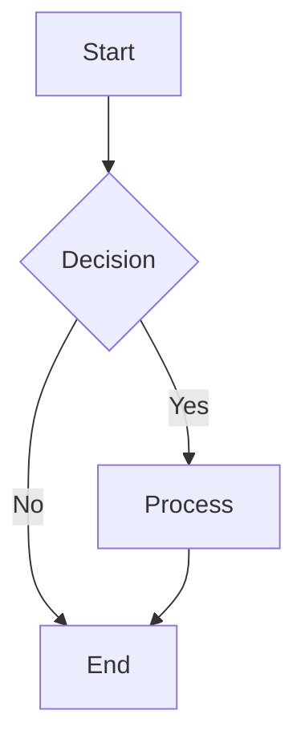
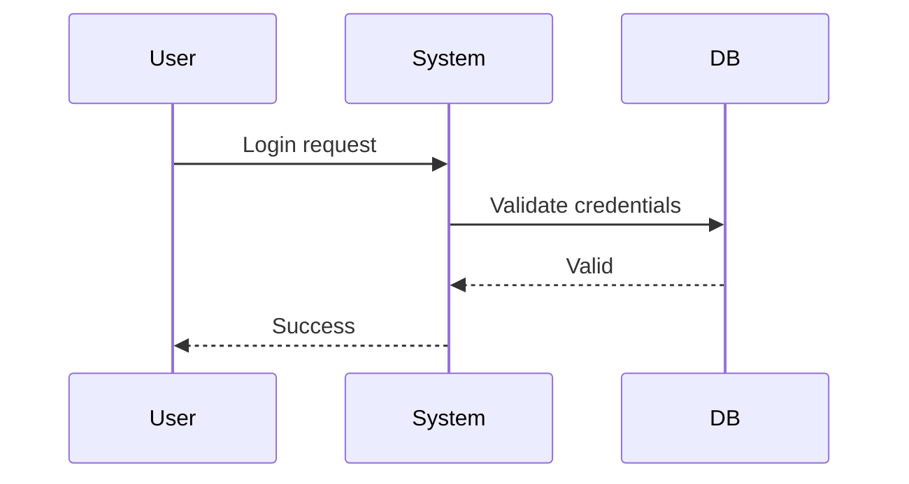
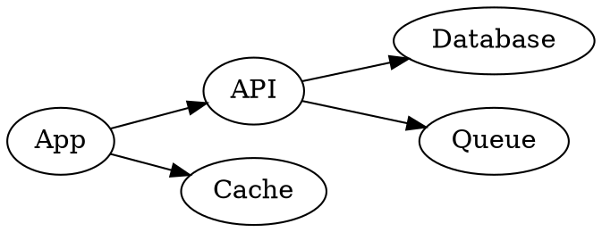

# Universal Diagram Generator

## Overview

Generates publication-quality diagrams from code blocks in Markdown files. Supports three syntaxes:

| Syntax             | Best For                                                                                    | Tool                      |
| ------------------ | ------------------------------------------------------------------------------------------- | ------------------------- |
| **Mermaid**        | Flowcharts, sequence diagrams, class diagrams, mind maps, Gantt, state diagrams, pie charts | `@mermaid-js/mermaid-cli` |
| **D2**             | Cloud architecture, network topology, AWS diagrams, system design                           | `d2` CLI                  |
| **Graphviz (DOT)** | Directed/undirected graphs, trees, automata, dependency graphs                              | `dot` CLI                 |

All diagrams render as SVG — natively viewable in GitHub Markdown AND embedded into PDF when
converted with `scripts/convert-to-pdf.js`.

---

## Quick Start

```bash
# Render all diagrams in a file
node scripts/diagram-gen.js notes.md

# Watch mode (auto-re-render on save)
node scripts/diagram-gen.js README.md --watch

# Convert MD to PDF with diagrams embedded
node scripts/convert-to-pdf.js notes-with-diagrams.md
```

---

## Supported Diagram Types

### Mermaid





### D2

```d2
User -> API: GET /data
API -> Database: SELECT * FROM data
Database -> API: rows
API -> User: JSON response
```

### Graphviz DOT



---

## Pipeline Integration

When `scripts/convert-to-pdf.js` runs, **Mermaid code blocks are automatically detected and
rendered**:

````
Source MD (with ```mermaid blocks)
       │
       ▼  diagram-gen.js
    SVG images + updated MD
       │
       ▼  convert-to-pdf.js (Playwright)
    Print-ready PDF with diagrams
````

The PDF renderer (Playwright Chromium) can render SVGs directly — all diagrams appear in the final
PDF.

---

## Usage

### From Markdown

1. Add diagram code blocks to your `.md` file
2. Run: `node scripts/diagram-gen.js input.md`
3. Get: SVG files + updated `.md` with `` tags
4. Convert to PDF: `node scripts/convert-to-pdf.js input-with-diagrams.md`

### From AI Code

When an AI agent needs to generate a diagram:

1. Determine the diagram type (Mermaid for most, D2 for architecture, DOT for graphs)
2. Include the diagram code block in the Markdown response
3. Reference `scripts/diagram-gen.js` for rendering
4. Reference `scripts/convert-to-pdf.js` for PDF output

### Standalone

```bash
# From inline code
node scripts/diagram-gen.js --code "flowchart TD; A-->B"

# List all formats
node scripts/diagram-gen.js --list-formats
```

---

## Best Practices

| Diagram Type        | Use Case                             | Max Elements    |
| ------------------- | ------------------------------------ | --------------- |
| **flowchart**       | Algorithms, processes, workflows     | < 50 nodes      |
| **sequenceDiagram** | API calls, user flows, protocols     | < 20 actors     |
| **classDiagram**    | OOP design, DB schemas               | < 30 classes    |
| **mindmap**         | Subject overviews, topic hierarchies | < 100 nodes     |
| **stateDiagram**    | State machines, protocols            | < 30 states     |
| **gantt**           | Project timelines, study schedules   | < 30 tasks      |
| **D2**              | System architecture, cloud infra     | < 40 components |
| **DOT**             | Dependency graphs, trees             | < 100 nodes     |

---

## Error Handling

| Situation | Action |
|---|---|
| Mermaid syntax error | Validate against Mermaid parser; simplify diagram or use alternate syntax (Graphviz/D2) |
| Renderer not available | Ensure `@mermaid-js/mermaid-cli` is installed (`npm install`); fall back to text description |
| D2 not installed | Install `d2` CLI or fall back to Mermaid for architecture diagrams |
| Diagram too complex | Split into multiple sub-diagrams; stay within element limits per Best Practices table |

## Quality Gate — Check Before Output

- [ ] Diagram renders without errors in the target format (Mermaid/D2/DOT)
- [ ] All nodes and edges are labelled meaningfully
- [ ] Accessible alt-text provided for each diagram
- [ ] Format matches request (flowchart vs sequence vs class vs architecture vs graph)
- [ ] Element count within recommended limits from Best Practices table

---

## Session Config

This skill integrates with the session config system (`deps/session-profile.json`). Before
executing, check for an existing session profile:

- If `deps/session-profile.json` exists, read `university`, `subject`, `pattern`, and `exam_type`
  fields to auto-configure the skill.
- If the file does not exist, fall back to user-provided context or prompt the user to run
  `setup-exam-prompt` (or `npm run init`) first.
- Session config eliminates redundant context detection — detection happens once and is reused
  across all skill calls.

---

## Integration with Other Skills

- **universal-session-config**: Reads diagram format preferences and subject context from session profile
- **universal-mind-map-generator**: Outputs Mermaid mind maps → renders via diagram-gen
- **universal-notes-generator**: Includes diagrams in generated notes → rendered in PDF
- **universal-document-generator**: All diagrams auto-embedded in PDF output
- **universal-a-plus-answer-writer**: Include diagrams in exam answers → rendered in solutions PDF
- **universal-study-planner**: Gantt charts for study schedules
