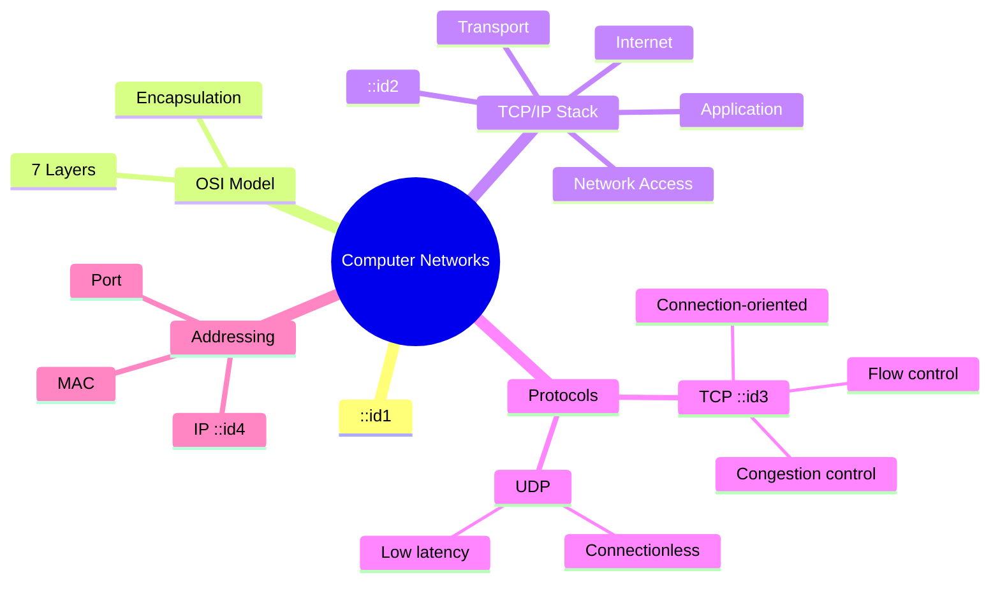

# Universal Mind Map Generator

## Overview

Transforms any syllabus, textbook chapter, or set of notes into a structured visual mind map. Maps
show hierarchical relationships, cross-topic connections, priority levels, and Bloom's taxonomy
distribution. Optimized for both quick overview and deep study.

## How This Skill Works

1. **User provides**: Subject, unit/topic, syllabus or notes, desired depth, output format
2. **System analyzes**: Concept hierarchy, relationships, dependencies, and importance
3. **System constructs**: Tree structure with central topic, main branches, sub-branches, and
   cross-links
4. **System renders**: In chosen format (Mermaid, text outline, or image description)

## 1. Mind Map Structure

```
                    [Central Topic]
              /         |          \
    [Main Branch 1] [Main Branch 2] [Main Branch 3]
      /    |    \       |    \          |
  [Sub] [Sub] [Sub]  [Sub] [Sub]    [Sub]
   |     |            |
 [Det] [Det]        [Det]
```

### Elements

| Element            | Visual                           | Purpose                                                              |
| ------------------ | -------------------------------- | -------------------------------------------------------------------- |
| **Central Topic**  | Center, largest node             | The main subject of the map                                          |
| **Main Branch**    | Directly from center, thick line | Major subtopics / units                                              |
| **Sub-Branch**     | From main branch, thinner line   | Individual concepts                                                  |
| **Detail Node**    | Leaf nodes, smallest             | Specific facts, formulas, examples                                   |
| **Cross-Link**     | Dashed line between branches     | Inter-topic connections                                              |
| **Priority Badge** | Color/icon annotation            | High (red) / Medium (yellow) / Low (green)                           |
| **Bloom's Tag**    | Label on node                    | R=Remember, U=Understand, Ap=Apply, An=Analyze, E=Evaluate, C=Create |

## 2. Output Formats

### Format 1 — Mermaid Mind Map (Recommended)



### Format 2 — Indented Text Outline

```
Computer Networks
|-- OSI Model (R) [HIGH]
|   |-- 7 Layers (R)
|   |   |-- Physical (R)
|   |   |-- Data Link (R)
|   |   |-- Network (R)
|   |   |-- Transport (R) [HIGH]
|   |   |-- Session (R)
|   |   |-- Presentation (R)
|   |   |-- Application (R)
|   |-- Encapsulation (U) [HIGH]
|   |-- Peer-to-peer communication (U)
|-- TCP/IP Stack (U) [HIGH]
|   |-- ...
|-- Protocols (Ap) [HIGH]
|   |-- TCP (Ap) [HIGH]
|   |   |-- Connection-oriented (U)
|   |   |-- Flow control (U)
|   |   |-- Congestion control (An)
|   |-- UDP (Ap) [MEDIUM]
|       |-- Connectionless (U)
|       |-- Low latency (U)
|-- Addressing (U) [MEDIUM]
    |-- MAC (R)
    |-- IP (U) [HIGH]
    |-- Port (R)
```

### Format 3 — Image Description

For use with image generation or hand drawing:

```
Layout: Center-outward radial tree
Central node: "Computer Networks" in a rounded rectangle
Branch 1 (top-right): "OSI Model" in blue — 7 sub-branches for each layer
Branch 2 (bottom-right): "TCP/IP Stack" in green — 4 sub-branches
Branch 3 (top-left): "Protocols" in orange — TCP (highlighted), UDP
Branch 4 (bottom-left): "Addressing" in purple — MAC, IP, Port nodes
Cross-link: dashed line from OSI Transport to TCP, from TCP to Flow Control concept
Priority: red highlight on TCP, IP, Encapsulation
```

## 3. Color Coding Scheme

| Element             | Color               | Meaning                             |
| ------------------- | ------------------- | ----------------------------------- |
| **Central**         | Dark (black/blue)   | Subject name                        |
| **Main Branch**     | Per-unit color      | Unit identity                       |
| **High Priority**   | Red border/shade    | Must know (PYQ frequency > 60%)     |
| **Medium Priority** | Yellow/amber border | Important (PYQ frequency 30-60%)    |
| **Low Priority**    | Green border        | Supplementary (PYQ frequency < 30%) |
| **Cross-Link**      | Purple dashed       | Inter-topic relationship            |
| **Remember**        | Blue tag            | Factual recall                      |
| **Understand**      | Teal tag            | Conceptual understanding            |
| **Apply**           | Green tag           | Procedure/application               |
| **Analyze**         | Orange tag          | Breaking down/compare               |
| **Evaluate**        | Red tag             | Judgment/justification              |
| **Create**          | Purple tag          | Synthesis/design                    |

## 4. Generation Strategies

| Strategy             | When                          | Map Style                          |
| -------------------- | ----------------------------- | ---------------------------------- |
| **Syllabus-Driven**  | Full subject overview         | Broad, hierarchical, all units     |
| **PYQ-Driven**       | Pre-exam focus                | Prioritized by question frequency  |
| **Deep Dive**        | Single complex topic          | Narrow, very deep, highly detailed |
| **Compare-Contrast** | Related topics side-by-side   | Dual-center with cross-links       |
| **Problem-Solution** | Numerical/conceptual problems | Flow-based, decision-path          |
| **Revision Map**     | Last-minute review            | Ultra-condensed, high-yield only   |

## Session Config

This skill integrates with the session config system (`deps/session-profile.json`). Before
executing, check for an existing session profile:

- If `deps/session-profile.json` exists, read `university`, `subject`, `pattern`, and `exam_type`
  fields to auto-configure the skill.
- If the file does not exist, fall back to user-provided context or prompt the user to run
  `setup-exam-prompt` (or `npm run init`) first.
- Session config eliminates redundant context detection — detection happens once and is reused
  across all skill calls.

---

## Error Handling

| Situation                         | Action                                                                                       |
| --------------------------------- | -------------------------------------------------------------------------------------------- |
| Subject/topic too broad           | Respond: "Topic too broad for a single mind map. Consider narrowing to one unit or chapter." |
| Mermaid syntax generation failure | Fall back to indented text outline format and notify user                                    |
| Cross-link cycle detected         | Simplify cross-links to avoid circular references in mind map                                |
| Color scheme conflict             | Apply default color scheme if user-specified colors conflict with priority/Bloom's mapping   |
| Accessibility description missing | Auto-generate: "Accessibility Description: A [type] diagram showing [subject]."              |

## Quality Gate — Check Before Output

- [ ] Central topic is clearly identified
- [ ] All main branches are labeled and connected to central node
- [ ] Priority annotations (HIGH/MEDIUM/LOW) present on all major nodes
- [ ] Bloom's level tags applied to leaf nodes
- [ ] Cross-links documented between related branches
- [ ] Accessibility description included for screen reader support
- [ ] Mermaid syntax validated before output (if Mermaid format selected)
- [ ] At least one alternative format (text outline or image description) available

## 5. Integration with Other Skills

| Skill                              | Integration                                                   |
| ---------------------------------- | ------------------------------------------------------------- |
| **universal-session-config**       | Reads university/subject/pattern from session profile         |
| **universal-notes-generator**      | Extracts concepts and structure from generated notes          |
| **universal-pyq-analyzer**         | Colors priority levels based on historical question frequency |
| **universal-imp-topics-generator** | Highlights important nodes in the map                         |
| **universal-study-planner**        | Mind maps serve as daily review anchors                       |
| **universal-diagram-generator**    | Renders Mermaid mind maps to SVG for document embedding       |

## 6. Accessibility & Compatibility

### Text-Only Accessibility Description

Every generated mind map MUST include a text-only description for screen readers and accessibility
tools. This ensures the map content is accessible to all users.

**Format:**

```
Accessibility Description: A [type] diagram showing [summary]. Central node: [X]. Branches: [Y], [Z], ...
```

**Example:**

```
Accessibility Description: A radial mind map diagram showing Computer Networks concepts.
Central node: Computer Networks. Branches: OSI Model (7 layers), TCP/IP Stack (4 layers),
Protocols (TCP, UDP), Addressing (MAC, IP, Port). Cross-links: OSI Transport ↔ TCP.
```

### Mermaid Renderer Compatibility Note

Mermaid mindmap syntax varies across renderers:

| Renderer                                          | mindmap Syntax Support | Notes                                              |
| ------------------------------------------------- | ---------------------- | -------------------------------------------------- |
| **GitHub Markdown**                               | ✅ Full                | Supports `mindmap` block with indented hierarchy   |
| **Mermaid Live Editor**                           | ✅ Full                | All features supported                             |
| **Obsidian**                                      | ⚠️ Partial             | May require `mindmap` plugin or alternative syntax |
| **VS Code Extensions**                            | ⚠️ Partial             | Check extension documentation for mindmap support  |
| **PDF Export (via universal-document-generator)** | ✅ Full                | Pre-rendered as SVG, no renderer dependency        |

**Recommendation:** For maximum compatibility, also generate the indented text outline format
(Format 2) alongside any Mermaid mind map. The text outline is universally readable.
