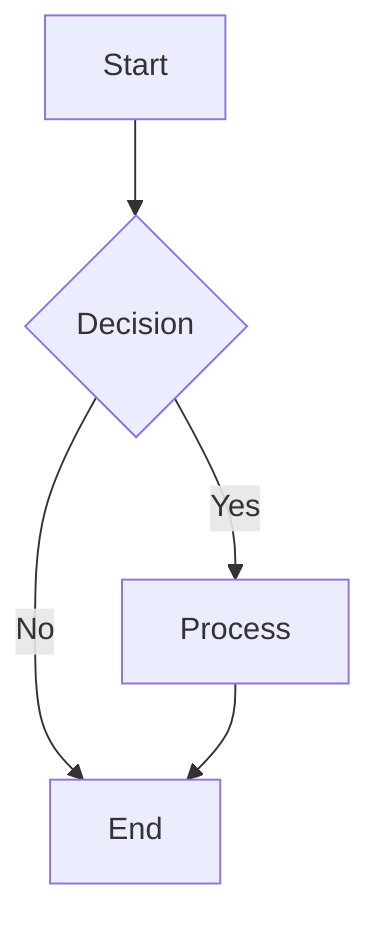
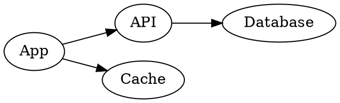

# Test Diagram Generation

## Flowchart


```mermaid
flowchart TD
    A[Start] --> B{Decision}
    B -->|Yes| C[Process]
    B -->|No| D[End]
    C --> D
```

## Architecture with D2

```d2
User -> API: GET /data
API -> Database: SELECT
Database -> API: rows
API -> User: JSON
```

## Graph


```dot
digraph G {
    rankdir=LR;
    App -> API -> Database;
    App -> Cache;
}
```
